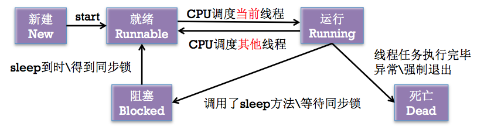
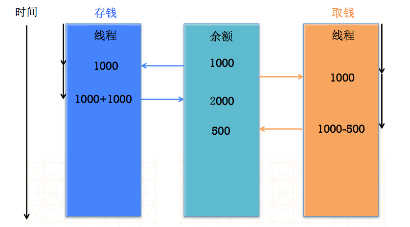
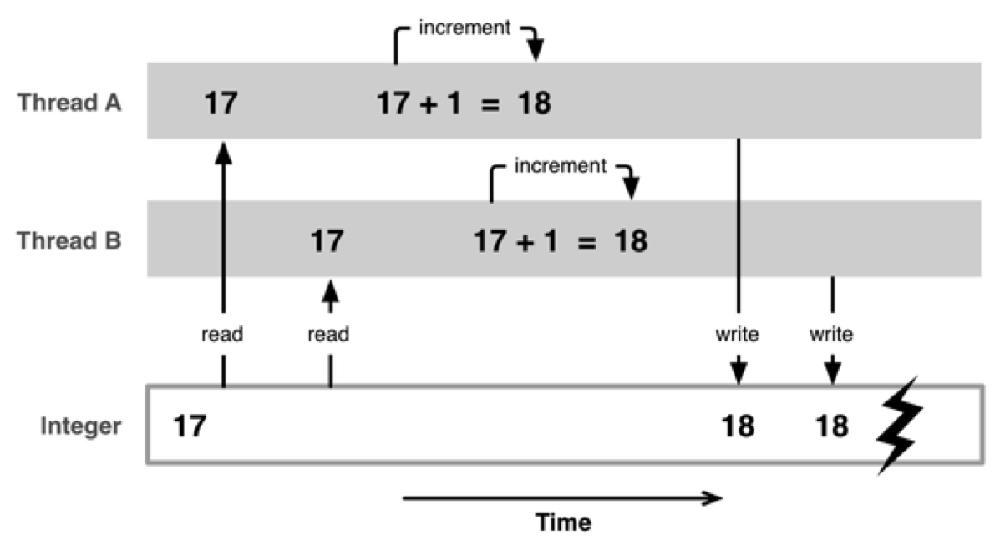
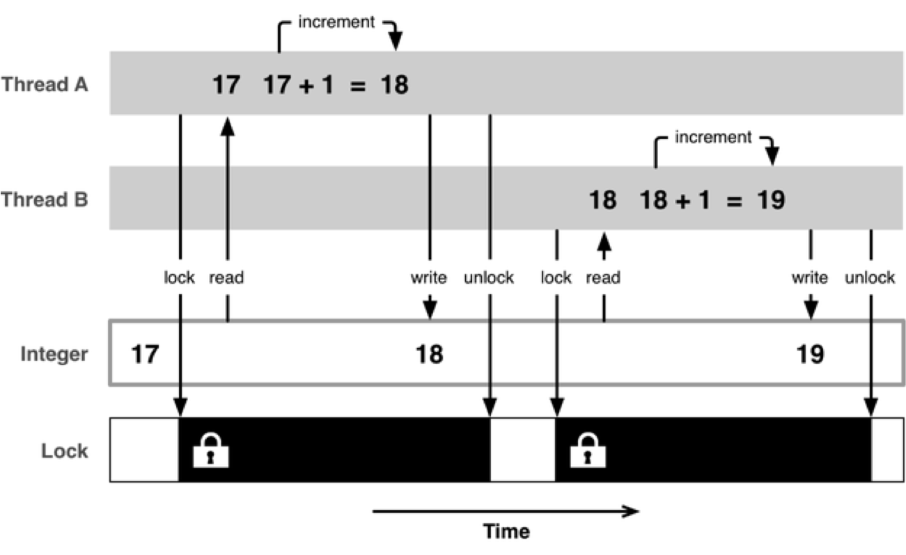

##Pthread
####使用pthread必须盗用头文件#import <pthread.h>
可以使用`[NSThread currentThread]`来获取当前在哪条线程上面 num = 1为主线程
####创建线程
	
	pthread_t myRestrict;
	pthread_create(&myRestrict, NULL, run, NULL);run为一个void的函数


##NSThread
###主线程相关用法

```objc
+ (NSThread *)mainThread; // 获得主线程
- (BOOL)isMainThread; // 是否为主线程
+ (BOOL)isMainThread; // 是否为主线程
```
###其他用法
```objc
//获得当前线程
NSThread *current = [NSThread currentThread];
//线程的名字
- (void)setName:(NSString *)n;
- (NSString *)name;
```
###创建线程
1. 第一种方式

		NSThread *thread = [NSThread alloc]initWithTarget:self selector:@selector(download:) object:@"哈哈"];//创建一个线程去调用download：方法并把哈哈传给这个方法，也可以不传值，设置为nil即可
		thread.name = @"下载线程";//可以设置线程的名称，设置与否不会造成什么影响的
		[thread start];//启动线程，必须加上，不然无法开启线程
		
	
2. 第二种方式

		[NSThread detachNewThreadSelector:@selector(download:) toTarget:self withObject:@"http://a.jpg"];
3. 第三种方式(隐式创建)

		[self performSelectorInBackground:@selector(download:) withObject:@"http://c.gif"];
		[self performSelector:@selector(download:) withObject:@"http://c.gif"];(不会开辟新线程)
	    [self download:@"http://c.gif"];(不会开辟新线程)
第二种和第三种创建的优缺点
- 优点:简单快捷
- 缺点:无法对线程进行更详细的设置
###线程状态
一般来说有以下几种
1. 新建NEW
2. 就绪Runnable
3. 运行Running
4. 阻塞Blocked
5. 死亡Dead

状态之间的切换见下图所示:


CPU在同一时间内只能执行一条多线程，并发是CPU调度任务才会造成多线程是同时执行的(因为调度事件非常短)
###控制线程的状态

```objc
//启动线程
- (void)start; 
// 进入就绪状态 -> 运行状态。当线程任务执行完毕，自动进入死亡状态

//阻塞（暂停）线程
+ (void)sleepUntilDate:(NSDate *)date;
+ (void)sleepForTimeInterval:(NSTimeInterval)ti;
// 进入阻塞状态

//强制停止线程
+ (void)exit;
// 进入死亡状态

注意：一旦线程停止（死亡）了，就不能再次开启任务

```
###多线程的安全隐患
- 资源共享
 - 1块资源可能会被多个线程共享，也就是多个线程可能会访问同一块资源
 - 比如多个线程访问同一个对象、同一个变量、同一个文件
- 当多个线程访问同一块资源时，很容易引发数据错乱和数据安全问题(现实生活中有买车票和银行存取钱等)
存钱取钱，内容见下图

网上用的最多的一张图


####互斥锁(@synchronized)
加锁的操作见下图所示

- 互斥锁使用格式
 
```objc
	@synchronized(锁对象) { // 需要锁定的代码  }
	注意：锁定1份代码只用1把锁，用多把锁是无效的
``` 
- 互斥锁的优缺点
 - 优点：能有效防止因多线程抢夺资源造成的数据安全问题
 - 缺点：需要消耗大量的CPU资源
- 互斥锁使用前提是多条线程抢夺同一块资源
- 相关专业术语：线程同步
 - 线程同步的意思是：多条线程在同一条线上执行（按顺序地执行任务）
 - 互斥锁，就是使用了线程同步技术
 
火车票以及银行取钱等情况下需要使用互斥锁来对线程进行加锁，避免造成混乱等情况
比如三个人进行买火车票，如果不用互斥锁的话那么一张票可能被两个人或者三个人同时买到，显然这是不符合逻辑的，每张票只能允许同一个人购买。这时候就需要用到互斥锁来对火车票进行加锁了，如果某一张火车票被人购买了，那么别人就无法继续买这张火车票了。
	
	- (void)saleTicket
	{
    	while (1) {
        	// ()小括号里面放的是锁对象（一般self即可，不要重复生成对象）
        	@synchronized(self) { // 开始加锁
            	int count = self.leftTicketCount;
            	if (count > 0) {
                	[NSThread sleepForTimeInterval:0.05];
                
                	self.leftTicketCount = count - 1;
                
                	NSLog(@"%@卖了一张票, 剩余%d张票", [NSThread currentThread].name, self.leftTicketCount);
            	} else {
                	return; // 退出循环
            	}
        	} // 解锁
    	}
	}
	
###原子和非原子属性
- OC在定义属性时有nonatomic和atomic两种选择
 - atomic：原子属性，为setter方法加锁（默认就是atomic）
 - nonatomic：非原子属性，不会为setter方法加锁，一般都用nonatomic，这样性能会稍微好点
- nonatomic和atomic对比
  - atomic：线程安全，需要消耗大量的资源
  - nonatomic：非线程安全，适合内存小的移动设备
- iOS开发的建议
 - 所有属性都声明为nonatomic
 - 尽量避免多线程抢夺同一块资源
 - 尽量将加锁、资源抢夺的业务逻辑交给服务器端处理，减小移动客户端的压力

###线程间通信
- 什么叫做线程间通信
 - 在1个进程中，线程往往不是孤立存在的，多个线程之间需要经常进行通信
- 线程间通信的体现
 - 1个线程传递数据给另1个线程
 - 在1个线程中执行完特定任务后，转到另1个线程继续执行任务

当处理耗时操作的时候需要开辟一条线程，比如从网络上面请求数据的时候，网络请求应该新开辟一条线程，放到子线程里面去，然后下载完成之后通知主线程进行更新UI。(这样也是为了线程安全着想)

```objc
	[self performSelectorOnMainThread:@selector(downloadFinished:) withObject:image waitUntilDone:NO];//回到主线程
```
	
比如在子线程中进行网络请求，得到数据之后通知主线程更新UI，具体代码如下

```objc

- (void)downImage {
    
    NSURL *url = [NSURL URLWithString:@"http://img.pconline.com.cn/images/photoblog/9/9/8/1/9981681/200910/11/1255259355826.jpg"];
    NSData *data = [NSData dataWithContentsOfURL:url];
    UIImage *image = [UIImage imageWithData:data];
    
//    [self.imageView performSelectorOnMainThread:@selector(setImage:) withObject:image waitUntilDone:YES];
    
    [self.imageView performSelector:@selector(setImage:) onThread:[NSThread mainThread] withObject:image waitUntilDone:YES];
//    [self performSelectorOnMainThread:@selector(hehe:) withObject:image waitUntilDone:YES];
}

- (void)hehe:(UIImage *)image
{
    self.imageView.image = image;
}

```
####小结
1. -(id)init //这个方法是NSThread的指定初始化方法
2. -(id)initWithTarget:(id)target selector:(SEL)seletoc object:(id)argument//初始化一个线程，应该注意到这个SEL方法只能有一个参数，并且选择的方法不能有返回值，而且这个方法只是创建了一个线程，并没有开始这个线程，需要调用start方法开始线程
3. +(void)detachNewThreadSelector:(SEL)aSelector toTarget:(id)aTarget withObject:(id)anArgument//创建并开始一个线程
4. -(void)start//开始一个线程
5. +(void)sleepUntilDate:(NSDate *)aDate//阻塞当前线程，直到指定时间
6. +(void)sleepForTimeInterval:(NSTimeInterval)time//使线程睡眠一段时间
7. -(BOOL)isExecuting//判断线程是否正在执行
8. -(BOOL)isCancelled//判断线程是否已经取消
9. -(BOOL)isFinished//判断线程是否执行完
10. +(BOOL)isMainThread//判断当前线程是否是主线程
11. +(BOOL)isMultiThreaded//判断是否是多线程的
12. +(NSThread *)currentThread//返回当前线程
13. +(NSThread *)mainThread//返回主线程对象
14. +(NSArray *)callStackReturnAddresses//返回的是这个线程在栈中所占的地址所组成的数组
15. +(NSArray *)callStackSymbols//返回栈空间的符号
16. – threadDictionary //返回线程对象的字典
17. – name //返回线程名字
18. – setName: //设置线程名字
19. – stackSize //返回线程所占栈的空间大小
20. – setStackSize: //设置线程所占栈的空间大小
21. +threadPriority //返回当前线程的优先权，其实返回的是一个double型数字，
//从0.0 到1.0 其中1.0最高


