/*
 沙盒~磁盘
 Library
    caches:缓存
    preferences:偏好设置
 Documents:会备份的数据,官方不允许你把缓存保存到该文件
 TMP:临时路径,里面的数据随时可能被删除
 */

- 线程
 - 单个线程是串行方式执行
- 多线程的优缺点

---
- 多种开启线程方式的对比

---
- 线程同步：
  - 多线程默认是并发(异步)，也就是同时执行，但是为了防止多个线程多同一个资源进行抢夺，所以有了互斥锁，让线程出现同步现象，也就是在一条线上按照顺序执行
  - 互斥锁的使用前提：多条线程抢夺同一块资源
  - 互斥锁对象：保证全局唯一，使用self就可以满足需求
  - 互斥锁优缺点：
     - 优点：可以有效防止多条线程抢夺同一块资源造成的数据安全问题
     - 缺点：需要消耗大量的CPU资源

- 主线程
 - 显示/刷新UI界面
 - 处理UI事件
 - isMainThread 是否是主线程
 - 使用注意
   - 别将比较耗时的操作放到主线程中
   - 耗时操作会卡住主线程，严重影响UI的流畅度，给用户一种“卡”的坏体验


- 子线程
 - 处理耗时操作
 - 刷新UI一定要在主线程操作

- 并行：
 - 多个线程一起执行任务，指的是同一时间处理多个任务的能力
- 并发：
 - 现象，同一时间多个任务同时执行

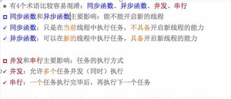
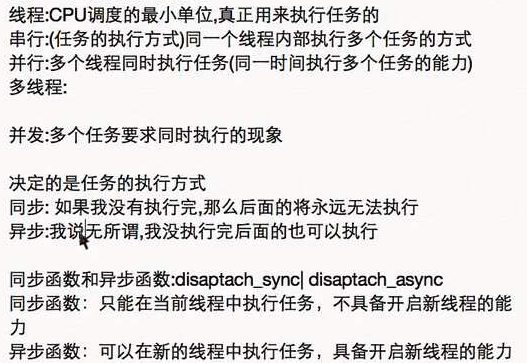

- 同步函数是需要立即执行的，异步函数会隔一下再执行

----
- 线程的优先级
 - 取值范围 0-1，double，默认0.5
 - 优先级高的线程一定是先执行完毕，cpu调度它的概率比较大

- 线程的状态
 - 创建后，放入可调度线程池
 - 线程调用start后，进入就绪状态，等待cpu调用
 - 被调用后进入运行状态，当cpu又去调用其他线程，那么当前线程继续进入就绪
 - 调用了sleep方法或者等待同步锁，那么进入阻塞状态
 - sleep到时\得到同步锁那么继续进入就绪状态
 - 线程任务执行完毕
异常\强制退出就会销毁，进入死亡状态，销毁后永久无法复活

###NSThread
- NSThread
 - 一个NSThread对象就代表一条线程
 - 创建完毕线程后别忘记start线程

```objc
[NSThread currentThread];//获得当前线程
+ (NSThread *)mainThread; // 获得主线程
- (BOOL)isMainThread; // 是否为主线程
+ (BOOL)isMainThread; // 是否为主线程

//创建线程后自动启动线程
[NSThread detachNewThreadSelector:@selector(run) toTarget:self withObject:nil];

//隐式创建并启动线程
[self performSelectorInBackground:@selector(run) withObject:nil];

以上方式:
优点：简单快捷
缺点：无法对线程进行更详细的设置

```

###GCD
- GCD
 - 是苹果专门为多核的并行运算提出的解决方案
 - 纯C语言
 - 会自动利用更多的CPU内核
 - 会自动管理线程的生命周期
 - 核心就是定制任务(执行什么操作)和将任务添加到队列(存放什么任务)
 - 任务的取出遵循FIFO(先进先出)原则

- GCD中有2个用来执行任务的常用函数(函数的作用是用来封装任务，把任务提交到队列)<br>
//通俗讲就是将block任务放到queue队列中，它会自动从队列中取出任务放到线程中执行，具体是放到主线程还是子线程则根据队列类型决定
 - dispatch_sync  同步函数
   - 只可以在当前线程中执行任务,不具备开启新线程能力
 - dispatch_async 异步函数
   - 可以在新的线程中执行任务，具体开启新线程的能力

- GCD中的队列(存放任务)可以分为2大类型 - 队列决定了任务在子线程还是主线程执行
 - 并发队列
   - 可以让多个任务并发（同时）执行（自动开启多个线程同时执行任务
   - 并发功能只有在异步（dispatch_async）函数下才有效

```objc
//使用dispatch_queue_create函数创建队列
//队列对象的类型：dispatch_queue_t
dispatch_queue_create(const char *label, // 队列名称
dispatch_queue_attr_t attr); // 队列的类型

//创建并发队列,最好给队列命名，方便后续调试查找
dispatch_queue_t queue = dispatch_queue_create("com.520it.queue", DISPATCH_QUEUE_CONCURRENT);
```
---
```objc
//GCD默认已经提供了全局的并发队列，供整个应用使用，可以无需手动创建
//iOS6.0之前，自己手动创建的队列需要自己手动释放内存，但是全局并发队列不需要自己释放，它是系统自动创建的
使用dispatch_get_global_queue函数获得全局的并发队列
dispatch_queue_t dispatch_get_global_queue(
dispatch_queue_priority_t priority, // 队列的优先级
unsigned long flags); // 此参数暂时无用，用0即可

全局并发队列的优先级
#define DISPATCH_QUEUE_PRIORITY_HIGH 2 // 高
#define DISPATCH_QUEUE_PRIORITY_DEFAULT 0 // 默认（中）
#define DISPATCH_QUEUE_PRIORITY_LOW (-2) // 低
#define DISPATCH_QUEUE_PRIORITY_BACKGROUND INT16_MIN // 后台

```
 - 串行队列
   - 让任务一个接着一个地执行(一个任务执行完毕后，再执行下一个任务)

```objc
//GCD中获得串行队列有2种途径
第一种：使用dispatch_queue_create函数创建串行队列
// 创建串行队列（队列类型传递NULL或者DISPATCH_QUEUE_SERIAL）
dispatch_queue_t queue = dispatch_queue_create("com.520it.queue", NULL);

*************************
第二种：使用主队列（跟主线程相关联的队列）
主队列是GCD自带的一种特殊的串行队列
1)主队列:
        1)所有在主队列中的任务都会被放在主线程中执行
        2)主队列中的任务在执行之前会先检查主线程的状态,如果发现主线程当前正在执行任务那么会暂停队列中任务的调度
2)同步:必须要得到该方法的返回值才能够继续往下执行--->如果我没有执行完毕,那么后面的将永远无法执行
3)异步:可以继续往下执行,等前面的任务执行完毕之后再回头执行-->我无所谓,你可以先执行后面的代码

使用dispatch_get_main_queue()获得主队列
dispatch_queue_t queue = dispatch_get_main_queue();
```
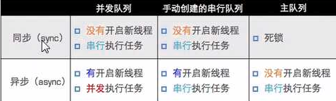
----
- 如果在主线程中通过同步函数往主队列添加任务会造成死锁
 - 同步函数是需要立即执行的，异步函数会隔一下再执行
- 异步函数里面可以使用同步函数往主队列添加任务不会造成死锁
 - 因为异步函数可以开启新的线程，只要整个任务是在其他线程里面，那么即使里面的是通过同步函数向主队列添加任务也不会造成死锁

```objc
在主线程中通过同步函数往主队列里面添加任务造成死锁的原因：
首先我们知道主队列里面的任务默认是在主线程中执行的，
而且每次主队列执行任务之前都会先检查主线程的状态，如
果发现当前主线程有任务正在执行，那么就会暂停队列里面
的任务执行，由于我们当前主线程正在处理touchBegin方法
里面的[self syncMain]这个任务，再加上现在主队列里面放
的是同步函数，同步函数的特点是需要立即在当前线程执行
当前的任务，不执行完后面的都无法执行，(也就是说同步函数
不执行完，这个syncMain方法就无法执行完，syncMain方法执
行不完那么当前主线程正在执行的任务就无法结束，任务无法
结束那么主队列就会一直暂停自己的调度，那么同步函数就永
远执行不完)现在同步函数需要先执行，但是主队列发现主线程
是有任务的，主队列在主线程处理完[selfsyncMain]这个任务
之前会暂停自己里面的任务调度，那么就会造成谁也无法进行
下一步的情况，就会造成死锁
*************************
换句话说，主队列发现里面有同步函数，让同步函数先执行，
但是同步函数一看你是主队列，你老大你先执行，这样你让
我，我让你，一直让下去谁也无法执行，就造成了死锁
```
----
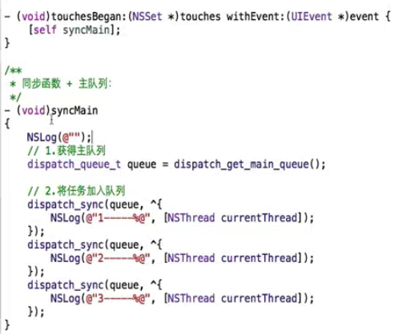


----
- 一次性代码--static dispatch_once_t
 - 在整个程序运行过程中，block代码块只会被执行一次
 - 本身是线程安全的
 - 不能在懒加载中写一次性函数
 - 应用场景：单例

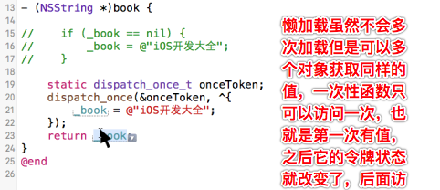

- 栅栏函数--dispatch_barrier_async
  - 可以控制并发队列里面任务的执行顺序，栅栏函数之前的任务执行完毕之后栅栏函数后面的任务才可以被执行
  - 不能使用全局并发队列，自己创建的并发队列才可以,这个苹果官方没有给出具体原因
- 延迟函数--dispatch_after
 - 延迟的时间是以纳秒为单位的
 - 延迟提交
- 快速迭代--dispatch_apply
 - 不可以传主队列，会造成死锁
   - 主线程会默认参与迭代任务，如果再在主队列执行该函数会造成死锁
   - dispatch_apply函数是dispatch_sync函数和Dispatch Group的关联API
   - 该函数按指定的次数将指定的Block追加到指定的DispatchQueue中,并等到全部的处理执行结束
   - dispatch_apply函数与dispatch_sync函数形同,会等待处理执行结束
 - 并不是只有多个子线程执行任务，而是主线程和子线程共同执行

- 队列组(管理队列)
 - 封装任务
 - 将任务提交到队列
 - 把当前任务的执行情况纳入到队列组的监听范围
 - 使用group_notify方法拦截通知，当对列中所有的任务都执行完毕的时候会收到通知然后回调block，它是异步的
 - 除了可以使用group_notify之外还可以使用group_wait(FOREVER死等，队列组里面所有任务都执行完才会回调)，如果自己创建时间，那么时间到后即使任务没有执行完也会往下执行，它是同步执行
   - 如果在自己指定时间段内完成任务，会返回0

- GCD中的定时器
 - ①GCD的定时器不会受到Runloop运行模式的影响
 - ②可以控制任务在主线程还是子线程执行
 - 需要添加强引用
 - 注意队列里面不要添加了其它的任务
 - 它也是想当准确的，因为它是以纳秒为单位，而且我们还可以设置误差范围，一般都设置0，没有误差

```objc
-(void)touchesBegan:(NSSet<UITouch *> *)touches withEvent:(UIEvent *)event
{
    //1.创建GCD定时器对象
    /*
     第一个参数：创建source的类型DISPATCH_SOURCE_TYPE_TIMER：表示是定时器
     第二个参数：可以理解为句柄、索引或id，假如要监听进程，需要传入进程的ID
     第三个参数：描述，提供更详细的描述，让它知道具体要监听什么
     第四个参数：决定定时器任务在哪个线程中执行的队列
     */
    dispatch_source_t timer = dispatch_source_create(DISPATCH_SOURCE_TYPE_TIMER, 0, 0, dispatch_get_global_queue(0, 0));

    //2.设置定时器(开始时间|间隔时间|精准度）
    /*
     第一个参数：定时器对象
     第二个参数：从什么时候开始计算时间
     第三个参数：间隔时间
     第四个参数：精准度，即该定时器允许的误差 要求绝对精准则传0
     注意：GCD中的时间单位为纳秒
     */
    dispatch_source_set_timer(timer, DISPATCH_TIME_NOW, 2.0 * NSEC_PER_SEC, 0 * NSEC_PER_SEC);

    //3.设置定时器需要处理的回调任务
    dispatch_source_set_event_handler(timer, ^{
        NSLog(@"GCD---%@",[NSThread currentThread]);
    });

    //4.启动定时器
    dispatch_resume(timer);

    //强引用
    self.timer = timer;
}

```


- 合成图片
 - 组队列，在group_notify之后进行图片合成

```objc
-(void)test3
{
    //0.创建队列组
    dispatch_group_t group = dispatch_group_create();

    //1.获得并发队列
    dispatch_queue_t queue = dispatch_get_global_queue(0, 0);

    //2.下载图片1
    dispatch_group_async(group, queue, ^{
       //2.1 确定url
        NSURL *url = [NSURL URLWithString:@"http://img4.duitang.com/uploads/item/201409/14/20140914002549_2G5LQ.thumb.700_0.jpeg"];

        //2.2 下载二进制数据
        NSData *data= [NSData dataWithContentsOfURL:url];

        //2.3 转换图片
        self.image1 = [UIImage imageWithData:data];

        NSLog(@"1---%@",[NSThread currentThread]);
    });

    //3.下载图片2
    dispatch_group_async(group, queue, ^{
        //2.1 确定url
        NSURL *url = [NSURL URLWithString:@"http://img4.duitang.com/uploads/item/201407/08/20140708161421_jYGYT.jpeg"];

        //2.2 下载二进制数据
        NSData *data= [NSData dataWithContentsOfURL:url];

        //2.3 转换图片
        self.image2 = [UIImage imageWithData:data];

        NSLog(@"2---%@",[NSThread currentThread]);
    });

    dispatch_group_notify(group, dispatch_get_main_queue(), ^{

        //4.1 开启上下文
        UIGraphicsBeginImageContext(CGSizeMake(200, 200));

        //4.2 画图1
        [self.image1 drawInRect:CGRectMake(0, 0, 200, 100)];
        self.image1 = nil;
        //4.3 画图2
        [self.image2 drawInRect:CGRectMake(0, 100, 200, 100)];
        self.image2 = nil;

        //4.4 得到图片
        UIImage *image = UIGraphicsGetImageFromCurrentImageContext();

        //4.5 关闭上下文
        UIGraphicsEndImageContext();

        NSLog(@"combie---%@",[NSThread currentThread]);
        //5.回到主线程设置图片
//        dispatch_async(dispatch_get_main_queue(), ^{
            self.imageView.image = image;
            NSLog(@"UI---%@",[NSThread currentThread]);
//        });

    });

}

```
 - 2张图片下载之后使用栅栏函数，在栅栏函数之后进行图片合成

```objc
//知识点:barrier在使用的时候不能使用全局并发队列
-(void)barrier
{
    //1.创建队列
    dispatch_queue_t queue = dispatch_queue_create("com.download", DISPATCH_QUEUE_CONCURRENT);

    dispatch_async(queue, ^{
        NSURL *url = [NSURL URLWithString:@"http://1.jpg"];
        NSData *data = [NSData dataWithContentsOfURL:url];
        self.imageOne = [UIImage imageWithData:data];
    });

    dispatch_async(queue, ^{
        NSURL *url = [NSURL URLWithString:@"http://2.jpg"];
        NSData *data = [NSData dataWithContentsOfURL:url];
        self.imageTwo = [UIImage imageWithData:data];
    });

    //1.在子线程中执行
    //2.开始执行之前确保前面的任务1和任务2都已经执行完毕
    //3.只有当我执行完毕之后才能继续执行后面的任务
    dispatch_barrier_async(queue, ^{
        NSLog(@"+++++++++++++%@",[NSThread currentThread]);
    });

    dispatch_async(queue, ^{
        UIGraphicsBeginImageContext(CGSizeMake(200, 200));
        [self.imageOne drawInRect:CGRectMake(0, 0, 200, 100)];
        [self.imageTwo drawInRect:CGRectMake(0, 100, 200, 100)];
        UIImage *image = UIGraphicsGetImageFromCurrentImageContext();
        UIGraphicsEndImageContext();

        dispatch_async(dispatch_get_main_queue(), ^{
            self.imageView.image = image;
        }) ;
    });
}
```

 - 使用NSOperation操作之间的依赖进行图片合成

```objc
- (void)touchesBegan:(NSSet<UITouch *> *)touches withEvent:(UIEvent *)event
{   //创建队列
    NSOperationQueue *queue = [[NSOperationQueue alloc] init];
    //创建操作1，下载第一张图片
    NSBlockOperation *blockOp1 = [NSBlockOperation blockOperationWithBlock:^{
        NSURL *url = [NSURL URLWithString:@"file:///Users/l494256513/Desktop/caipiao.png"];
        NSData *data = [NSData dataWithContentsOfURL:url];
        UIImage *imageOne = [UIImage imageWithData:data];
        self.imageOne = imageOne;
        NSLog(@"---111---%@",[NSThread currentThread]);
    }];
    //创建操作2，下载第2张图片
    NSBlockOperation *blockOp2 = [NSBlockOperation blockOperationWithBlock:^{
        NSURL *url = [NSURL URLWithString:@"file:///Users/l494256513/Desktop/Snip20160506_20.png"];
        NSData *data = [NSData dataWithContentsOfURL:url];
        for (int i=0; i<10000; i++) {
            NSLog(@"--");//模拟耗时操作
        }
        UIImage *imageTwo = [UIImage imageWithData:data];
        self.imageTwo = imageTwo;
        NSLog(@"---222---%@",[NSThread currentThread]);
    }];
   //创建队列3，用以合成图片
    NSBlockOperation *blockOp3 = [NSBlockOperation blockOperationWithBlock:^{
        UIGraphicsBeginImageContext(CGSizeMake(200, 200));
        [self.imageOne drawInRect:CGRectMake(0, 0, 200, 100)];
        [self.imageTwo drawInRect:CGRectMake(0, 100, 200, 100)];
        UIImage *image = UIGraphicsGetImageFromCurrentImageContext();
        UIGraphicsEndImageContext();
        // 在操作3里面回到主线程刷新UI
        [[NSOperationQueue mainQueue] addOperationWithBlock:^{

            self.imageView.image = image;
            NSLog(@"---444---%@",[NSThread currentThread]);
        }];

        NSLog(@"---333---%@",[NSThread currentThread]);
    }];
    //操作3分别依赖于操作1和操作2，也就是需要1和2完毕之后才可以执行3
    [blockOp3 addDependency:blockOp2];
    [blockOp3 addDependency:blockOp1];

    [queue addOperation:blockOp1];
    [queue addOperation:blockOp2];
    [queue addOperation:blockOp3];
}

```

###NSOperation
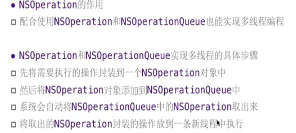

- NSOperation是对GCD的包装，它是基于OC语言的
 - 它也有2个核心概念
   - 队列
   - 操作(和GCD中的任务有相似的意思)
 - 它本身是一个抽象类，所以需要使用它的子类
   - 和核心动画、手势一样都是抽象类
   - 好处是更加的面向对象
 - 三个子类分别是：NSBlockOperation、NSInvocationOperation以及自定义继承自NSOperation的类(该类需要通过重写main函数封装操作)
   - 如果只是创建了一个操作，直接就开启线程，那么它不会自动开辟新的线程，会默认在主线程去操作，除非将操作添加到队列中
 - NSOperation(操作)和NSOperationQueue(队列)结合使用实现多线程并发

- NSInvocationOperation

```objc
//不常用，在主线程中执行
//封装操作
NSInvocationOperation *operation = [[NSInvocationOperation alloc] initWithTarget:self selector:@selector(run) object:nil];
//2.启动操作
[operation start];
```
- NSBlockOperation

```objc
//在主线程中执行，唯一它有一个特殊的add操作可以让操作在子线程中执行
NSBlockOperation *operation = [NSBlockOperation blockOperationWithBlock:^{
//在主线中执行
     NSLog(@"---%@",[NSThread currentThread]);
 }];
//2.追加操作，追加的操作在子线程中执行
[operation addExecutionBlock:^{
//额外的追加操作会在开辟新的线程，在子线程执行
NSLog(@"---download2--%@",[NSThread currentThread]);
}];
[operation start];
```
- 自定义NSOperation

```objc
//在主线程中操作
//如何封装操作？
//自定义的NSOperation,通过重写内部的main方法实现封装操作
-(void)main
{
NSLog(@"--main--%@",[NSThread currentThread]);
}
//如何使用？
//1.实例化一个自定义操作对象
XMGOperation *op = [[XMGOperation alloc]init];
//2.执行操作
[op start];
```

####NSOperationQueue
- NSOperation中的两种队列(队列决定了操作/任务将来怎么执行)
 - 主队列
   - 通过mainQueue获得，凡是放到主队列中的任务都将在主线程执行
 - 非主队列
   - 直接alloc init出来的队列
   - 非主队列同时具备了并发和串行的功能,默认是并发执行的
   - 通过设置最大并发数属性来控制任务是并发执行还是串行执行
   - 在非主队列的操作默认自动会在子线程中执行的，而且是自动执行，不必我们再去调用satrt方法，底层已经封装了start方法
---
- 自定义的操作（当你的异步操作代码特别长，而且经常需要使用到的时候，到时候只需要alloc init即可）
 - 创建队列
 - 封装操作
 - 添加操作到队列中就可以自动执行，而且默认是在子线程执
---
- 创建block操作

```objc
- (void)touchesBegan:(NSSet<UITouch *> *)touches withEvent:(UIEvent *)event
{
    NSOperationQueue *queue = [[NSOperationQueue alloc] init];

    //创建操作
    NSBlockOperation *op1 = [NSBlockOperation blockOperationWithBlock:^{
        NSLog(@"---%@",[NSThread currentThread]);
    }];
    NSBlockOperation *op2 = [NSBlockOperation blockOperationWithBlock:^{
        NSLog(@"---%@",[NSThread currentThread]);
    }];
    //追加操作
    [op1 addExecutionBlock:^{
        NSLog(@"---%@",[NSThread currentThread]);
    }];
    [op2 addExecutionBlock:^{
        NSLog(@"---%@",[NSThread currentThread]);
    }];
    //向队列中添加操作
    [queue addOperation:op1];
    [queue addOperation:op2];
    //快捷添加操作方法
    [queue addOperationWithBlock:^{
        NSLog(@"---%@",[NSThread currentThread]);
    }];
}
```
- NSOperation其它用法
 - 最大并发数 queue.maxConcurrentOperationCount
        //注意点：该属性需要在任务添加到队列中之前进行设置
        //该属性控制队列是串行执行还是并发执行
        //如果最大并发数等于1，那么该队列是串行的，如果大于1那么是并行的
        //系统的最大并发数有个默认的值，为-1，如果该属性设置为0，那么不会执行任何任务
 - 暂停和恢复以及取消  cancelAllOperations
   - suspended设置为YES表示暂停，suspended设置为NO表示恢复
   - 暂停表示不继续执行队列中的下一个任务，暂停操作是可以恢复的
   - 取消队列里面的所有操作
   - 取消之后，当前正在执行的操作的下一个操作将不再执行，而且永远都不在执行，就像后面的所有任务都从队列里面移除了一样
   - 取消操作是不可以恢复的
  - 操作可以进行依赖，但是注意不要循环依赖，这样会死锁
    - 还可以跨队列依赖，这个是比较方便
  - 每一个操作里面都有一个属性(completionBlock)，如果实现了这个block，那么操作里面的任务完成之后会调用这个block里面的事情，而且这个block也是在子线程执行的
---
```objc
---------自定义NSOperation取消操作--------------------------
        -(void)main
        {
            //耗时操作1
            for (int i = 0; i<1000; i++) {
                NSLog(@"任务1-%d--%@",i,[NSThread currentThread]);
            }
            NSLog(@"+++++++++++++++++++++++++++++++++");

    //如果是自定义的Operation，苹果官方建议，每当执行完一次耗时操作之后(这个例子里面有2处)，就查看一下当前队列是否为取消状态，如果是，那么就直接退出
            //好处是可以提高程序的性能
            if (self.isCancelled) {
                return;
            }

            //耗时操作2
            for (int i = 0; i<1000; i++) {
                NSLog(@"任务1-%d--%@",i,[NSThread currentThread]);
            }

            NSLog(@"+++++++++++++++++++++++++++++++++");
        }
```
---
- GCD和NSOperation的对比：

```objc
1）GCD是纯C语言的API,而操作队列则是OC的对象。
    2）在GCD中，任务用块（block）来表示，而块是个轻量级的数据结构；相反操作队列中的『操作』NSOperation则是个更加重量级的Object-C对象。
    3）具体该使用GCD还是使用NSOperation需要看具体的情况

NSOperation和NSOperationQueue相对GCD的好处有：
    1）NSOperationQueue可以方便的调用cancel方法来取消某个操作，而GCD中的任务是无法被取消的（安排好任务之后就不管了）。
    2）NSOperation可以方便的指定操作间的依赖关系。
    3）NSOperation可以通过KVO提供对NSOperation对象的精细控制（如监听当前操作是否被取消或是否已经完成等）
    4）NSOperation可以方便的指定操作优先级。操作优先级表示此操作与队列中其它操作之间的优先关系，优先级高的操作先执行，优先级低的后执行。
    5）通过自定义NSOperation的子类可以实现操作重用，

```

###图片的二级缓存
- 第一次运行程序无论是内存缓存(就是程序中用来保存图片的字典)还是磁盘缓存(沙盒)里面都是没有数据的
  - 如果内存缓存没有数据，就先去磁盘缓存检测下，如果磁盘缓存有数据，就去磁盘缓存取出数据然后保存到内存缓存
  - 如果磁盘缓存没有数据，那么就去网络下载，下载之后把图片保存到内存缓存以及磁盘缓存
    - 注意保存到磁盘缓存的时候是需要把NSData写入磁盘的
    - 注意拼接文件全路径的时候由于文件名是它的url，所以需要先拿出最后一个成分然后再去拼接全路径
    - NSString *subStr = [model.icon lastPathComponent];
    - NSString *fullPath = [subStr pathWithCache];


####使用NSOperation进行多线程操作时需要注意：
- 考虑操作的实际情况，然后觉得哪些操作需要放在子线程
 - I/O操作，就是文件操作比较耗时
 - 下载操作属于耗时操作
 - 下载完东西写入沙盒缓存也属于耗时操作
 - 下载完显示属于刷新UI，回到主线程操作
 - 最好设置队列的最大并发数，别开太多线程，以免影响cpu
 - 队列对象也可以懒加载
 - 还需要考虑各个操作的执行顺序，比如显示图片就必须在图片下载完成之后再去执行
 - 下载图片的时候显示一张占位图片，不然网络慢图片下载慢的时候，刚开始subtitle格式的cell是不会显示imagview的
   - 这个时候它的frame 是0 ，因为下载操作是在队列中异步执行的，而且下载操作是添加到队列之后才会执行，这样网速慢或者模拟耗时操作，就会在cell返回之后还没有下载成功，这样刚开始就不会显示imageview
   - 解决办法就是不要直接给cell的imageview赋值，而是刷新指定行
   - 为了防止图片还没有下载完，用户一直上下拖拽，重复创建下载操作，需要弄一个操作缓存，使用字典保存操作，图片的url作为key
 - 图片数据显示错乱问题解决
   - 回到主线程不要直接给cell的imageview的image属性赋值了，而是调用刷新指定行方法
   - 直接刷新cell网速慢会有问题，因为图片还没有下载完之前用户可能来回滚动，cell会循环利用到其他地方，这样图片如果在这个时候下载好，就会把图片显示到错误的位置
   - 不如刷新指定行好，你cell再循环利用，我只要在下载好的时候去找到之前的indexPath去刷新去给image赋值就行了
   - 直接刷新指定行，那么即使后续图片下载完了，即使cell现在被循环利用到其他地方，但是一旦刷新指定行，无论当前cell是否显示在屏幕，它都会重新调用cellForRow方法，这个时候图片已经被保存到内存中了，这个时候直接就给我们给它的行号的cell赋值了，就不会错乱了
   - 声明一个全局的队列，和一个全局的存放操作的字典，先去看看字典中有没有操作，没有的话就创建操作去下载，然后最后在操作的block(图片下载/显示到image上)后面把之后把操作添加到队列，再把操作存放到操作字典中,后续循环引用cell即使图片没有下载完也不会再去重新创建操作再去下载
   - 下载的时候有可能存在下载失败的情况，这个时候还需要判断下载的data是否为空，为空的话，需要移除当前下载操作，以便有网的时候重新创建下载操作，不然操作一直存在就一直无法成功下载
   - 下载完毕的时候也需要将操作移除
   - 最后还需要监听内存警告
   - 移除内存缓存，赋值nil，移除队列操作

```objc
 // 先从内存缓存中取出图片
    UIImage *image = self.images[app.icon];
    if (image) { // 内存中有图片
        cell.imageView.image = image;
    } else {  // 内存中没有图片
        // 获得Library/Caches文件夹
        NSString *cachesPath = [NSSearchPathForDirectoriesInDomains(NSCachesDirectory, NSUserDomainMask, YES) firstObject];
        // 获得文件名
        NSString *filename = [app.icon lastPathComponent];
        // 计算出文件的全路径
        NSString *file = [cachesPath stringByAppendingPathComponent:filename];
        // 加载沙盒的文件数据
        NSData *data = [NSData dataWithContentsOfFile:file];

        if (data) { // 直接利用沙盒中图片
            UIImage *image = [UIImage imageWithData:data];
            cell.imageView.image = image;
            // 存到字典中
            self.images[app.icon] = image;
        } else { // 下载图片
            cell.imageView.image = [UIImage imageNamed:@"placeholder"];

            NSOperation *operation = self.operations[app.icon];
            if (operation == nil) { // 这张图片暂时没有下载任务
                operation = [NSBlockOperation blockOperationWithBlock:^{
                    // 下载图片
                    NSData *data = [NSData dataWithContentsOfURL:[NSURL URLWithString:app.icon]];
                    // 数据加载失败
                    if (data == nil) {
                        // 移除操作
                        [self.operations removeObjectForKey:app.icon];
                        return;
                    }

                    UIImage *image = [UIImage imageWithData:data];

                    // 存到字典中
                    self.images[app.icon] = image;

                    // 回到主线程显示图片
                    [[NSOperationQueue mainQueue] addOperationWithBlock:^{
                        [tableView reloadRowsAtIndexPaths:@[indexPath] withRowAnimation:UITableViewRowAnimationNone];
                    }];

                    // 将图片文件数据写入沙盒中
                    [data writeToFile:file atomically:YES];
                    // 移除操作
                    [self.operations removeObjectForKey:app.icon];
                }];

                // 添加到队列中，让下载可以异步执行
                [self.queue addOperation:operation];

                // 存放到字典中，防止没有下载完成上下拖拽的时候重复创建下载操作
                self.operations[app.icon] = operation;
            }
        }
    }

    return cell;


```

---

####SD_WebImage
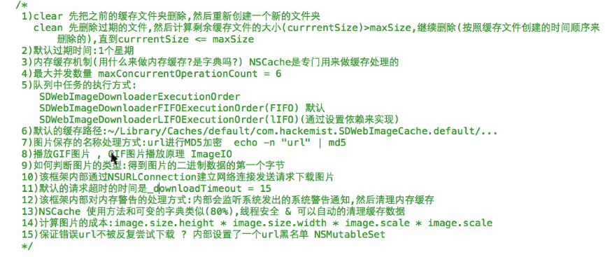
- 内部细节补充
 - 1、如果删除过期文件后当前文件大小还是大于我们设置的最大缓存大小，那么继续删除，按照当前缓存文件的时候先后顺序删除，最早缓存的先删除，直到当前缓存文件大小小于我们设置的最大缓存大小
   - 接收到系统级内存警告时如何处理(面试)<br>
    //（1）取消当前正在进行的所有下载操作
    [[SDWebImageManager sharedManager] cancelAll];<br>
    //（2）清除缓存数据<br>
     [[SDWebImageManager sharedManager].imageCache clearMemory];
 - 3、

```objc
NSCache是苹果官方提供的缓存类，具体使用和NSMutableDictionary类似，在AFN和SDWebImage框架中被使用来管理缓存
    2）苹果官方解释NSCache在系统内存很低时，会自动释放对象，自动清理缓存数据（但模拟器演示不会释放）
        建议：接收到内存警告时主动调用removeAllObject方法释放对象
    3）NSCache是线程安全的，在多线程操作中，不需要对NSCache加锁
    4）NSCache的Key只是对对象进行Strong引用，不是拷贝，在清理的时候计算的是实际大小而不是引用的大小
```
---
```objc
-(NSCache *)cache
{
    if (_cache == nil) {
        _cache = [[NSCache alloc]init];
        //totalCostLimit 缓存空间的最大总成本,默认是0，表示没有成本限制
       // _cache.totalCostLimit = 10;
    //在存数据的时候.如果发现当前计算得到的成本超过总成本,那么会自动开启一个回收过程,把之前的数据删除
    //[self.cache setObject:data forKey:@(i) cost:2];设置每一个data的成本是2，假如最大成本设置10
        //也就是最多存5个data，多的会自动开启回收过程，调用-(void)cache:(NSCache *)cache willEvictObject:(id)obj方法
        _cache.delegate = self;
        //如果totalCostLimit和countLimit同时设定了，那么会取最小的值进行核对
        //能够缓存的对象的最大数量。默认值为0，表示没有限制
        _cache.countLimit = 8;

    }
    return _cache;
}
```

- 7 、
 - sdwebimage缓存的文件名为什么需要加密呢，因为是为了保证文件名不一样，因为在同一个文件夹里面相同名字的文件会被覆盖
---
 - 8、
```objc
播放gif图片
    （1）播放GiF图片部分过程解析
        a.把用户传入的gif图片->NSData
        b.根据该Data创建一个图片数据源（NSData->CFImageSourceRef）
        c.计算该数据源中一共有多少帧，把每一帧数据取出来放到图片数组中
        d.根据得到的数组+计算的动画时间-》可动画的image
        e.[UIImage animatedImageWithImages:images duration:duration];
    （2）如何使用
        -(void)gif
        {
            //self.imageView.image = [UIImage imageNamed:@"123"];  不可用
            UIImage *image = [UIImage sd_animatedGIFNamed:@"123"];
            self.imageView.image = image;
        }
```
 - 12、
 //监听到UIApplicationDidReceiveMemoryWarningNotification（应用程序发生内存警告）通知后，调用removeAllObjects方法
        [[NSNotificationCenter defaultCenter] addObserver:self selector:@selector(removeAllObjects) name:UIApplicationDidReceiveMemoryWarningNotification object:nil];

 - 15、

```objc
BOOL isFailedUrl = NO;  //初始化设定该URL是正确的

    //加互斥锁，检索请求图片的URL是否在曾下载失败的集合中（URL黑名单）
    @synchronized (self.failedURLs) {
        isFailedUrl = [self.failedURLs containsObject:url];
    }

    //如果url不正确或者 选择的下载策略不是『下载失败尝试重新下载』且该URL存在于黑名单中，那么直接返回，回调任务完成block块，传递错误信息
    if (url.absoluteString.length == 0 || (!(options & SDWebImageRetryFailed) && isFailedUrl)) {


else if (error) { //如果下载失败，则处理结束的回调，在合适的情况下把对应图片的URL添加到黑名单中
 @synchronized (self.failedURLs) {
                            [self.failedURLs addObject:url];
                        }

 else {//下载成功
                    //先判断当前的下载策略是否是SDWebImageRetryFailed，如果是那么把该URL从黑名单中删除
                    if ((options & SDWebImageRetryFailed)) {
                        @synchronized (self.failedURLs) {
                            [self.failedURLs removeObject:url];
                        }
                    }

```
---

###RunLoop
- 它的底层相当于一个死循环一直不死一直运行
 - 节省系统资源，该做事的时候做事该休息的时候休息
 - 保证程序一直运行
 - 处理app中的各种事件


- 每一个线程都有唯一的一个与之对应的Runloop
 - 主线程的Runloop已经默认创建好了，子线程的需要我们自己手动创建
   - 创建方式 直接通过currentRunLoop获取即可，它本身实质是懒加载的
   - 开启  run
- Runloop在第一次获取时创建，在线程结束时销毁
- Runloop是使用字典存储的，key就是线程，一个线程对应一个runloop

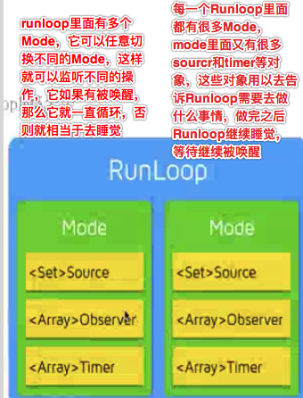
- 每次runloop启动时，只能指定一个mode，mode里面至少要有一个source或者一个timer，它俩就相当于是事件，光有监听者是没有用的，否则程序一跑起来就退出了，被称作currentMode
 - 如果需要切换mode，那么只可以退出当前loop，再重新指定一个mode进入
 - 这样做主要是为了分隔开不同组的source、timer、Observer,让其互不影响
---
- 正常的规则是将定时器添加到什么模式下，它就在什么模式下有效
- 在主线程中操作定时器，因为主线程的操作默认都是在主运行循环中执行，主运行循环默认的模式是默认模式，这个时候如果处于拖拽模式就不会工作了
- 定时器设置为通用模式后，里面包括了2个模式，普通和拖拽
 - 但是这个并不违背每一个runloop只可以同时指定一个Mode，因为它默认是相当于把定时器分别添加到了普通和拖拽模式下，这样无论是切换到普通还是拖拽，定时器都可以运作
 - 常用的那种定时器创建方式(调度那种)，系统默认是已经将其添加到默认模式了，如果我们想让他无论是拖拽还是默认都起作用还需要将定时器添加到拖拽模式


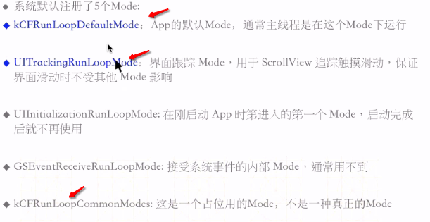

- 给runloop添加监听者只可以使用CF框架
- 最大的好处就是没有事情做就去休眠，节约CPU资源，提高程序性能
- runloop处理逻辑

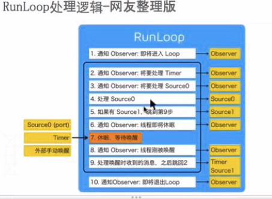


- 常驻线程
 - 子线程默认只可以执行一次任务，执行完毕就死了
 - 如果想让他继续执行，需要使用到常驻线程
 - 除了主线程是默认系统创建的，子线程的runloop需要我们自己创建自己run
 - 必须给子线程的runloop添加定时器或者source事件，不然是没有用的，添加观察者也是没有用的
- source种类：基础端口的，performselector，自定义的事件
- 自动释放池
 - runloop第一次启动的时候创建
 - runloop最后一次退出的时候销毁
 - 其它时候的创建和销毁：当Runloop即将进入休眠状态的时候会把当前的自动释放池释放并创建一个新的，等待被唤醒的时候用，提前创建备用比较好(同时做)

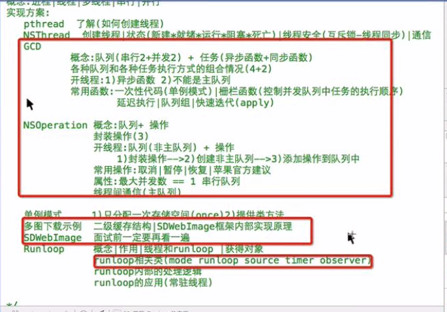
