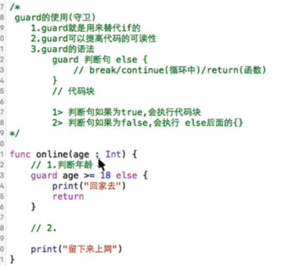

#Swift
```objc
    1、Swift的核心是面向协议的编程。
    面向协议的编程的核心是抽象（abstraction）和简化（simplicity）。
    所以swift的核心就是抽象和简化。
    2、Swift同时具备了编译型语言(OC/C#)的高性能和脚本语言(JS/Python)的灵活交互性
编译型语言：每一行代码都需要没有错误才可以成功运行，性能高，功能比较强大，比如OC开发手机程序，C#开发服务器程序
脚本语言：对一行就可以执行一行代码
   3、Swift可以和C、Objective-C混合使用，相互调用
   4、OC是弱语言，Swift是强语言，它是类型安全语言，不同类型的数据不可以进行运算
   5、Swift中不存在隐式类型转换，所有的类型转换必须是显式的
```
```objc
/*
swift推荐能不写self就不写self，但是在闭包里面必须写上self
创建对象
OC: alloc/intWithXXX
Swift: (XXX:)
调方法：
OC： [UIColor redColor]
Swift:UIcolor.redColor()
枚举：
OC：UIButtonTypeContactAdd
Swift：UIButtonType.ContactAdd
创建结构体：
OC：CGPointMake(x,y)
Swift：CGPoint(x,y)
*/
```
```objc
1、swift2个不需要，不需要编写main函数，从上向下按顺序执行，在最上面的代码就会自动当做程序的入口，不需要在每一句后面加分号，加上也不会错，但是如果同一行出现多个语句的时候中间需要加分号
2、swift里面多行注释可以嵌套多行注释
3、用let声明常量，用var声明变量
        var imageview=UIImageView()
        imageview.image=UIImage(named: "111")
        imageview.backgroundColor=UIColor.redColor()
        imageview.frame=CGRectMake(200, 150, 50, 50)
        self.view .addSubview(imageview)
4、playground：演练操场，能迅速看到该行代码编写完毕后，变量的值，控件的状态
```
```objc
5、字符串不再是NSString类型，它是oc里面的,oc里面继承自NSObject，swift里面是string类型，是一个结构体
let string=“mnnbnj”
  -1、用+做字符串拼接
var str = "Hello, playground" ; let str2="笑了”;var str3=str+str2
  -2、用\和()做字符串的插入
var str = "Hello, playground”；let age=388；var string="\(str)了\(age)次"
在使用\和()中，由于swift是非常注重类型的，属于类型安全语言，2个类型不同的数据是不能相加的，比如这里str和age一个是字符串一个是整形，使用 var string=str+String(age),这里先把整形age强转成字符串，然后再相加就可以了(使用"\(age)”也可以将age转成字符串
  -3、可以使用任意喜欢的字符作为常量和变量的名称，command+control+空格快速弹出emoji键盘
  -4、格式化：var str=String(format: "%02d:%02d:%02d", arguments: [1,12,3])//"01:12:03"
  -5、字符串的截取一：目前建议使用OC里面的字符串截取方法，swift里面的比较麻烦
  var nsStr: NSString = str4 或者 var nsStr = "str4" as NSString
  //2个方式都可以将swift的字符串转成OC的字符串
  var subStr = nsStr.substringWithRange(NSMakeRange(0, 3))
  字符串的截取二：
  -6、字符串遍历
  let nsStr = "caocaoxcao"
   for c in nsStr.characters
     {
       print(c)
     }
   -7/字符串长度
   nsStr.characters.count
```
```objc
6、指定变量常量的数据类型（一般来说没有必要明确指明类型，因为在声明的时候如果赋了初始值，那么swift会自动判断出类型，它有自己的类型推断机制）
let name :String="newyork"
7、swift严格要求变量在使用之前必须初始化，只定义不初始化的话系统也不会给它赋值为0，
 // Swift中定义属性, 必须在构造方法中初始化, 否则就必须加上?
 // 注意: 以下写法代表闭包的返回值可以为nil，也可不为nil
    var finished: ()->()?
 // 注意: 以下写法代表闭包的类型可以为nil，也可不为nil
    var finished: （()->()）?
8、在swift语言中，小数默认类型是Double类型的
9、OC里面typedef int Myint；swift里面typealias Myint=Int
10、溢出运算符
swift为整型计算提供了5个&开头的溢出运算符，可以对超出运算范围的整数进行灵活处理
上溢出&+，下溢出&-，除零溢出&*，&/, &%,比如&+，会在超出最大值后自动循环到0，物极必反的原则
```
```objc
11、范围运算符（“..<”半闭合范围运算符和“…“闭合范围运算符）
a..<b,相当于[a,b),从a到b，包括a，但不包括b；a...b，相当于[a,b]，从a到b，包括a和b
12、swift中“=”赋值运算符是没有返回值的，这样可以防止把“==”写成“=”造成问题，所以
if（x=y）{}这个写法是错误的，if（x==y）{}这个是正确的
12、求余运算 “ % ” 结果的正负跟%左边数值的正负一样，跟之前不一样的是swift支持浮点数求余
13、Bool运算符，在C语言中，0是假，非0就是真，在swift中，没有这个概念，只有true或者false，需要注意的是if判断的值必须是Bool类型的值，还有需要注意的是三木运算符的条件必须是bool类型的值
14、元组
元组类型是由N个任意类型的数据（元素）组成的
可以通过下标获取到对应的元素,并且直接使用元素的属性,比如字符串的个数,而数组和字典不强转是不可以的
let position=(x:10,y:15), position元组里面有x和y2个元素
访问：position.x，position.y===position.0，position.1
还可以简单定义：var point=(10,15)，访问需要使用下标访问
还可以明确指定元素类型：var person:(Int,String)=(10,"jack”)，但是在明确指定元素类型的情况下，如果再给元素命名，那不可以通过名称访问元素，只可以通过下标
var person:(Int,String)=(age:10,name:"jack")
访问 person.0；person.1
还可以使用多个变量接收元组数据：var (x,y)=(10,15)    var point=(x,y)
还可以将元组里面的元素分别赋值给多个变量：var point=(10,15)    var(x,y)=point
还可以使用下划线_忽略某个元素的值，取出其他元素的值:
var point=(10,15)      var(_,height)=point      height
```
/*
```
15:在for-in循环结构中，for i in 0..<5代表从0开始循环，循环到4为止，需要注意的是如果循环中没有使用到常量”i“的话，可以使用下划线_进行忽略，节约内存，for _ in 0..<5
16:switch,在c语言的switch结构中，switch的条件里面只可以放int类型的数据，不可以放其他类型的，但是在swift中，switch的条件里面可以放任何东西，而且每一个case语句后面不需要使用break，执行完case后面的代码后会自动退出switch
switch使用注意：每一个case语句后必须有可以执行的代码；switch后面的条件不需要使用（）；一个case后面可以填写多个匹配条件，条件之间使用”，“隔开,而c语言里面一个case只可以匹配一个条件 ,而且case里面条件还可以使用范围匹配  ，而且switch语句里面需要处理所有情况，所以一般情况下default语句不可以省略，但是如果所有情况都考虑到了，可以省去default
var age=70                        var age=70
switch age/10{                    switch age{
case 9,10:print("优秀")            case 90...100:print("优秀")
case 6,7,8:print("及格")           case 60...89:print("及格")
default:print("不及格”)}            default:print("不及格")}
而且， case还可以用来匹配元组,判断一个点在不在一个坐标范围内
let point=(1,1)
switch point{
case (0,0):print("原点")
case(_,0):print("x")
case(0,_):print("y")
case(-2...2,-2...2):print("在")
default:print("哪都不在")}
```
```objc
而且，在case匹配的同时，可以将switch中的值(2)绑定给一个特定的常量或者变量(x)，以便在case后面的语句(  print("x,x=\(x)"  )中使用
let point=(2,0)
switch point{
case (let x,0):print("x,x=\(x)")
case (0,let y):print("y,y=\(y)")
case(let x,let y):print("(x=\(x),y=\(y))")
}
而且，switch语句可以使用where来增加判断的条件，case条件和where中间使用空格隔开
var point=(10,10)
switch point{
case (let x,let y) where x==y:print("在右邪")
case (let x,let y) where x == -y:print("在左邪")
default:print("都不在")}
而且，fallthrough作用：执行完当前case后，会接着执行fallthrough后面的case或者default语句句后,注意fallthrough语句后面的case里面不能定义常量或者变量。最终输出（在左邪 都不在）
var point=(-10,10)
var string=""
switch point{
case (var x,var y) where x==y: string+="在右邪"
case (var x,var y) where x == -y: print("在左邪");print(string)
     fallthrough
default:print("都不在")}
```
```objc
17：标签
使用标签的其中一个作用就是明确指定跳出哪一层循环
 for _ in 0...2{                  out:
  out:                                for _ in 0...2{
    for _ in 0...1{					    for _ in 0...1{
    print("做俯卧撑")                    print("做俯卧撑")
       break out                         break out
    }                                                 }
    print("休息一次") }                   print("休息一次")}
使用break out，直接跳出内层循环，            使用break out直接跳出外层循环
结果：做俯卧撑                                结果：做俯卧撑
         休息一次
         做俯卧撑
         休息一次
         做俯卧撑
         休息一次
```
```objc
18：函数
外部参数:在函数外部能看到的参数叫做外部参数
内部参数,在函数内部可以看到的参数叫做内部参数

定义格式：
func sum(num1:Int,num2:Int) ->Int{   没有返回值的话，->后面可以写Void或者（）或者什么也不写
    return num1+num2                 形参列表即使没有形参，也要写()
}
而且，函数还可以返回元组，比如可以通过向函数传入一个ID参数，返回学生的姓名和年龄（name:String,age:Int）
而且，一般情况下通过形参的名字就可以推断出这个参数代表的意思，但是形参是用在函数内部的，当我们在外面调用函数的时候是看不到形参的名字的，可能会导致以后不太明白每一个参数的意思，为了解决这个问题，函数提供了可以使用外部参数名，在调用函数时提醒每个参数的含义
func sum(first_num num1:Int, num2:Int) ->Int{  first_num num1:Int  外部参数名
    return num1+num2                      还可以简写，通过“#”，#num1，既是外部又是内部参数名
}
sum(first_num: 15, num2: 20)
而且，函数还可以使用默认参数值，就是在形参列表里面直接给参数赋值,带有默认参数值的形参，swift会自动生成一个和形参名相同的外部参数名
func sum(num1:Int, num2:Int=30) ->Int{这里由于给形参直接赋值,所以num2:Int=30==#num2:int=30
    return num1+num2                  但是在带有默认参数值得形参前面加一个_,调用的时候就不用写
}                                     func sum(num1:Int, _ num2:Int=30) ->Int{}
sum(15)//45                           调用的时候直接写sum(12,15)即可
sum(15, num2: 50)//60
而且，在swift中，函数的参数列表里面定义的参数都是常量值，不能在函数内部修改，但是有些情况我们又需要在函数里面修改参数的值，这个时候需要在形参列表的参数名称前面加上“var”
```
```objc
19：输入输出参数                      关键字：inout
在C语言里利用指针可以在函数内部修改外部变量的值，但是在swift中，使用输入输出参数来进行修改，作用有点像指针,传递实参时，必须在实参的前面加上&，不能传入常量或者字面值，输入输出参数不能有默认值，输入输出参数不能是可变参数
func change(inout num:Int){   在形参列表的参数名称前面加上inout关键字，这个时候连var都不用写了
   num=10    //num=10
}
var num=20  //num=20
change(&num)//num=10
在交换2个值的函数实现里面，如何在不利用第三方变量的情况下交换2个变量的值
func change(inout num1:Int,inout _ num2:Int){
   num1=num1+num2  //num1相当于总和sum
   num2=num1-num2//相当于总和-以前的num2，结果等于之前num1的值然后把之前num1的赋值给现在的num2
   num1=num1-num2//相当于总和-第二句后的num2的值，结果就是最早的num2的值赋值给现在的num1
}
或者
func change(inout num1:Int,inout _ num2:Int){
   num1=num1^num2  //num1=num1^num2
    num2=num1^num2   //num2=num1^num2 == num1^num2 ^num2=num1
    num1=num1^num2   // num1=num1^num2 == nu1^num2 ^num1=num2
}
而且，输入输出参数的一个使用价值就是可以实现函数的多返回值
func sumAndminxs(num1:Int,_ num2:Int,inout _ sum:Int,inout  _ minxs:Int){
    sum=num1+num2
    minxs=num1-num2
}
var sum=0,minxs=0
sumAndminxs(20,10, &sum ,&minxs)
sum
minxs

参数是指针类型:


```
*/
```objc
20:可选类型
//在swift中,nil也是一种特殊的数据类型
1、一个方法或者数据类型后面有‘？’，就代表返回的是一个可选类型，可选类型代表可以有值，也可以没有值
2、如果直接打印了可选类型，那么打印出来的值会被optional包裹,通过加一个!,可以将包裹的Optional关键字去掉
3、'!'告诉编译器可选类型一定有值，进行强制解析,强制解析是非常危险的,一旦没有值,会崩溃，这个时候编译器会相信我们，编译能够通过,但是如果运行时没有值就会直接崩溃，所以为了安全起见
let url = NSURL(string: "http://www.520it.com/")
let url2 = NSURL(string: "http://www.520it.com/李南江")//url不经过编码解析之前是不支持中文的
// 需要考虑url是否有值
//Swift的用意就是让我们把大部分运行时的错误，在编译时就解决
if url != nil{
    let request = NSURLRequest(URL: url!)//需要加上'!'
}
//但是上述方法比较低级，不太符合Swift编码规范，高级一点的是下面这个方法，**可选绑定**，
// **可选绑定**不需要考虑url是否有值, 能进入{}一定有值
if let url3 = url{
    let request = NSURLRequest(URL: url3)//不需要加'!'
}//含义是会将url中的值取出来赋值给url3，如果url3的值为空，不进入{}，反之可以进入，能够进入说明url3一定有值，那么它就不是可选类型
//系统先判断url是否有值,没有值直接跳过大括号,如果有值,会自动帮我们把url解包,并将解包后的结果赋值给url3
//可以不需要命名一个其他名字,可以把url3也写成url
4/它是泛型集合,必须告诉可选类型中存放的是什么类型的元素
不常见写法  var name Optional<String> =  nil
常见写法 var name : String? = nil 语法糖
```
```objc
21：数组
1、oc：NSArray *array=@["lb","mj"];
swift:var array=["mj","lb"];
2、在Swift开发中数组可以直接存放任意类型，而不像oc一样，只可以存放对象，非对象还需要包装
var arrayM2 = ["lnj", "lmj", 123]
arrayM2.append("456")
3、只有相同类型的数组才可以合并
var arrayM=["lmj","libo"];
这里array和arrayM都是var类型的，而且里面存放都是字符串类型的对象，所以可以使用‘+’合并，而arrayM和arrayM2虽然都是var类型的但是里面存放的对象类型不一样，所以不可以合并
4、 删除并保留容量
arrayM.removeAtIndex(1)//使用这种方式删除会将删除的元素返回
var arrayM=["lmj","libo"];
arrayM.removeAll(keepCapacity: true)//打印 []
arrayM3.capacity      //打印 2
arrayM3.append("1")   //打印["1"]
arrayM3.capacity     //打印 2
arrayM3.append("2")  // ["1","2"]
arrayM3.capacity     // 2
// 超过容量,容量会直接*2
arrayM3.capacity   // 4
5、 初始化
var arrayM4: [String]//数组里面存放的数据类型都是String类型的
arrayM4 = [String]()
// 数组没有初始化之前不允许做任何操作
arrayM4.append("lnj")
```
```objc
22:字典      -无序的
1、定义字典
//oc中字典@{@"name":libo};
//swift中定义创建字典和创建数组一样，都使用[]
// 最常见的字典类型格式
1.1/var dict = [String : NSObject]()
1.2/var dict = ["name":"lnj", "age": 30]
2、获取value，和oc一样
dict["name"]
3、 遍历字典
//OC
for key in dict.keys
{
  print("\(key)= \(dict[key]!)")
}
//Swift中 k,v 可以随便写, 前面是key后面是value
//利用元组类型遍历字典
for (k, v) in dict{//会自动把字典中的key赋值给元组中的k，把字典中的value赋值给元组中的v
   print(k)
   print(v)
}
4、添加元素/修改元素
var dict = ["name":"lnj", "age": 30]
dict["score"]=99//原字典中如果key不存在就会新增
dict//["score": 99, "age": 30, "name":"lnj"]
dict.updateValue("lnj",forkey:"name")
5、合并字典，不可以使用'+',原理和添加元素一样
var dict = ["name":"lnj", "age": 30]
var dict2 = ["type": "dog"]
for (k, v) in dict2{//把dict2中的key和value分别赋值给k和v
   dict[k] = v //实质就是看看dict字典中有没有dict["type"]="dog"，没有的话直接添加进dict
}
需要注意的是字典合并也是看类型的，比如dict字典里面之前有2种类型的数据"name":"lnj"（String）和"age": 30（Int），
dict2字典里面只有一种类型的数据"type": "dog"（String），少进多里面，如果2个字典里面类型完全一样，那么谁进谁都无所谓
6、初始化
var dict3: [String: NSObject]//字典里面存放的数据类型都是"字符串：对象"类型的
dict3 = [String: NSObject]()
dict3["name"] = "lnj"

```
```objc
23：闭包
 --1.概念：闭包类似于block,block是C语言的,类似于匿名函数,闭包是定义函数的,Swift中函数就是一种特殊的闭包,闭包的使用和block一样,用于保存一段代码,用作回调, 用作执行耗时操作(和block一样当作函数的返回值，在函数内部被调用，然后回调)
 --2、基本格式
 {
   (形参)->(返回值) in  //in的含义是区分形参/返回值和执行代码
   //需要执行的代码
 }
 3、简写格式
  /*
       闭包简写:
       1.如果没有参数, 没有返回值, in和in之前的东西可以省略
       2.如果闭包是函数的最后一个参数, 可以写在()后面  -- 尾随闭包
       3.如果只有一个闭包参数, 那么()也可以省略  -- 尾随闭包
 */
4、闭包可以作为函数形参
5、闭包中的循环引用
weak var weakSelf=self
```
```objc
24：析构函数（deinit）
相当于oc中的dealloc
```
```objc
25:懒加载
1、 //Swift中的懒加载会在第一个访问的时候执行
    // 懒加载其实就是一个提前准备好的的闭包
2、格式：
lazy var dataList: [String] = {
        ()->[String】 in//如果闭包是用于懒加载，那么这句话可以删除
        print("我懒加载了")
        return ["lnj", "lmj", "why"]
    }()
```

```objc
26:getter/setter
setter：
var title:String? {000
        // 把传进来的值赋值给title之后调用, 用于替换OC中setter方法更新UI
        didSet{
           title ="欢迎回来"
        }
    }
getter:
 var age:Int{
        // 如果只重写了get,没有set. 那么属性是一个"计算型"属性
        // 计算型属性因为只返回一个值所以不占用存储空间, 相当于OC中的readOnly
        //因为是只读的，所以肯定有值，所以？可以不写
        get{
            return 30
        }
    }

```
```objc
27:构造方法
1、Swift中定义属性, 必须在构造方法中初始化, 否则就必须加上?，不可以什么都不做
如果要初始化必须要重写init方法, 只要重写了init方法就不用加?号了，
如果是自定义构造方法，重写父类的，那么会有2个构造方法，不重写父类的那么只有自己定义的那个
2、Swift中有重载的概念，即使方法名一样，只要函数的形参或者返回值不一样就可以
3、在Swift中，如果想在构造方法中石油KVC给属性赋值，必须在石油kvc之前调用super.init()为属性分配存储空间
    // 定义 "基本数据类型" 最好赋初始值,直接赋值为0，因为Swift中基本数据类型设置为? , super.init()不会为其分配存储空间，所以利用KVC赋值会报属性找不到错误
     var age: Int = 0//正确
     var age: Int?//错误
    //定义"对象属性",那么后面可以写上"?"，如果属性是一个基本数据类型的，并且是可选的，那么super.init()会为其分配存储空间
    var name: String?
```
```objc
28:命名空间
在Swift中，如果想要使用某一个类，不需要import头文件，因为swift中比oc多了一个命名空间的机制，只要是在同一个命名空间内的资源，都是共享的,默认情况下，项目名称下的都是同一个命名空间，命名空间名称就是项目名称，所以如果是Swift项目要使用第三方框架，建议使用cocoapods，它集成的框架在另一个项目中，那么命名空间就不一样，这样可以避免三方框架中的类型和我们自己的类型冲突
```
29:guard
```objc
guard就是用来替代if的
```



30:类型转化
- is的使用,类似于OC中的isKindOfClass
```objc
let array = ["nl",18]
let m = array[0]
if m is Int{}
```
- as的使用,as?/as!---->将NSObject转成具体的类型
 - 一般是从数组和字典里面取值的时候,取出来的值不确定类型,需要转化类型,一般都是需要2次解包

