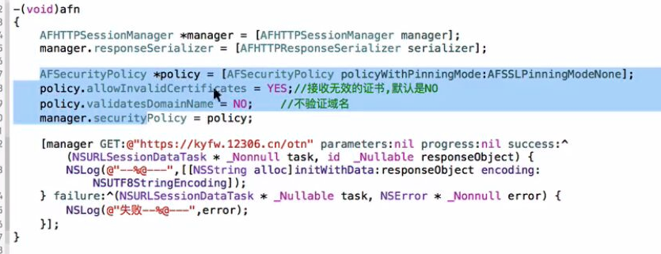

###加密
- 单向散列函数


     性质
     1）对任意长度的消息散列得到散列值是定长的
     2）散列计算速度快，非常高效
     3）消息不同，则散列值一定不同
     4）消息相同，则散列值一定相同
     5）具备单向性，无法逆推计算

     消息认证码特点
     ①消息的发送者和接收者有一个共享密钥
     ②发送者使用共享密钥对消息加密计算得到MAC值（消息认证码）
     ③消息接收者使用共享密钥对消息加密计算得到MAC值
     ④比较两个MAC值是否一致


- 对称加密 AES、DES
      - 对称加密的特点
      加密/解密使用相同的密钥
      是可逆的
      - 密码算法可以分为分组密码和流密码两种
      - 分组密码：每次只能处理特定长度的一zu数据的一类密码算法
      - ECB分组模式、CBC分组模式、AES-ECB、AES-CBC


- 数字签名可以解决中间人攻击的问题

```objc
1.数字签名的应用场景
    答：需要严格验证发送方身份信息情况
2.数字签名原理
    1）客户端处理
        ①对"消息"进行 HASH 得到 "消息摘要"
        ②发送方使用自己的私钥对"消息摘要" 加密(数字签名)
        ③把数字签名附着在"报文"的末尾一起发送给接收方
    2）服务端处理
        ①对"消息" HASH 得到 "报文摘要"
        ②使用公钥对"数字签名" 解密
        ③对结果进行匹配

```

- 使用AFN访问未签名的https网站，需要单独进行设置

