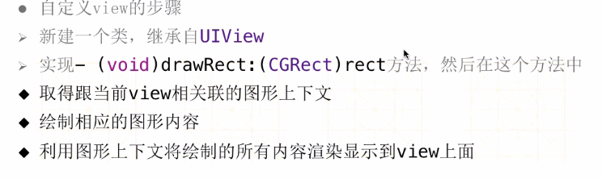

#Animations
```/******************** ** 基本动画**  ********************/```
- **基本动画一般配合控件的hidden、alpha、以及transform属性使用**
         - makeTransform会把之前的形变全部清空再去重新设置新的，多形变结合的时候也会这样的，所以使用这个的时候需要注意
         - Transform是按照就近原则的，旋转的时候如果想反方向旋转，可以给它的旋转角度变小，然后多次执行即可达到效果
   ##### - 头尾式
   ##### - dispatch_after(dispatch_time(DISPATCH_TIME_NOW, (int64_t)(2.0 * NSEC_PER_SEC)), dispatch_get_main_queue(),^{   });

   ##### - UIView animateWithDuration：animations：

   ##### - UIView animateWithDuration: animations: completion:

```objc
//嵌套配合使用比较好
[UIView  animateWithDuration:1.0 animations:^{
        self.mylabel.alpha=1.0;
    } completion:^(BOOL finished) {
        [UIView animateWithDuration:1.0 delay:1.5 options:UIViewAnimationOptionTransitionNone animations:^{
            self.mylabel.alpha=0.0;
        } completion:^(BOOL finished) {
            NSLog(@"----%@",self.mylabel.text);
        }];
    }];
```


```   /********************  核心动画  ********************/```
- position，决定着layer在父控件中的位置，以父控件的左上角为原点
- anchorPoint 锚点(默认(0.5,0.5),范围是(0-1,0-1))，指明了layer自身上的哪一个点和position这个点是重合的
- 每一个UIView内部都会默认关联一个CALayer,我们称其为根层,所有的非根层也就是手动创建的CALyer对象，都存在隐式动画
- 隐式动画：当对非根层layer部分属性进行修改时，默认会产生一些动画效果，被称为隐式动画
- 核心动画的执行过程都是在后头操作的，不会阻塞主线程，是直接作用在layer上的，并不是uiview
- 动画的本质就是修改图层的某些属性
- 坐标系
 - X轴，上下
 - Y轴，左右，
 - Z轴，平面
---
- CABasicAnimation
 - 设置以下2个属性，可保证动画执行后不回退到原位置，但是需要在图层添加动画之前设置这2个属性
   - basic.removedOnCompletion=NO;
   - basic.fillMode=kCAFillModeForwards;

---
- 核心动画和UIView的区别
 - 核心动画的一切都是假象，并不会真正的改变图层的属性值 ，UIView动画需要真实改变属性值才可以产生动画效果
 - 做动画如果不需要与用户交互的话，那么可以使用核实动画
 - uiview继承自uiresponders
CALayer继承自nsobject，没有事件处理功能
 - uikit 只可以使用到iOS开发中，quaztdCore coreGraphics是可以跨平台使用在手机以及电脑系统中的
---
```objc
    // 设置边框
    _imageView.layer.borderWidth = 1;
    _imageView.layer.borderColor = [UIColor whiteColor].CGColor;

    //  创建图层
    CALayer *layer = [CALayer layer];
    layer.backgroundColor = [UIColor redColor].CGColor;
    // 必须设置尺寸,或者bounds
    layer.frame = CGRectMake(50, 50, 100, 100);
    // 设置内容
    layer.contents = (id)[UIImage imageNamed:@"阿狸头像"].CGImage;
    [self.view.layer addSublayer:layer];

    //CABasicAnimation  基本动画
    // 1.创建动画对象
    CABasicAnimation *anim = [CABasicAnimation animation];
    // 2.描述修改layer的属性
    anim.keyPath = keyPath(_imageView.layer, transform);
    // 3.修改layer的值
    anim.toValue = [NSValue valueWithCATransform3D:CATransform3DMakeScale(0.5, 0.5, 1)];
    // 设置动画执行次数
    anim.repeatCount = MAXFLOAT;
    // 4.添加到图层
    [_imageView.layer addAnimation:anim forKey:nil];
该动画还有其他属性
     // 动画时长
    anim.duration = 1;
    // 取消反弹
    // 1.在动画完成的时候不要给我把动画销毁
    anim.removedOnCompletion = NO;
    // 2.动画永远保持最新的状态
    anim.fillMode = kCAFillModeForwards;
```
---
```objc
     // 帧动画
    CAKeyframeAnimation *anim = [CAKeyframeAnimation animation];
    // 描述修改layer的属性,transform.rotation只能二维旋
    anim.keyPath = @"transform.rotation";
    // 修改Layer值
    anim.values = @[@(angle2Radion(-5)),@(angle2Radion(5)),@(angle2Radion(-5))];
    anim.duration = 2;
    // 动画执行次数
    anim.repeatCount = MAXFLOAT;
    [_imageView.layer addAnimation:anim forKey:nil];
该动画还有其他属性
    //比如你要让动画按照某一个路径执行
     // 创建路径
    UIBezierPath *path = [UIBezierPath bezierPathWithArcCenter:_imageView.center radius:100 startAngle:0 endAngle:M_PI * 2 clockwise:YES];
    anim.path = path.CGPath;
    anim.repeatCount = MAXFLOAT;
    anim.duration = 1;
```
---
```objc
转场动画

// 只要切换界面 都可以使用转场动画
// 谁切换界面 就添加到谁上
// 转场动画代码必须和界面切换的代码放在一起
    //界面切换的代码
    // 转场动画
    CATransition *anim = [CATransition animation];
    // 指定转场类型
    anim.type = @"pageCurl";
    // 设置转场的方向
    anim.subtype = kCATransitionFromLeft;
    // 设置动画的进度
    anim.startProgress = 0.5;
    anim.endProgress = 0.8;
    anim.duration = 3;
    [_imageView.layer addAnimation:anim forKey:nil];

**动画也是有代理的，也是可以监听到动画执行完毕的**

动画组
1、可以同时支持多个动画
2、创建组动画，再单独创建子动画，分别再去设置子动画的效果，最后把子动画添加到组动画里面，让图层去执行组动画
```
---
```objc
- (void)setupChildViews {
    UIImageView *bottomImageView = [[UIImageView alloc]init];

    CGFloat w = 250;
    CGFloat h = 250;
    CGFloat x = ([UIScreen mainScreen].bounds.size.width - w) * 0.5;
    CGFloat y = ([UIScreen mainScreen].bounds.size.height - h) * 0.5;

    bottomImageView.frame = CGRectMake(x, y, w, h);

    bottomImageView.image = [UIImage imageNamed:@"qrcode_border"];

    [self.view addSubview:bottomImageView];

    UIImageView *imageView = [[UIImageView alloc]init];

    imageView.image = [UIImage imageNamed:@"qrcode_scanline_barcode"];

    CGFloat imageH = h * 0.5;
    CGFloat imageW = w;

    imageView.frame = CGRectMake(0, 0, imageW, imageH);

    [bottomImageView addSubview:imageView];

    self.imageView = imageView;

    imageView.layer.anchorPoint = CGPointMake(0.5, 0);

    imageView.layer.position = CGPointMake(imageW * 0.5, -imageH);

    bottomImageView.layer.masksToBounds = YES;

}
- (void)startScanCode {
    CABasicAnimation *anim = [CABasicAnimation animation];
    anim.keyPath = @"transform.translation.y";
    anim.toValue =@350;
    anim.repeatCount = MAXFLOAT;
    anim.duration = 1;
    [self.imageView.layer addAnimation:anim forKey:nil];
}


/**
 *  完全显示的时候调用
 */
- (void)viewDidAppear:(BOOL)animated {

    [super viewDidAppear:animated];

    // 开始扫码
    [self startScanCode];

}
```

---
###Quartz2D

- drawrect

     // 只要画的东西,不显示到view就不需要自定义view<br>
    // layer上下文只能在drawRect方法中获取<br>
    //  除了layer上下文,其他上下文(位图上下文)都需要自己手动创建
  - 这个里面获取到的是layer上下文
  - 只有在drawrect方法中才可以获得跟view相关联的上下文
  - drawrect里面的rect是控件的bounds
  - 该方法不能手动调用,只可以系统调用，系统调用才可以创建上下文，这样才可以渲染绘图
  - 只要调用drawrect方法，就会把之前view的画图状态全部清空
---
- 贝塞尔画图步骤
  - 获取上下文     上下文实质是一个内存缓存区
    - UIGraphicsGetCurrentContext()
  - 绘制内容，拼接路径，一个路径中可以保存多条线段
  - 添加路径到上下文
    - cgcontextAddPath
  - （可选）设置绘图状态
    //描边颜色
    - [[UIcolor redcolor]  setStroke]
    -  [[UIcolor redcolor]  set]
    - cgcontextsetlinewidth  线宽(或者path.linWidth)
    - 连接样式  linejoinStyle   ->Round
    - setlinecap  线头圆角
  -  渲染上下文
    - cgcontextStokePath(ctx)

- 保存状态 save
- 恢复状态 restore

- 同一个path可以多次重新申请，一根线对应一个路径，只要绘制的线不连接，最好使用一根线对应一个路径的方法
- stroke  简单的画图形方法
  - closePath
  - fill  -->填充颜色
  - [UIcolor redcolor] setfill  --> 同时设置描边和填充颜色
---
- 画文字
 - drawInPoint ->文字多的话不会换行，默认就是一行
 - drawInRect  ->文字多的话会自动换行

- 画图片
 - drawInPoint ->绘制的内容跟图片内容一样大
 - drawInRect  ->可以把绘制的内容控制到某个内容内
---
- setNeedsDisplay( 重绘)
 - 底层并不会马上调用drawrect，只会给当前控件绑定一个刷新的标识，每次屏幕刷新的时候就会把绑定刷新标识的控件重新绘制刷新一次，就会调用drawrect方法去重绘
---
- CADisplayLink
  - 定时器(一般需要重绘的时候使用这个定时器，不使用NSTimer)
  - 每次屏幕刷新的时候就会调用，屏幕一秒刷新60次
  - 创建，并加入主运行循环
  - 使用这个不会有延迟刷新的效果，会同步刷新 ，它的重绘时间和系统的时间是一致的

 - NSTimer
  - 我们自己制定的时间如果和屏幕刷新的时间不一致的话，那就会出现卡顿延迟的现象
---
- 图片水印
  - 开启一个位图上下文  begin
     - size 上下文的尺寸
     -  opaque 不透明度
     - scale   0  == 不缩放
  - 绘制图片
     - drawAtPoint (cgponitzero) 底层会自动获取位图上下文
  - 绘制文字
  - 从上下文内容中生成一张图片 getimagefrom
  - 关闭位图上下文    endImage
  - 把图片写入到桌面
     - image -> NSData     -> uiimagepng…
     -  writetofile
 注意：jpeg 格式的图片，高清度越低越好 ->0.0001

---
- 图片裁剪
 - 给指定图片进行裁剪，不需要进行图层渲染，只需要画到对应位置即可,可以以需要不需要加载image为区分点
   - 加载image图片
   - 开启位图上下文
   - 设置裁剪区域
     - 描述圆形路径
     - 把圆形路径设置为裁剪区域  [path addClip]
   - 绘制图片
   - 把上下文中的内容生成一张图片
   - 结束上下文
   - 显示到imageView上面
---
- 屏幕截图
 - 屏幕截图或者是指定区域截图都需要进行图层渲染，可以以需要不需要加载image为区分点
   - 开启位图上下文
   - 获取当前的位图上下文
   - 给上下文中填充内容，把控制器view的内容画上去，应该是把控制器view上的图层画到上下文中
   - layer render…
     - 把layer中的内容渲染到上下文中，图层只可以渲染，不可以draw...绘制
  - 从上下文中取出图片  赋值给image view的image
  - 结束上下文
  - 图片转二进制并保存
---
- 指定区域截图
  - 和屏幕截图差不多，但是需要设置裁剪区域
    - 开启位图上下文
    - 设置贝塞尔路径，添加截图区域
    - [path addClip]
    - 获取当前的位图上下文(c语言的)
    - 给上下文填充内容，就是给当前imageview的内容画上去，应该是把imageview上的图层渲染到上下文
    - 取出图片
    - 给imageview赋值
layout
只要父控件的尺寸一确定，就会调用这个方法布局子控件
只要父控件的尺寸一改变，就会调用这个方法布局子控件
