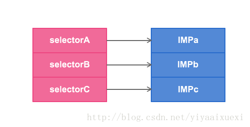
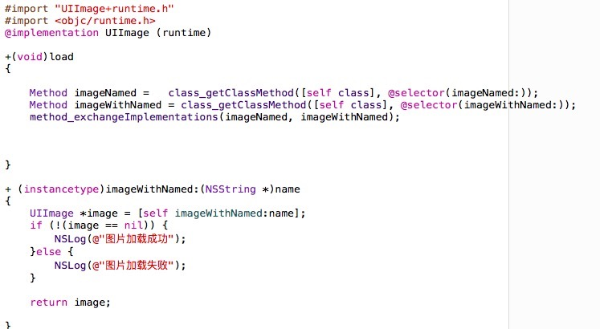
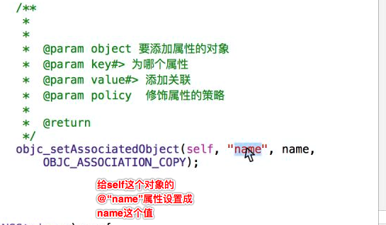

# Runtime
####<发送消息>方法调用的本质，就是让对象发送消息。
   - 查找消息的唯一依据是selector的名字。利用Objective-C的动态特性，可以实现在运行时偷换selector对应的方法实现，达到给方法挂钩的目的
   - 每个类都有一个方法列表，存放着selector的名字和方法实现的映射关系。IMP有点类似函数指针，指向具体的Method实现
   -  objc_msgSend,只有对象才能发送消息，因此以objc开头.
   - 使用消息机制前提，必须导入#import <objc/message.h>,并且在项目配置文件中搜索“msg”，把它设置为NO

    #####消息机制简单使用
   - clang -rewrite-objc main.m 查看最终生成代码
```objc
// 创建person对象
    Person *p = [[Person alloc] init];

    // 调用对象方法
    [p eat];

    // 本质：让对象发送消息
    objc_msgSend(p, @selector(eat));

    // 调用类方法的方式：两种
    // 第一种通过类名调用
    [Person eat];
    // 第二种通过类对象调用
    [[Person class] eat];

    // 用类名调用类方法，底层会自动把类名转换成类对象调用
    // 本质：让类对象发送消息
    objc_msgSend([Person class], @selector(eat));
    //给testBtn按钮设置背景色，一切的代码实质上都在运行时转化为类似的代码
    objc_msgSend(testBtn, @selector(setBackgroundColor:),[UIColor redColor]);
```

####<方法交换>
- 方法交换小结:
 - 个人认为Method Swizzling是OC动态性的最好诠释，深入地去学习并理解其特性，将有助于我们在业务量不断增大的同时还能保持代码的低耦合度，降低维护的工作量和难度
- 方法交换应用场景
 - 公司项目图片名字全部修改了,前面统一多了一个new,修改图片名是不切实际的,最快的办法是写一个新的图片加载方法,然后给图片名参数拼接一个new,然后与imageNamed方法交换
 - 系统的一些方法效果不足以满足我项目当前的需求,我需要写一个方法在里面添加一部分功能,然后与系统的方法进行交换
 - 出于某些需求，我们需要跟踪记录APP中按钮的点击次数
- 系统自带的方法功能不够，给系统自带的方法扩展一些功能，并且保持原有的功能。
 - 方式一:继承系统的类，重写方法.
 - 方式二:(归根结底，都是偷换了selector的IMP)
   - 使用runtime,交换方法,利用 method_exchangeImplementations 来交换2个方法中的IMP,即交换实现
   - 可以利用 class_replaceMethod 来用一个方法的实现替换另一个方法的实现
   - SEL originalSEL = @selector(viewWillAppear:);
   - 通过SEL获取一个方法,
class_getInstanceMethod实例方法或者class_getClassMethod类方法,返回值Method
   - 获取一个方法的实现
method_getImplementation
   - 获取一个OC实现的编码类型
method_getTypeEncoding
   - 給方法添加实现
class_addMethod




```objc
***********************************方法交换完整实现****************************

方法交换应该保证唯一性和原子性
唯一性：应该尽可能在＋load方法中实现，这样可以保证方法一定会调用且不会出现异常。
原子性：使用dispatch_once来执行方法交换，这样可以保证只运行一次。

 static dispatch_once_t onceToken;
    dispatch_once(&onceToken, ^{
        //case1: 替换实例方法
        Class selfClass = [self class];
        //case2: 替换类方法
        Class selfClass = object_getClass([self class]);

        //源方法的SEL和Method
        SEL oriSEL = @selector(viewWillAppear:);
        Method oriMethod = class_getInstanceMethod(selfClass, oriSEL);

        //交换方法的SEL和Method
        SEL cusSEL = @selector(customViewWillApper:);
        Method cusMethod = class_getInstanceMethod(selfClass, cusSEL);

        //先尝试給源方法添加实现，这里是为了避免源方法没有实现的情况
        BOOL addSucc = class_addMethod(selfClass, oriSEL, method_getImplementation(cusMethod), method_getTypeEncoding(cusMethod));
        if (addSucc) {
            //添加成功：将源方法的实现替换到交换方法的实现
            class_replaceMethod(selfClass, cusSEL, method_getImplementation(oriMethod), method_getTypeEncoding(oriMethod));
        }else {
            //添加失败：说明源方法已经有实现，直接将两个方法的实现交换即可
            method_exchangeImplementations(oriMethod, cusMethod);
        }
    });

```

####<动态给一个类添加方法>
- Objective C 中的方法其实就是至少带有两个参数（self 和 _cmd）的普通 C 函数，因此在上面的代码中提供这样一个 C 函数 dynamicMethodIMP，让它来充当对象方法 MissMethod 这个 selector 的动态实现

```objc
void eat(id self,SEL sel)
{
    NSLog(@"%@ %@",self,NSStringFromSelector(sel));
}
// 当一个对象调用未实现的方法，会调用这个方法处理,并且会把对应的方法列表传过来.
// 刚好可以用来判断，未实现的方法是不是我们想要动态添加的方法，是的话添加这个方法就可以了
+ (BOOL)resolveInstanceMethod:(SEL)sel
{

    if (sel == @selector(eat)) {
        // 动态添加eat方法

        // 第一个参数：给哪个类添加方法
        // 第二个参数：添加方法的方法编号
        // 第三个参数：添加方法的函数实现（函数地址）
        // 第四个参数：函数的类型，(返回值+参数类型) v:void @:对象->self :表示SEL->_cmd
        class_addMethod(self, @selector(eat), eat, "v@:");

    }

    return [super resolveInstanceMethod:sel];
}
```
```objc
本例中types参数为"i@:@“，按顺序分别表示：

v      ： v表示返回值为void

@    ：参数id(self)

:       ：SEL(_cmd)对象

@    ：id(str)
```


---

####<给UIButton添加属性>
---例子，比如 文明直播的那个 点击cell，拿到cell显示的电话号码给alertView，然后在alertView的代理方法中拿到这个号码进行拨号
```objc
1、第一步，给UIButton弄一个分类，分类的.h文件
@interface UIButton (Name)
@property (copy, nonatomic) NSString *name;
@end

2、第二步，分类的.m文件
 2.1、先弄一个key，c语言类型的，实质我们要的是地址，这个key是媒介作用，
 通过key把对象和属性绑定起来，然后再通过这个key取对应对象的属性
 static const char *key = "name";
 或者另一种写法
 static const void *key = &name
 2.2、重写新增属性的set，get方法
////get方法
 - (NSString *)name
{
    //self就是给谁动态添加属性
    //key就是相当于一个标识
    return objc_getAssociatedObject(self, key);

}

////set方法
- (void)setName:(NSString *)name{
//name就是动态添加的那个属性，快速写法可以直接把值写到这，但是可读性不高
    objc_setAssociatedObject(self, key, name, OBJC_ASSOCIATION_RETAIN_NONATOMIC);

}


3、第三步，外面直接创建button，直接btn.name就可以操作了

```

---
- 可打印一个控件内部的所有属性，包括私有的
```objc
//通过打印得出pageControl的替换图片属性是~_currentPageImage~
    unsigned int count = 0;
    Ivar *  ivarList = class_copyIvarList([UITextField class], &count);
    for (int i=0; i < count; i++) {
      //Ivar ivar = ivarList(i);
        Ivar ivar = *(ivarList + i);
        NSString *name = [NSString stringWithUTF8String：ivar_getName(ivar];
        LBLog(@"%s",ivar_getName(ivar));
    }
    //重要
    free(ivarList);
```
- 对象的方法就敲 objc_开头，类的方法就是class_开头
- 给一个对象或者属性



###补充
- hook交换方法产生的一些小问题但是，也不影响使用，只能说会方法交换的核心你就能在合适的地方使用它
```objc
它不是线程安全的，非原子嘛，(但是写在+load方法中在一开始就实现交换，95%可以避免安全问题，就跟property一样，我们宁
愿抛弃小部门分的安全，选择大部分性能优化，使用noautomatic。方法交换不要写在initialize中，)，其次  就是改变了原有代码的所有权
(也就是说改变了原始方法的行为
，如果你重写了一个类的方法，而且没有调用父类的这个方法
，这可能会引起问题。大多数情况下，父类方法期望会被调用（至少文档是这样说的）。如果你在swizzling实现中也这样做了
，这会避免大部分问题)，其次
命名冲突，不过也不必过多考虑这个问题。只需要在原始方法命名前做小小的改动来命名就好，就跟 mj的框架或者SD_Webimgae一样，
在前面加上属于自己的签注  mj或者sd 开头就行了
```
