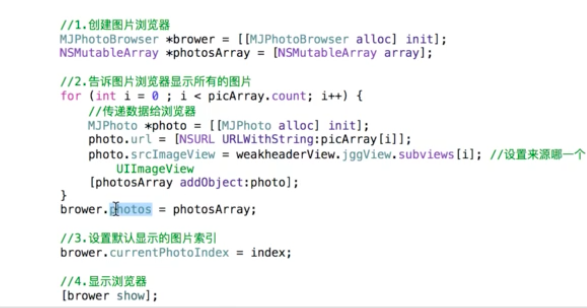
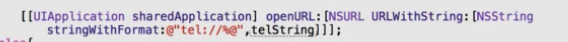

# tips-开发小技巧


      perforSelector  可以调用私有的方法
      NSStringFromClasse可以使用私有的类
      KVC 拿到或者修改私有的属性


##### ********QQ自动回复**********
- 将自动回复快捷消息放入<关键字-快捷消息>字典，key是关键词，value是回复语
- 由于发送的关键词不确定是一个字或者多个字，所以需要遍历依次判断
```objc
-(NSString *)autoReplace:(NSString *)str{
    NSString *str2;//定义一个str2，用来临时存放从文本框依次取出的1、2、3...个字
    //遍历文本框输入的语句
    for (int i=0; i<str.length; i++) {
       str2=[str substringWithRange:NSMakeRange(i, 1)];
       //每得到一次str2就从字典取值，如果可以取成功，就直接返回对应的快捷语
        if (self.autoarray[str2]) {
            return self.autoarray[str2];
        }
    }//文本框里面的字没有和字典里面匹配的，直接返回“哈哈”
    return @"哈哈";
}
```

##### ******计算行数万能公式******
`  (count - 1)/cols + 1 `
##### ******九宫格快速计算******

```objc
       #define COLUMN 8
       #define ROW 3
       #define MARGIN 10
       #define SCREENW [UIScreen mainScreen].bounds.size.width
       #define SCREENH [UIScreen mainScreen].bounds.size.height

        int col=i%COLUMN;
        int row=i/COLUMN;
        CGFloat  btnW=(self.optioView.frame.size.width-(COLUMN+1)*MARGIN)/COLUMN;
        CGFloat  btnH=(self.optioView.frame.size.height-(ROW+1)*MARGIN)/ROW;
        CGFloat btnX=MARGIN + col * (btnW + MARGIN);
        CGFloat btnY=MARGIN + row *(btnH + MARGIN);
        btn.frame=CGRectMake(btnX, btnY, btnW, btnH);

```

##### ******SVProgressHUD和MBProgressHUD的基本用法********
- 以下2种办法前者是转圈时有遮盖阴影，用户无法点击，后者直接转圈用户可以点击后面
 - 设置遮盖类型
   - setDefaultMaskType
 - 直接显示圈圈指示器
   - show
- 隐藏指示器
 - dismiss
- 显示错误信息
 - showErrorWithStatus:@"失败"
- 显示正确信息
 - showSuccessWithStatus:@"成功"
- setDefaultStyle
 - 设置弹框颜色
*************************************
#####******MJPhotoBroswer的使用**

---

##### ******MJExtension.h的使用********
- 简单的字典转模型:

```objc
//(实质上responseObject是个字典，里面的key[@"statuses"]也是一个字典,所以responseObject[@"statuses"]也是字典)
//把responseObject[@"statuses"]这个字典数组,通过objectArrayWithKeyValuesArray这个方法转成LBstatus这个类型的模型。
self.statuses(模型数组)=[LBstatus(模型类) objectArrayWithKeyValuesArray:responseObject[@"statuses"]];
```
- 模型转字典： NSDictionary ＊dict＝［模型对象  keyValues］；

- MJExtension框架特别需要注意的地方：
 - 如果字典里面有id这个key，这样你会想着把你的模型里面的属性也命名为id，但是id属于oc的一个数据类型，所以为了不发生命名冲突的事情，您需要在模型的.m文件中实现replacedKeyFromPropertyName这个方法，在这个方法中添加 return @{@”ID”:@”id”};即可
 - 复杂的字典转模型
   -  人模型里面拥有自己的姓名name，有一个书本数组books，书本模型里面拥有自己的书名name以及价格price，如果一个字典中包含人姓名以及书本数组，书本数组里面包含书本，书本里面包含书名以及价格，
   -  这个时候想使用objectWithKey将字典转成模型之前，必须使用objectClassInArray这个方法说明书本数组里面将来想存放的是什么类型的模型，
   -  也就是想把书本数组按照什么类型转（return @{@”books”:[LBBook class]};）。
   -  这个方法需要在拥有书本数组的类里面实现
 - 如果有属性名称是id，和系统的id冲突了，这个时候我们可以给网络返回的数据里面的id属性直接修改成ID

```objc
        [videoModel mj_setupReplacedKeyFromPropertyName:^NSDictionary *{
            return @{
                     @"ID":@"id"
                     };
        }];

```
#### ******MJRefresh的使用********
#####主要分为上拉加载更多和下拉刷新新的数据
- 下拉加载新的数据--loadNewData
 - MJRefreshNormalHeader
 - MJRefreshGifHeader
 - begin...自动进入刷新状态，
- 上拉加载更多数据--loadMoreData


##### ******解档/归档的使用********
- 自定义的对象需要存入沙盒的话需要使用解档/归档比较好
 - 对象需要遵守NSCoding协议
 - 在对象所在的类，实现-(void)encodeWithCoder:和-(instancetype)initWithCoder:方法，说明对象的哪些属性需要怎样存，以及怎样取
 - 最好提供一个工具类，提供一个保存归档对象的类方法以及一个读取解档对象的类方法，一般开发中都是直接读取数组，数组里面是需要解档归档的对象
   - 保存归档对象的类方法中，使用archive
   - 读取解档对象的类方法中，使用unarchive
   - 注意点：在initWithCoder方法中读取数据后一定要通过self.***保存值，不然返回的self是空的
 - 注意点：通过数组去操作归档解档的对象，那么直接在懒加载中获取这个数组即可，但是需要多一个判断，如果数组首次进来为空，需要创建新的数组

```objc
-(void)encodeWithCoder:(NSCoder *)aCoder{
    [aCoder encodeObject:self.name forKey:@"name"];
}

-(instancetype)initWithCoder:(NSCoder *)aDecoder{
    if (self=[super init]) {
    self.name=[aDecoder decodeObjectForKey:@"name"];
    }
    return self;
}

****快速归档的方法--MJExtension的使用
- 在模型的.m文件写上一句宏
MJCodingImplementation
- 如果我们想一个person模型里面的gay属性不被归档，那么实现以下方法即可
[Person setupIgnoredCodingPropertyNames:^NSArray *{
    return @[@"gay"];
}];
```
---
- //点击就自动设置第0列第0行到textfield上，给textfield写一个分类，只定义setUpText方法，不用谢实现，在每一个子类textfield上实现，然后在控制器.m文件内部的键盘开始编辑代理方法中让父textfield调用分类方法即可
- //父类指针指向子类--多态
- // 父类调用子类方法 ---不是多态
---
- 比如只有2张图片，图片名有规律（name1，name2），想让一个imageView自动切换图片显示的话，可以对2取模再加1
- 数值转弧度
 -
//#define degreesToRadians(x) (M_PI*(x)/180.0) //把角度转换成PI的方式
 - CGFloat angle=(10)/(180.0*M_PI);
---
- 设置随机色
 - CGFloat r = arc4random_uniform(256)/255.0;
---

- LBLog调试

```objc
#ifdef DEBUG
#define LBLog(...)  NSLog(__VA_ARGS__)
#else
#define LBLog(...)
#endif

```
- 截取字符串的时候使用双引号需要转义一下，使用 \"

###NSURLSession
    -(void)viewDidDisappear:(BOOL)animated
    {
    [super viewDidDisappear:animated];
    [self.session invalidateAndCancel]; //释放代理对象
    }

####获得文件的MIMEType
    - 对着该文件发请求,可以得到响应头信息(MIMEtype)
    - 调用C语言的API
    - 百度
    - 通用的二进制数据类型  任意的二进制数据 application/octet-stream


###AFN
- 上传图片

```objc
/*
     第一个参数:请求路径(NSString)
     第二个参数:非文件参数
     第三个参数:constructingBodyWithBlock 拼接数据(告诉AFN要上传的数据是哪些)
     第四个参数:progress 进度回调
     第五个参数:success 成功回调
        responseObject:响应体
     第六个参数:failure 失败的回调
     */
    [manager POST:@"http://120.25.226.186:32812/upload" parameters:nil constructingBodyWithBlock:^(id<AFMultipartFormData>  _Nonnull formData) {

        NSData *data = [NSData dataWithContentsOfFile:@"/Users/apple/Desktop/Snip20160409_148.png"];
        //拼接数据
        /*
         第一个参数:文件参数 (二进制数据)
         第二个参数:参数名~file
         第三个参数:该文件上传到服务器以什么名称来保存
         第四个参数:
         */
        [formData appendPartWithFileData:data name:@"file" fileName:@"123.png" mimeType:@"image/png"];

    } progress:^(NSProgress * _Nonnull uploadProgress) {
        NSLog(@"%f",1.0 * uploadProgress.completedUnitCount / uploadProgress.totalUnitCount);

    } success:^(NSURLSessionDataTask * _Nonnull task, id  _Nullable responseObject) {
        NSLog(@"success--%@",responseObject);
    } failure:^(NSURLSessionDataTask * _Nullable task, NSError * _Nonnull error) {
        NSLog(@"failure -- %@",error);
    }];

```
- 下载

```objc
[[manager downloadTaskWithRequest:request progress:^(NSProgress * _Nonnull downloadProgress) {

        NSLog(@"%f",1.0 * downloadProgress.completedUnitCount / downloadProgress.totalUnitCount);

    } destination:^NSURL * _Nonnull(NSURL * _Nonnull targetPath, NSURLResponse * _Nonnull response) {

        //拼接文件的全路径
        NSString *fullpath = [[NSSearchPathForDirectoriesInDomains(NSCachesDirectory, NSUserDomainMask, YES) lastObject] stringByAppendingPathComponent:response.suggestedFilename];

        NSLog(@"fullpath == %@",fullpath);
        return [NSURL fileURLWithPath:fullpath];

    } completionHandler:^(NSURLResponse * _Nonnull response, NSURL * _Nullable filePath, NSError * _Nullable error) {

        NSLog(@"%@",filePath);
    }] resume];
```

- 反序列化

```objc
/*
     默认情况:JSON  AFJSONResponseSerializer
     XML:AFXMLParserResponseSerializer
     既不是XML也不是JSON:AFHTTPResponseSerializer
*/

-(void)xml
{
    //1.创建会话管理者
    AFHTTPSessionManager *manager = [AFHTTPSessionManager manager];

    //设置以XML的方式来解析数据
    manager.responseSerializer = [AFXMLParserResponseSerializer serializer];

    NSDictionary *dict = @{@"type":@"XML"};
    //2.发请求
    [manager GET:@"http://120.25.226.186:32812/video" parameters:dict progress:nil success:^(NSURLSessionDataTask * _Nonnull task, id  _Nullable responseObject) {

        NSLog(@"%@--%@",[responseObject class],responseObject);
        //1.创建解析器
        NSXMLParser *parser = (NSXMLParser *)responseObject;

        //2.设置代理
        parser.delegate = self;

        //3.开始解析
        [parser parse];

    } failure:^(NSURLSessionDataTask * _Nullable task, NSError * _Nonnull error) {
        NSLog(@"%@---",error);
    }];
}

#pragma mark NSXMLParserDelegate
-(void)parser:(NSXMLParser *)parser didStartElement:(NSString *)elementName namespaceURI:(NSString *)namespaceURI qualifiedName:(NSString *)qName attributes:(NSDictionary<NSString *,NSString *> *)attributeDict
{                video,dict
    NSLog(@"%@--%@",elementName,attributeDict);
}
```
- 既不是json也不是xml数据,比如是图片

```objc
-(void)httpData
{
    //1.创建会话管理者
    AFHTTPSessionManager *manager = [AFHTTPSessionManager manager];

    //设置不做处理
    manager.responseSerializer = [AFHTTPResponseSerializer serializer];

    //2.发请求
    [manager GET:@"http://120.25.226.186:32812/resources/images/minion_02.png" parameters:nil progress:nil success:^(NSURLSessionDataTask * _Nonnull task, id  _Nullable responseObject) {

        NSLog(@"%@--%@",[responseObject class],responseObject);

        UIImage *image = [UIImage imageWithData:responseObject];
        self.imageview.image = image;

    } failure:^(NSURLSessionDataTask * _Nullable task, NSError * _Nonnull error) {
        NSLog(@"%@---",error);
    }];
}
```
- 监听网络状态

```objc
-(void)networkStatusChangeAFN
{
    //1.获得一个网络状态监听管理者
   AFNetworkReachabilityManager *manager =  [AFNetworkReachabilityManager sharedManager];

    //2.监听状态的改变(当网络状态改变的时候就会调用该block)
    [manager setReachabilityStatusChangeBlock:^(AFNetworkReachabilityStatus status) {

        /*
         AFNetworkReachabilityStatusUnknown          = -1,  未知
         AFNetworkReachabilityStatusNotReachable     = 0,   没有网络
         AFNetworkReachabilityStatusReachableViaWWAN = 1,    3G|4G
         AFNetworkReachabilityStatusReachableViaWiFi = 2,   WIFI
         */
        switch (status) {
            case AFNetworkReachabilityStatusReachableViaWiFi:
                NSLog(@"wifi");
                break;
            case AFNetworkReachabilityStatusReachableViaWWAN:
                NSLog(@"3G|4G");
                break;
            case AFNetworkReachabilityStatusNotReachable:
                NSLog(@"没有网络");
                break;
            case AFNetworkReachabilityStatusUnknown:
                NSLog(@"未知");
                break;

            default:
                break;
        }
    }];

    //3.手动开启 开始监听
    [manager startMonitoring];
}

```
- 苹果自带的也有一个监听网络改变的类，它那个麻烦，本身只支持单次获得网络状态，如果想持续监听是通过注册通知的方式


###UIWebView
- 识别特殊格式的字符串
 - self.webView.dataDetectorTypes = UIDataDetectorTypeAll
- 设置网页自动适应(默认是NO)
 - self.webView.scalesPageToFit = YES;
- 内部已经有前一页、后一页、前一页按钮是否可以点击刷新等方法

###一些数据计算显示技巧
- %02zd : 占据2位，多余的空位用0来填补
- 比如，320秒用 05:20 表示为5分20秒
- 用320/60作为分钟，%02zd
- 用320%60作为秒数，%02zd
- %属于特殊字符，可以使用%%来进行显示就可以了
###按照图片的比例实现等比例缩放
- 比如广告页面、或者点击查看图片详情页面、根据服务器给的图片宽高自己计算一个宽高，一般宽度是屏幕宽度，高度需要交叉相乘再相除
- 服务器.height/服务器.width = 图片等比例处理后的height/屏幕宽度

###UIApplication 功能
- 打电话



- 保存照片

1）方案一

```objc
1、UIImageWriteToSavedPhotosAlbum(self.bigImageView.image, self, @selector(image:didFinishSavingWithError:contextInfo:), nil);
2、- (void)image:(UIImage *)image didFinishSavingWithError:(NSError *)error contextInfo:(void *)contextInfo
{
    if (!error) {
     [SVProgressHUD showSuccessWithStatus:@"保存成功"];
    }else {
     [SVProgressHUD showSuccessWithStatus:@"保存失败"];
    }
}
+++这里需要注意的是第2个方法，这个方法不可以胡写，建议使用苹果推荐的(遇到selector  建议去文档看一下苹果有没有推推荐)
+++当然了，这里我们说的是建议，不一定非用苹果的，我们可以自定义一个方法，但是参数必须要使用这几个固定的参数，所以最好还是用苹果的
```
补充：`关于UIImagePickerController`的图片获取
- UIImagePickerController
 - 一次只可以拿到一张图片
 - 创建一个控制器，设置`sourceType`(相册、照相机)，设置代理
 - 手动将这个照片控制器modal出来即可(前2步需要在点击按钮需要弹出照片选择的方法里面操作即可)
 - 点击一下照片就会自动退出，需要使用代理方法监听拿到相片
 - 看头文件需要遵守2个协议
 - 2个代理方法，
   - `disFinishPicking...`点击图片后就可以拿到图片进行操作了，但是照片控制器需要我们自己`dismiss`
   - `cancel`方法里，实现dismiss方法即可

2）方案二，利用苹果提供的photos框架<br>
1.添加图片到【相机胶卷】<br>
2.拥有一个【自定义相册】<br>
3.将刚才添加到【相机胶卷】的图片，引用（添加）到【自定义相册】

```objc
Photos框架须知
 1.PHAsset : 一个PHAsset对象代表一张图片或者一个视频文件
 1> 负责查询一堆的PHAsset对象

 2.PHAssetCollection : 一个PHAssetCollection对象代表一个相册
 1> 负责查询一堆的PHAssetCollection对象

 3.PHAssetChangeRequest
 1> 负责执行对PHAsset的【增删改】操作
 2> 这个类只能放在-[PHPhotoLibrary performChanges:completionHandler:] 或者 -[PHPhotoLibrary performChangesAndWait:error:]方法的block中使用

 4.PHAssetCollectionChangeRequest
 1> 负责执行对PHAssetCollection的【增删改】操作
 2> 这个类只能放在-[PHPhotoLibrary performChanges:completionHandler:] 或者 -[PHPhotoLibrary performChangesAndWait:error:]方法的block中使用
```
---

```objc
- (IBAction)save {
    //相当于一个标识
    __block NSString *createdAssetId = nil;
    // 添加图片到【相机胶卷】，使用同步方法
    //还有一个异步方法:[[PHPhotoLibrary sharedPhotoLibrary] performChanges
    [[PHPhotoLibrary sharedPhotoLibrary] performChangesAndWait:^{//通过传入一个image对象的方式添加图片
        createdAssetId = [PHAssetChangeRequest creationRequestForAssetFromImage:self.imageView.image].placeholderForCreatedAsset.localIdentifier;
    } error:nil];

    // 在保存完毕后取出这张刚保存的图片
    PHFetchResult<PHAsset *> *createdAssets = [PHAsset fetchAssetsWithLocalIdentifiers:@[createdAssetId] options:nil];

    // 获取软件的名字作为相册的标题
    NSString *title = [NSBundle mainBundle].infoDictionary[(NSString *)kCFBundleNameKey];

    // 已经创建的自定义相册
    PHAssetCollection *createdCollection = nil;

    // 获得所有的自定义相册
    PHFetchResult<PHAssetCollection *> *collections = [PHAssetCollection fetchAssetCollectionsWithType:PHAssetCollectionTypeAlbum subtype:PHAssetCollectionSubtypeAlbumRegular options:nil];
    for (PHAssetCollection *collection in collections) {
        if ([collection.localizedTitle isEqualToString:title]) {
            createdCollection = collection;
            break;
        }
    }

    if (!createdCollection) { // 没有创建过相册
        __block NSString *createdCollectionId = nil;
        // 创建一个新的相册
        [[PHPhotoLibrary sharedPhotoLibrary] performChangesAndWait:^{
            createdCollectionId = [PHAssetCollectionChangeRequest creationRequestForAssetCollectionWithTitle:title].placeholderForCreatedAssetCollection.localIdentifier;
        } error:nil];

        // 创建完毕后再取出相册
        createdCollection = [PHAssetCollection fetchAssetCollectionsWithLocalIdentifiers:@[createdCollectionId] options:nil].firstObject;
    }
   // 如果照片为空或者相册为空
    if (createdAssets == nil || createdCollection == nil) {
        [SVProgressHUD showErrorWithStatus:@"保存失败！"];
        return;
    }

    //能来到这说明保存成功，将刚才添加到【相机胶卷】的图片，引用（添加）到【自定义相册】
    NSError *error = nil;
    [[PHPhotoLibrary sharedPhotoLibrary] performChangesAndWait:^{
        PHAssetCollectionChangeRequest *request = [PHAssetCollectionChangeRequest changeRequestForAssetCollection:createdCollection];
        [request insertAssets:createdAssets atIndexes:[NSIndexSet indexSetWithIndex:0]];
    } error:&error];

    // 保存结果
    if (error) {
        [SVProgressHUD showErrorWithStatus:@"保存失败！"];
         dispatch_after(dispatch_time(DISPATCH_TIME_NOW, (int64_t)(1.0 * NSEC_PER_SEC)), dispatch_get_main_queue(), ^{
            [SVProgressHUD dismiss];
        });
    } else {
        [SVProgressHUD showSuccessWithStatus:@"保存成功！"];
         dispatch_after(dispatch_time(DISPATCH_TIME_NOW, (int64_t)(1.0 * NSEC_PER_SEC)), dispatch_get_main_queue(), ^{
            [SVProgressHUD dismiss];
        });
    }

```
---

对上述方法的一个封装，分为3步

```objc
1)
 取出刚才添加到【相机胶卷】中的图片
 - (PHFetchResult<PHAsset *> *)createdAssets
{
    __block NSString *createdAssetId = nil;

    // 添加图片到【相机胶卷】
    [[PHPhotoLibrary sharedPhotoLibrary] performChangesAndWait:^{
        createdAssetId = [PHAssetChangeRequest creationRequestForAssetFromImage:self.bigImageView.image].placeholderForCreatedAsset.localIdentifier;
    } error:nil];

    if (createdAssetId == nil) return nil;

    // 在保存完毕后取出图片
    return [PHAsset fetchAssetsWithLocalIdentifiers:@[createdAssetId] options:nil];
}
2）获得【自定义相册】
- (PHAssetCollection *)createdCollection
{
    // 获取软件的名字作为相册的标题
    NSString *title = [NSBundle mainBundle].infoDictionary[(NSString *)kCFBundleNameKey];

    // 获得所有的自定义相册
    PHFetchResult<PHAssetCollection *> *collections = [PHAssetCollection fetchAssetCollectionsWithType:PHAssetCollectionTypeAlbum subtype:PHAssetCollectionSubtypeAlbumRegular options:nil];
    for (PHAssetCollection *collection in collections) {
        if ([collection.localizedTitle isEqualToString:title]) {
            return collection;
        }
    }

    // 代码执行到这里，说明还没有自定义相册

    __block NSString *createdCollectionId = nil;

    // 创建一个新的相册
    [[PHPhotoLibrary sharedPhotoLibrary] performChangesAndWait:^{
        createdCollectionId = [PHAssetCollectionChangeRequest creationRequestForAssetCollectionWithTitle:title].placeholderForCreatedAssetCollection.localIdentifier;
    } error:nil];

    if (createdCollectionId == nil) return nil;

    // 创建完毕后再取出相册
    return [PHAssetCollection fetchAssetCollectionsWithLocalIdentifiers:@[createdCollectionId] options:nil].firstObject;
}
3）保存图片到相册
- (void)saveImageIntoAlbum
{
    // 获得相片
    PHFetchResult<PHAsset *> *createdAssets = self.createdAssets;

    // 获得相册
    PHAssetCollection *createdCollection = self.createdCollection;

    if (createdAssets == nil || createdCollection == nil) {
        [SVProgressHUD showErrorWithStatus:@"保存失败！"];
        return;
    }

    // 将相片添加到相册
    NSError *error = nil;
    [[PHPhotoLibrary sharedPhotoLibrary] performChangesAndWait:^{
        PHAssetCollectionChangeRequest *request = [PHAssetCollectionChangeRequest changeRequestForAssetCollection:createdCollection];
        [request insertAssets:createdAssets atIndexes:[NSIndexSet indexSetWithIndex:0]];
    } error:&error];

    // 保存结果
    if (error) {
        [SVProgressHUD showErrorWithStatus:@"保存失败！"];
        dispatch_after(dispatch_time(DISPATCH_TIME_NOW, (int64_t)(1.0 * NSEC_PER_SEC)), dispatch_get_main_queue(), ^{
            [SVProgressHUD dismiss];
        });
    } else {
        [SVProgressHUD showSuccessWithStatus:@"保存成功！"];
        dispatch_after(dispatch_time(DISPATCH_TIME_NOW, (int64_t)(1.0 * NSEC_PER_SEC)), dispatch_get_main_queue(), ^{
            [SVProgressHUD dismiss];
        });
    }
}

```
```objc
最后一步，把上述三步综合起来

1）首先需要说明的是：requestAuthorization方法的功能
     1.如果用户还没有做过选择，这个方法就会弹框让用户做出选择
     1> 用户做出选择以后才会回调block

     2.如果用户之前已经做过选择，这个方法就不会再弹框，直接回调block，传递现在的授权状态给block
- （void）save
{
//取出用户之前给该应用访问相册的权限
PHAuthorizationStatus oldStatus = [PHPhotoLibrary authorizationStatus];

    [PHPhotoLibrary requestAuthorization:^(PHAuthorizationStatus status) {
        dispatch_async(dispatch_get_main_queue(), ^{
            switch (status) {
                case PHAuthorizationStatusAuthorized: {
                    //  保存图片到相册
                    [self saveImageIntoAlbum];
                    break;
                }

                case PHAuthorizationStatusDenied: {
                    if (oldStatus == PHAuthorizationStatusNotDetermined) return;

                    XMGLog(@"提醒用户打开相册的访问开关")
                    break;
                }

                case PHAuthorizationStatusRestricted: {
                    [SVProgressHUD showErrorWithStatus:@"因系统原因，无法访问相册！"];
                    break;
                }

                default:
                    break;
            }
        });
    }];
}

知识补充：
// PHAuthorizationStatusNotDetermined
  // 用户还没有对当前App授权过(用户从未点击过Don't Allow或者OK按钮)

// PHAuthorizationStatusRestricted
  // 因为一些系统原因导致无法访问相册（比如家长控制）

// PHAuthorizationStatusDenied
  // 用户已经明显拒绝过当前App访问相片数据（用户已经点击过Don't Allow按钮）

// PHAuthorizationStatusAuthorized
  // 用户已经允许过当前App访问相片数据（用户已经点击过OK按钮）
```
