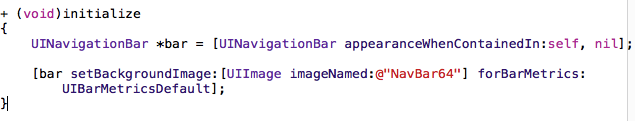

# UINav/UITabBar
- 导航条上面的内容由**栈顶控制器的navigationItem**属性决定
- UINavigationItem有以下属性--控制导航条的内容，**实质是模型**
 - UIBarButtonItem 星backBarButtonItem---默认的左上角返回按钮，**实质也是模型**

 - UIView *titleView---中间标题视图，可以使用任何控件
 - NSString *title---中间的标题文字
 - UIBarButtonItem *leftBarButtonItem---左上角的视图
 - UIBarButtonItem *rightBarButtonItem---右上角的视图
   - 给左右上角视图包装按钮的时候，系统会自动给这个视图设置导航条默认的位置，自己只需要设置尺寸即可；
   - 一般这种情况都使用：sizeToFit
```objc
UIImage *image=[UIImage imageNamed:@"111"];
    [image imageWithRenderingMode:UIImageRenderingModeAlwaysOriginal];
    UIButton *btn=[[UIButton alloc]init];
    self.navigationItem.rightBarButtonItem=[[UIBarButtonItem alloc]initWithCustomView:btn];
    [btn sizeToFit];//关键，让按钮的尺寸和图片的尺寸一样大
    [btn setImage:image forState:UIControlStateNormal];
```


- UINavigationController
 - 导航条上面的标题或者标题视图或者左右UIBarButtonItem都是由当前栈顶控制器的navigationItem决定的
 - 导航控制器需要有一个根控制器，也有一个控制器数组viewControllers，实质是一个栈，里面存放push进来的控制器
 - 导航条高度是44，但是导航条显示高度范围是64，内部有一个专门显示 背景图片的view，它的高度是64，所以今后如果想给导航条设置图片，实质上并不是直接给导航条设置图片，而是给导航条内部的view设置图片
 ----
- 修改导航条的主题
 - UINavigationBar *bar = [UINavigationBar appearance];
   - appearance可以获取当前应用下所有的导航条，然后给bar设置背景图片，那么导航条上面的图片就可以由我们自己控制
   - 但是开发中，我们一般不直接使用appearance，因为它会直接覆盖所有的导航条，但是我们用到系统的一些控制器，比如相册功能的时候我们是不想让导航条变成我们自己设置的样式的
   - 这个时候我们可以使用appearanceWhenContainedIn,它会获取哪个类下面的导航条，我们一般都是在initialize这个类方法中设置背景图片，也就是用我们自定义导航条的类才需要更换背景，而且在这个类方法中设置，只会设置一次，节能


```objc
//设置导航条标题属性(颜色，字体)
     UINavigationBar *bar = [UINavigationBar appearanceWhenContainedIn:self, nil];
     NSMutableDictionary *dic=[NSMutableDictionary dictionary];
     dic[NSForegroundColorAttributeName]=[UIColor whiteColor];
     dic[NSFontAttributeName]=[UIFont systemFontOfSize:14];
     [bar setTitleTextAttributes:dic];
```
---
- UITabBarController
 - 内部有一个ChildViewControllers数组，里面存放当前TabBarController的子控制器
 - 不需要根控制器，只需要将对应的控制器通过addChildViewController添加到UITabBarController即可
 - 如果UITabBarController有4个子控制器，那么UITabBar就会有4个UITabBarButton作为子控件
 - 注意点：UITabBarController的view不是懒加载的，在控制器创建的时候就会加载，而其他的控制器的view是懒加载的
 - 每一个UITabBarButton上面显示的图片文字都是由对应UITabBarItem属性决定的
   - UIViewController *VC=[UIViewController alloc]init];
   - VC.tabBarItem.title=@"首页";
 - 实质title、image、selectedIndex的属性都是UITabBarItem的属性
