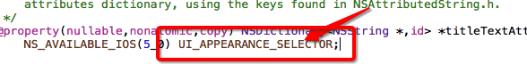

# UINav/UITabBar
- 导航条上面的内容由**栈顶控制器的navigationItem**属性决定
- UINavigationItem有以下属性--控制导航条的内容，**实质是模型**
 - UIBarButtonItem 星backBarButtonItem---默认的左上角返回按钮，**实质也是模型**

 - UIView *titleView---中间标题视图，可以使用任何控件
 - NSString *title---中间的标题文字
 - UIBarButtonItem *leftBarButtonItem---左上角的视图
 - UIBarButtonItem *rightBarButtonItem---右上角的视图
   - 给左右上角视图包装按钮的时候，系统会自动给这个视图设置导航条默认的位置，自己只需要设置尺寸即可；
   - 一般这种情况都使用：sizeToFit
```objc
UIImage *image=[UIImage imageNamed:@"111"];
    [image imageWithRenderingMode:UIImageRenderingModeAlwaysOriginal];
    UIButton *btn=[[UIButton alloc]init];
    self.navigationItem.rightBarButtonItem=[[UIBarButtonItem alloc]initWithCustomView:btn];
    [btn sizeToFit];//关键，让按钮的尺寸和图片的尺寸一样大
    [btn setImage:image forState:UIControlStateNormal];
```


- UINavigationController
 - 导航条上面的标题或者标题视图或者左右UIBarButtonItem都是由当前栈顶控制器的navigationItem决定的
 - 导航控制器需要有一个根控制器，也有一个控制器数组viewControllers，实质是一个栈，里面存放push进来的控制器
 - 导航条高度是44，但是导航条显示高度范围是64，内部有一个专门显示 背景图片的view，它的高度是64，所以今后如果想给导航条设置图片，实质上并不是直接给导航条设置图片，而是给导航条内部的view设置图片
 ----
- 修改导航条的主题
 - UINavigationBar *bar = [UINavigationBar appearance];
   - appearance可以获取当前应用下所有的导航条，然后给bar设置背景图片，那么导航条上面的图片就可以由我们自己控制
   - 但是开发中，我们一般不直接使用appearance，因为它会直接覆盖所有的导航条，但是我们用到系统的一些控制器，比如相册功能的时候我们是不想让导航条变成我们自己设置的样式的
   - 这个时候我们可以使用appearanceWhenContainedIn,它会获取哪个类下面的导航条，我们一般都是在initialize这个类方法中设置背景图片，也就是用我们自定义导航条的类才需要更换背景，而且在这个类方法中设置，只会设置一次，节能


```objc
//设置导航条标题属性(颜色，字体)

     nav.titleColor = ...
     UINavigationBar *bar = [UINavigationBar appearanceWhenContainedIn:self, nil];
     NSMutableDictionary *dic=[NSMutableDictionary dictionary];
     dic[NSForegroundColorAttributeName]=[UIColor whiteColor];
     dic[NSFontAttributeName]=[UIFont systemFontOfSize:14];
     [bar setTitleTextAttributes:dic];

// UIBarButtonItem *item也可以
```
- **拦截-重写导航控制器的push方法**
 - 通过拦截导航控制器的push方法，可以修改全局的导航条上面按钮
 - 可以让首页控制器存在tabbar，其他跳转的子页面全部隐藏tabbar
 - 需要判断是否当前导航控制器数组里面的子控制器个数大于0
   - self.viewControllers.count>0表示当前显示的控制器不是导航控制器的根控制器，这个时候才可以进行我们需要实现的操作
 - 调用super需要在最后调用
---
- **控制器页面的滑动返回功能**
 - 目前有2个方式。一个是投机取巧的，另一个是比较专业的
   - 根据美工提供的返回图片，如果图片效果和系统的差不多，可以先设置导航条的titleColor，然后通过appearanceWhenContainedIn方法拿到系统的UIBarbuttonItem，通过里面的一个setOffset的方法把文字的偏移量设置的很大
   - 系统默认的滑动返回是通过代理管控的，所以我们可以把代理干掉来恢复滑动返回,但是需要通过一些判断决定什么时候恢复什么时候干掉这个代理
     - 声明一个strong的代理来保存系统的管理滑动手势的代理
        - @property (nonatomic, strong) id popDelegate;
     - 在push方法中，判断当为非根控制器的时候干掉代理
       * self.interactivePopGes....delegate=nil;
     - 让导航控制器自己成为自己的代理，然后实现view即将显示的方法，在方法内部判断参数传过来的控制器是否是根控制器，是的话恢复代理

```objc
//遵守代理协议
<UINavigationControllerDelegate,UIGestureRecognizerDelegate>
// 当导航控制器的子控制器完全显示的时候才会调用
//- (void)navigationController:(UINavigationController *)navigationController didShowViewController:(UIViewController *)viewController animated:(BOOL)animated
{
    if (viewController == self.childViewControllers[0]) {
        // 恢复手势代理
        self.interactivePopGestureRecognizer.delegate = _popDelegate;
    }
}

```
---
- **控制器页面的全屏滑动返回功能**

```objc
1、在viewdidload
    // 设置代理,目的监听子控制器有没有完全显示
    self.delegate = self;
    // 为什么会有滑动返回功能,苹果实现,每次触发滑动手势,都会调用苹果某个对象方法
    id ges = self.interactivePopGestureRecognizer;
2、
    // 1.系统的手势类型:UIScreenEdgePanGestureRecognizer,才不能全屏滑动
    // 2.target:_UINavigationInteractiveTransition
    // 3.action:(滑动返回功能)handleNavigationTransition:
    //NSLog(@"%@",self.interactivePopGestureRecognizer.delegate);
    //NSArray *targets = [self.interactivePopGestureRecognizer valueForKeyPath:@"_targets"];
    // 禁止使用系统自带的手势
    self.interactivePopGestureRecognizer.enabled = NO;
    // 自己创建一个全屏手势,调用系统的滑动返回功能
    UIPanGestureRecognizer *pan = [[UIPanGestureRecognizer alloc] initWithTarget:self.interactivePopGestureRecognizer.delegate action:@selector(handleNavigationTransition:)];
   pan.delegate = self;

    [self.view addGestureRecognizer:pan];
3、
- (BOOL)gestureRecognizerShouldBegin:(UIGestureRecognizer *)gestureRecognizer
{
    // 如果是根控制器,就触发手势

    return self.childViewControllers.count != 1;
}
/*
  <UIScreenEdgePanGestureRecognizer: 0x7fbff3f49190; state = Possible; delaysTouchesBegan = YES; view = <UILayoutContainerView 0x7fbff3f3af60>; target= <(action=handleNavigationTransition:, target=<_UINavigationInteractiveTransition 0x7fbff3f489d0>)>>
 */

```

---


##UITabBarController
 -tabbar这个条子的高度是49，不是44
 - 内部有一个ChildViewControllers数组，里面存放当前TabBarController的子控制器
 - 不需要根控制器，只需要将对应的控制器通过addChildViewController添加到UITabBarController即可
 - 如果UITabBarController有4个子控制器，那么UITabBar就会有4个UITabBarButton作为子控件
 - 注意点：UITabBarController的view不是懒加载的，在控制器创建的时候就会加载，而其他的控制器的view是懒加载的
 - 每一个UITabBarButton上面显示的图片文字都是由对应UITabBarItem属性决定的
   - UIViewController *VC=[UIViewController alloc]init];
   - VC.tabBarItem.title=@"首页";
 - 实质title、image、selectedIndex的属性都是UITabBarItem的属性

- 只要有显示这个的方法，都是可以统一设置皮肤的

