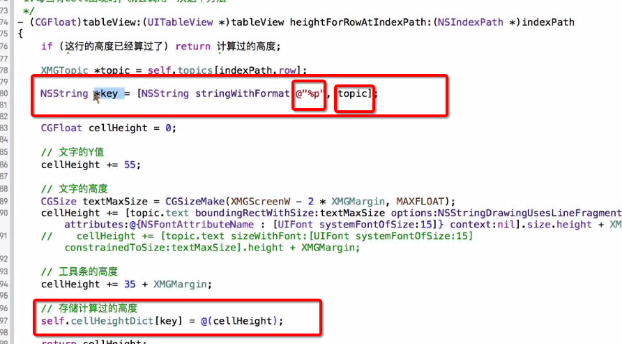
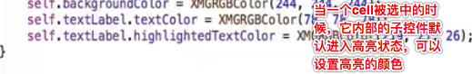
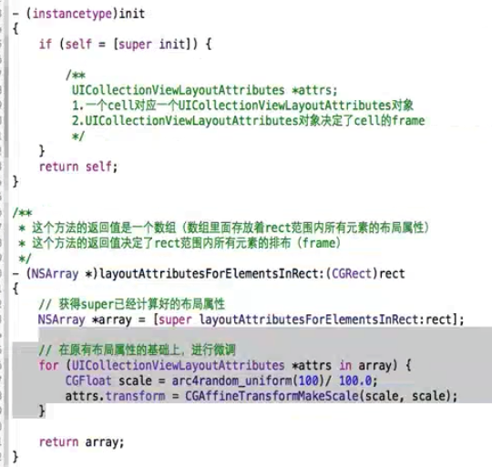

##UIScrollView
- **frame**：以父控件内容的左上角为左边原点(严谨)，看下自己的矩形框在哪
- bounds:以自己内容的左上角为坐标原点，看下自己的矩形框在哪
- scrollsToTop
- contentOffset - 》内容的偏移量<br>
 - scrollView左上角-内容的左上角==屏幕的左上(scrollview的尺寸就是屏幕的尺寸)角-内容的左上角==可视范围的左上角-内容的左上角==frame - contensize
   - 这里(0.0)这个点是相对于内容(contensize)的左上角的，内容之上都是负值，之下都是正值
   - scrollview如果设置内边距的话，它会设置完后立即调用didscroll方法先将其滚动内边距的上下距离
 - 基于scrollView左上角，默认等于CGPointZero，用来设置scrollView的滚动偏移量<br>
    scrollView.contentOffset = CGPointMake(-20, -10);
    
 - 如果有内边距存在的话，实质上内容的尺寸和内边距是分开的，内边距并不会计算在内容范围之内
- contentSize
 - scrollView的可滚动范围大小，内容的尺寸，它包括tabbleview的cell+头部视图+尾部视图
- contentInset -》内容周边的间距
 - 如果给Tableview添加子控件，这个时候还有顶部内边距，那么内边距是和第一个cell挨着的，子控件是和内边距挨着的
 - 默认是UIEdgeInsetsZero，用来设置scrollView的额外滚动区域，这个区域初始情况是不会出现的，但是滚动过程中额外区域一旦出现，就回不去（额外区域无法消失）,而且这个额外区域部分也属于scorllview，但是内边距和内容是不一样的，此时整个scorllview是内容和额外区域的总和,都是scrollview的可视范围，而内容还是之前的内容，比如内容还是图片的大小，有内边距偏移量和内容都不会发生变化
- 如果tabbleview有头部和尾部视图，那么头部和尾部都属于它的内容的一部分，也就是contensize变大了，此时注意偏移量也会改变哦

- 如果给tabbleview添加额外的控件，那么这个控件是会添加到第一个cell的顶部，但是它并不算tabbleview内容的一部分
- bounces
 - 默认为YES，用来设置scrollView的弹簧效果
- pagingEnabled
 - 默认为NO，用来设置scrollView是否开启分页.
- showsHorizontalScrollIndicator
 - 默认为YES，用来设置scrollView是否显示水平滚动条，实际中一般设置为NO.
- showsVerticalScrollIndicator
 - 默认为YES，用来设置scrollView是否显示垂直滚动条,实际中一般设置为NO.
- minimumZoomScale和maximumZoomScale
 - 用来设置scrollView最小和最大缩小比例
- UIScrollView有个keyboardDismissMode属性，设置成UIScrollViewKeyboardDismissModeOnDrag就可以在拖拽ScrollView的时候自动缩起键盘

- 根据偏移量设置导航条淡出效果
- Scrollview设置约束时需要注意
 - 它需要明确自己的contensize，这个取决于自己里面包裹的内容的宽高以及子控件距离它的左右或者上下的距离
 - 里面的子控件设置宽度、高度约束时千万不要相对于scrollview设置，因为scrollview的宽度和高度是松散的，因为这样仅仅是设置scrollview的contensize
 - 而且里面的子控件设置约束时除了正常的约束外，还要明确设置子控件的宽度和高度，这个宽度和高度设置不是说一定需要设置成200这样的固定值，只是说不要相对于scrollview计算，可以相对于其他view计算就行
 - 最后一个子控件的底部要和scrollview有一个间距，这个间距可以是0，这样它才会计算出contensize的高度，同理宽度也是如此
 - contensize宽度和高度只要有一个或者2个控件能够给出它的W和H就行了，其他的控件就不需要再去多余的算这个
 - 打印scrollview的contensize最好在view完全显示的时候打印，这个时候才是最准确的
 - 它的frame值不会改变，之所以它难弄约束就是因为它的contensize和约束有很大关系


- 和微博详情页不一样，红色条子是在scrollview身上添加的情况还需要做到悬浮效果，可以考虑将红色条子随时调整它的父控件，有时候遇到不太好处理的效果，可以考虑是否是假象造成的

```objc
 CGFloat offsetY = scrollView.contentOffset.y;
    NSLog(@"%f",scrollView.contentOffset.y);
    if (offsetY >= imageH) {
        // 将红色控件添加到控制器的view中，设置Y值为0
        CGRect redF = self.redView.frame;
        redF.origin.y = 0;
        self.redView.frame = redF;
        [self.view addSubview:self.redView];
    } else {
        // 将红色控件添加到scrollView中，设置Y值为图片的高度
        CGRect redF = self.redView.frame;
        redF.origin.y = 140;
        self.redView.frame = redF;
        [self.scrollView addSubview:self.redView];
}

```


## UITableView
`松散知识点`
```objc
     1、plain样式顶部标题会停留，滚动过程中会被顶走，group样式不会
     2、每当有一个cell进入我们视野范围内的时候，就会调用
     - (UITableViewCell *)tableView:(UITableView *)tableView cellForRowAtIndexPath:(NSIndexPath *)indexPath
     {}
     3、在UITabelViewcontroller中，self.view==self.tableView
     4、想给cell内部添加子控件，添加到cell.contentView
     5、方法estimatedHeightForRowAtIndexPath，估计高度，减少heightForRow调用频率，延迟计算目前不需要展示cell的高度，需要展示再去计算
     * 返回每一行的估计高度
     * 只要实现了这个方法，就会先返回一个估计高度，那么就会先调用tableView:cellForRowAtIndexPath:方法创建cell，再调用tableView:heightForRowAtIndexPath:方法获取对应行号的 cell的真实高度
     而如果不实现这个方法，那么就会先调用高度的方法，再调用创建cell的方法，但是这样是不好的
     这个值写大写小，会影响一开始heightForRow方法的调用次数，最少次数就是当前需要实际显示的cell的个数
     这个时候我们会想，写的越大，那么它的调用次数越少，这样会越好，其实不然，写的越大，那么tabbleview计算它的contensize的误差就越大，明显效果就是滚动条的高度很奇怪(跳跃性很大)，所以还是根据cell平均值给一个估算高度
       -(CGFloat)tableView:(UITableView *)tableView estimatedHeightForRowAtIndexPath:(NSIndexPath *)indexPath
         {
           return 200;
         }
    所以使用不使用估算高度，可以根据公司需求和要求，如果不使用估算，又想避免计算过的cell不再重复去计算高度，可以做一个判断，已经计算过的cell。直接返回对应高度就可以
     6、cellForRowAtIndexPath这个方法根据传入的indexPath可以获得显示在tableView上的某一行cell
     7、indexPathForSelectedRow
     可以在系统没有传入indexPath的方法或者自定义的方法中，通过该方法获得被选中的cell的indexPath，可以得到section，row
     NSIndexPath *indexPath=[self.tableView indexPathForSelectedRow];
     8、layoutIfNeeded（强制布局）
     告诉控件拿到对应数据之后立即计算自己尺寸和位置明确自己摆放到哪里
     9、代码方式创建自定义cell，无论是自己创建cell还是让系统去注册对应类型的cell，都会调用initWithStyle方法
     //自定义cell和自定义其他控件不一样，自定义cell会调用initWithStyle而不是initWithFrame
     10、
     //告诉Tableview所有cell的真实高度是自动计算的(根据设置的约束自动计算)
     self.myTabelview.rowHeight=UITableViewAutomaticDimension;
     //骗一下它，给他一个估算高度
    self.myTabelview.estimatedRowHeight=44;
     11、//支持编辑模式下多选
    self.mytableView.allowsSelectionDuringEditing=YES;
    //返回的是一个存放选中的多行cell的indexPath的数组
    self.mytableView.indexPathsForSelectedRows
     12、cell的文字以及图片都可以设置高亮状态
        cell.imageView.highlightedImage = [UIImage imageNamed:c.highlighted_icon];
        // 设置label高亮时的文字颜色
        cell.textLabel.highlightedTextColor = [UIColor redColor];
     13、静态cell，可以设置多组，每一组可以自由添加cell，需要注意的是cell的style需要设置为custom
     14、tableView如果是分组样式，默认每一组都会有头部和尾部间距
     如果不想有，或者嫌大，可以对以下2个属性进行调整
     sectionHeaderHeight
     sectionFooterHeight
     经常多配合同时设置tableView的内边距的顶部 去让每一组cell的间距都看起来一样
     15、tabbleview 是会自动计算它的contensize的，只不过你需要实时让tabbleview自动计算它的真是高度
     比如百思项目，我的页面让一个collectionview成为tabbleview的底部视图，而且一开始还给collectionview的高度设置了0
     16、tableview内部是一开始就把所有的cell的fram算好放到一个数组里面，等到cell需要展示的时候从数组里面取出来
     17、就是因为tabbleview不需要我们计算他的contensize，它需要自己计算，所以才会在一开始就把已经存在的cell全部调用heightForRow方法
     17-1）正常情况下，heightForRow方法会会在reloadData后，重新调用全部cell的heightForRow，或者每当有一个cell需要显示也会重新调用
```



- 循环利用知识点
      1、 只要有其他cell设置过imageView.image, 其他不显示图片的cell都需要设置imageView.image = nil
        cell.imageView.image = nil;
        养成良好的习惯
       2、不要直接修改cell上的数据，而是通过修改模型，然后刷新表格去改变cell的数据，有yes就有no，有显示就有隐藏

- cell高亮的时候内部子控件就会进入高亮


- cell的复用创建
 -  dequeueReusableCell方法内部,首先根据ID去缓存池中看有没有可以用的cell,
 -  如果没有,看之前有没有注册过;如果没有注册过,会自动去storyboard中找有没有ID这个标识的cell
 -  如果SB里面也没有的话就需要自己手动创建了
 -  这里需要说明一点就是，复用cell需要标识，自己的事情自己做，最好把标识创建在cell内部，在自定义cell的类里面提供一个返回标识的类方法比较好

- 系统的cell如果使用sd_wedImage下载图片会产生图片尺寸异常问题我们需要自定义一个cell，重写布局方法就行了

```objc
- (void)layoutSubviews {
    [super layoutSubviews];
    self.imageView.frame = CGRectMake(5,5,80,60);
    float limgW =  self.imageView.image.size.width;
    if(limgW > 0) {
        self.textLabel.frame = CGRectMake(90,self.textLabel.frame.origin.y,self.textLabel.frame.size.width,self.textLabel.frame.size.height);
        self.detailTextLabel.frame = CGRectMake(90,self.detailTextLabel.frame.origin.y,self.detailTextLabel.frame.size.width,self.detailTextLabel.frame.size.height);
    }
}

```

```objc
1、根据cell的标识先去缓存池查找标识一样的cell，也就是可循环利用的cell，没有的话自己创建
    - (UITableViewCell *)tableView:(UITableView *)tableView cellForRowAtIndexPath:(NSIndexPath *)indexPath {
         static NSString *ID=@"cell";
         UITableViewCell *cell = [tableView dequeueReusableCellWithIdentifier:ID ];
         if (cell==nil) {
         cell=[[UITableViewCell alloc]initWithStyle:UITableViewCellStyleSubtitle reuseIdentifier:ID];
                        }
         cell.textLabel.text=[NSString stringWithFormat:@"这是第%ld组cell",indexPath.row];
         return cell;
}

2、在view加载完毕的时候注册一个带有指定标识的cell类型，然后在cellForRowAtIndexPath方法中，先去缓存池找有没有可循环利用的cell，找不到就会自动创建之前注册好类型的带有标识的cell返回给你，设置数据
//这种方法创建的如果是系统自带的cell，那么无法自己设置样式
//所以这种创建cell的方式一般用在自定义cell
[self.tableView registerClass:[UITableViewCell class] forCellReuseIdentifier:ID];

- (UITableViewCell *)tableView:(UITableView *)tableView cellForRowAtIndexPath:(NSIndexPath *)indexPath {
    UITableViewCell *cell = [tableView dequeueReusableCellWithIdentifier:ID ];
    cell.textLabel.text=[NSString stringWithFormat:@"这是第%ld组cell",indexPath.row];
    return cell;
}

3、结合stotyboard创建复用cell,首先会去缓存池查找，找不到会去storyboard找看有没有对应标识的cell，有的话就创建这种类型的cell给你，你再赋值
  - (UITableViewCell *)tableView:(UITableView *)tableView cellForRowAtIndexPath:(NSIndexPath *)indexPath {
    UITableViewCell *cell = [tableView dequeueReusableCellWithIdentifier:ID ];
    cell.textLabel.text=[NSString stringWithFormat:@"这是第%ld组cell",indexPath.row];
    return cell;
}
```
- cell的更新、删除、添加

```objc
1、首先对模型进行对应的操作；
2、其次可以使用[self.tableView reloadData]对显示在眼前的整个tableview进行更新，该方法会
重新调用多少行以及每一行显示什么样的cell的的那2个方法；
  或者使用单独的操作，比如：
  //删除cell，可以调用
  deleteRowsAtIndexPaths:@[indexPath] withRowAnimation:UITableViewRowAnimationBottom
  //添加cell,实质就是插入指定位置，可以调用
  [self.tableView insertRowsAtIndexPaths:@[indexPath] withRowAnimation:UITableViewRowAnimationBottom];
  //更新cell，可以调用
  [self.tableView reloadRowsAtIndexPaths:@[indexPath] withRowAnimation:UITableViewRowAnimationBottom];

/**
 * 这个方法决定了编辑模式时，每一行的编辑类型：insert（+按钮）、delete（-按钮）
 */
//- (UITableViewCellEditingStyle)tableView:(UITableView *)tableView editingStyleForRowAtIndexPath:(NSIndexPath *)indexPath
//{
//    return indexPath.row % 2 == 0? UITableViewCellEditingStyleInsert : UITableViewCellEditingStyleDelete;
//}

  ******左滑出现删除按钮******
  /**
 * 只要实现这个方法，左划cell出现删除按钮的功能就有了
 * 用户提交了添加（点击了添加按钮）\删除（点击了删除按钮）操作时会调用
 */

  //删除按钮默认是英文，可以通过一个代理方法返回一个字符串去修改这个文字，或者在项目的工程配置中添加支持简体中文
-(void)tableView:(UITableView *)tableView commitEditingStyle:(UITableViewCellEditingStyle)editingStyle forRowAtIndexPath:(NSIndexPath *)indexPath
{
    NSLog(@"----%ld,%zd",editingStyle,indexPath.row);
    [self.deals removeObjectAtIndex:indexPath.row];
    //[self.tableView reloadData];
    [self.tableView deleteRowsAtIndexPaths:@[indexPath] withRowAnimation:UITableViewRowAnimationBottom];
}

  ******自定义一个编辑按钮，点击出现删除选项******
  //进入编辑模式，带动画
    [self.tableView setEditing:!self.tableView.isEditing animated:YES];
    //不带动画
    self.tableView.editing=!self.tableView.isEditing;
```

```objc
******Tableview自动滚动到指定行******
//点击某个按钮，或者执行某个方法之后，tableview自动滚动到指定行
NSIndexPath *indexpath=[NSIndexPath indexPathForRow:self.marray.count-1 inSection:0];
[self.tableview scrollToRowAtIndexPath:indexpath atScrollPosition:UITableViewScrollPositionBottom animated:YES];
```
- 多行删除实现思路
 - 弄一个数组存放需要删除的模型，再弄一个数组存放需要删除模型的索引
 - 删除的时候先让总的模型数组移除需要删除的模型的那个数组然后再让tableView删除索引数组(deleteRowsAtIndexPaths)
   - 切记删除后需要分别给2个小数组赋值nil，不然后续删除会有问题
 - 弄一个bool值记录cell是否被选中，在celldid方法中实现
    - cell.deal.check=!cell.deal.isCheck;
 - 每次取消选中或者选中后都要刷新下当前点击这一行，已更新是否勾选这个状态
 - 最后判断模型如果是被勾选了
   -  [self.removeArray addObject:deal];
   - [self.removeIndexArray addObject:indexPath];
 - 否则
   -  [self.removeArray removeObject:deal];
   -  [self.removeIndexArray removeObject:indexPath];
 - 最后也千万千万不要忘记在模型的set方法里面去判断什么时候隐藏什么时候显示那个勾选图片，防止循环引用的时候出现的问题
   - if (deal.isCheck==YES) {
        self.myImageView.hidden=NO;
    }else{
        self.myImageView.hidden=YES;
    }


```objc
//设置tableview的分割线没有开头的间距
-(void)viewDidLayoutSubviews
{
    if ([self.tableView respondsToSelector:@selector(setSeparatorInset:)]) {
        [self.tableView setSeparatorInset:UIEdgeInsetsMake(0,0,0,0)];
    }

    if ([self.tableView respondsToSelector:@selector(setLayoutMargins:)]) {
        [self.tableView setLayoutMargins:UIEdgeInsetsMake(0,0,0,0)];
    }
}
-(void)tableView:(UITableView *)tableView willDisplayCell:(UITableViewCell *)cell forRowAtIndexPath:(NSIndexPath *)indexPath
{
    if ([cell respondsToSelector:@selector(setSeparatorInset:)]) {
        [cell setSeparatorInset:UIEdgeInsetsZero];
    }
    if ([cell respondsToSelector:@selector(setLayoutMargins:)]) {
        [cell setLayoutMargins:UIEdgeInsetsZero];
    }
}

```

##UICollectionView
#####自定义继承自系统的流水布局
- prepareLayout
 - 该方法是准备布局，会在cell显示之前调用，可以在该方法中设置布局的一些属性
 - 建议在这个方法中做布局的初始化操作，不建议在init方法中初始化
 - 如果重写了该方法，一定要调用父类的prepareLayout
- 重写 (NSArray *)layoutAttributesForElementsInRect:(CGRect) rect方法
 - 里面存放的都是UICollectionViewLayoutAttributes对象，该对象决定了cell的排布样式
- 重写- (BOOL)shouldInvalidateLayoutForBoundsChange:(CGRect)newBounds
  - 该方法内部重写会按顺序调用另外2个方法
- 重写- (CGPoint)targetContentOffsetForProposedContentOffset:(CGPoint)proposedContentOffset withScrollingVelocity:(CGPoint)velocity
 - proposedContentOffset：原本情况下，collectionview停止滚动时最终的偏移量
 - velocity：滚动速率，里面可以根据x和y判断它是向上向下向右向左滑动


```objc
 // 注册cell、sectionHeader、sectionFooter
    [_collectionView registerClass:[UICollectionViewCell class] forCellWithReuseIdentifier:cellId];
    [_collectionView registerClass:[UICollectionReusableView class] forSupplementaryViewOfKind:UICollectionElementKindSectionHeader withReuseIdentifier:headerId];
    [_collectionView registerClass:[UICollectionReusableView class] forSupplementaryViewOfKind:UICollectionElementKindSectionFooter withReuseIdentifier:footerId];

- (UICollectionReusableView *)collectionView:(UICollectionView *)collectionView viewForSupplementaryElementOfKind:(NSString *)kind atIndexPath:(NSIndexPath *)indexPath
{

    if([kind isEqualToString:UICollectionElementKindSectionHeader])
    {
        UICollectionReusableView *headerView = [_collectionView dequeueReusableSupplementaryViewOfKind:kind withReuseIdentifier:headerId forIndexPath:indexPath];
        //注册过就不需要判断
        if(headerView == nil)
        {
            headerView = [[UICollectionReusableView alloc] init];
        }
        headerView.backgroundColor = [UIColor grayColor];

        return headerView;
    }
    else if([kind isEqualToString:UICollectionElementKindSectionFooter])
    {
        UICollectionReusableView *footerView = [_collectionView dequeueReusableSupplementaryViewOfKind:kind withReuseIdentifier:footerId forIndexPath:indexPath];
        if(footerView == nil)
        {
            footerView = [[UICollectionReusableView alloc] init];
        }
        footerView.backgroundColor = [UIColor lightGrayColor];

        return footerView;
    }

    return nil;
}
}

- (CGSize)collectionView:(UICollectionView *)collectionView layout:(UICollectionViewLayout*)collectionViewLayout referenceSizeForHeaderInSection:(NSInteger)section
{
    return (CGSize){ScreenWidth,44};
}


- (CGSize)collectionView:(UICollectionView *)collectionView layout:(UICollectionViewLayout*)collectionViewLayout referenceSizeForFooterInSection:(NSInteger)section
{
    return (CGSize){ScreenWidth,22};
}
```
- (NSArray *)layoutAttributesForElementsInRect:(CGRect)
 rect

 - 返回在collectionView的可见范围内(bounds)所有item对应的layoutAttrure对象装成的数组
 - collectionView的每个item都对应一个专门的UICollectionViewLayoutAttributes类型的对象来表示该item的一些属性，该对象内部有比如bounds,size,,center,transform,alpha等。
- (UICollectionViewLayoutAttributes )layoutAttributesForItemAtIndexPath:(NSIndexPath )indexPath
 - 传入indexPath，返回该indexPath对应的layoutAtture对象

```objc
//当当前layout的布局发生变动时，是否重新加载该layout，重新刷新布局
- (BOOL)shouldInvalidateLayoutForBoundsChange:(CGRect)newBounds;
//默认返回NO，若返回YES，那么就会重新刷新布局，就会重新执行这俩方法，重新计算cell的大小比例等情况：
1）- (void)prepareLayout;
2）- (NSArray *)layoutAttributesForElementsInRect:(CGRect)rect;


//该方法的返回值，决定了CollectionView停止滚动时的偏移量，里面其中一个参数是原本停止滚动时它的偏移量，但是如果我们给它返回了一个值，那么他会停到我们指定的那个偏移量
- (CGPoint)targetContentOffsetForProposedContentOffset:(CGPoint)proposedContentOffset withScrollingVelocity:(CGPoint)velocity;返回layout“最终”的偏移量，何谓“最终”，手指离开屏幕时layout的偏移量不是最终的，因为它有惯性，当它停止时才是“最终”偏移量。

下面这两个方法一般用于自定义插入删除时的动画，后面再说。

    - (UICollectionViewLayoutAttributes )initialLayoutAttributesForAppearingItemAtIndexPath:(NSIndexPath )itemIndexPath;

    - (nullable UICollectionViewLayoutAttributes )finalLayoutAttributesForDisappearingItemAtIndexPath:(NSIndexPath )itemIndexPath

```



