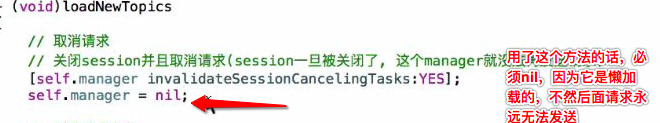
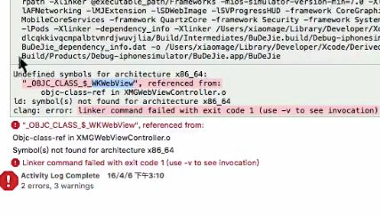
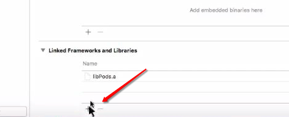
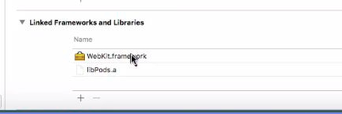
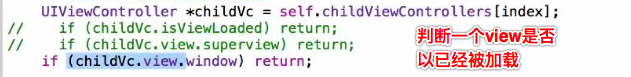
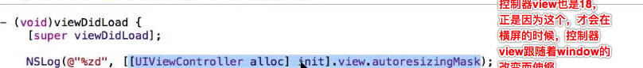

# 项目经验
###百思不得姐
1）场景：每点击一个cell或者按钮就发送一次请求，如果上一次请求的数据还没有回来，这个时候点击了其他cell或者按钮
- 如果用户来回切换页面，为了防止之前的页面请求失败信息提示到用户的新页面，可以声明一个字典属性，用请求参数赋值给字典，在请求成功里面判断self.paras是否等于当前请求的请求里面的paras，如果是相等的那么说明是同一个请求，那么就接收并显示数据，如果不是同一个那么说明请求不是同一个，那么就过滤这个请求
- 针对场景一的补充：
 - 一个页面有上拉和下拉功能，如果上拉还没有请求成功，这个时候用户等不及去下拉，如果服务器请求数据像新浪微博那种是每次请求给定一个时间戳参数的话，那么就没有事，但是如果是像百思这种服务器，需要进行处理，不然会出现比如获取到重复的数据或者获取到的数据少了中间的几条数据的情况
 - #### **处理方式：**
 - 第一种：下拉时先取消上拉，上拉时先取消下拉，并且像上面场景一样，根据参数字典是否一样，来决定是否return
 - 第二种：新版百思推荐的；下拉时先取消上拉，上拉时先取消下拉，同时让请求管理者取消里面所有的task
` [self.manager.tasks makeObjectsPerformSelector:@selector(cancel)];`,这里仅仅是取消请求, 不会关闭session，后面还可以继续使用这个manager发送请求，另外这种方式取消后是会自动来到请求失败的方法，所以如果在请求失败的方法里面写了` [self headerEndRefreshing];`那么其实进入下拉或者上拉一开始就不需要我们再去主动取消下拉或者上拉了，另外这种方式取消的，我们最好就直接返回, 不需要提醒错误信息

        if (error.code == NSURLErrorCancelled) return;


---
2）场景：当请求还没有成功的时候，用户等不及返回了上一个页面，我们需要做的是dismiss弹框提醒，并取消网络请求
- 可以在控制器销毁的时候处理，或者在控制器view消失的时候处理
- [SVNPregress dismiss]
- [[AFHTTPSessionManager manager].operationQueue cancelAllOperations];<br>

或者

 - 让网络请求管理者拿到task，每一个请求都会返回一个task对象，然后取消task([_task cancel])

---
3）Bug，获取到数据但是tabbleview 不显示数据

遇到一个bug，从服务器获取到数据但是tabbleview并没有显示对应cell的内容，检查了cell的创建，标识注册等信息都没有问题，，后来查了好久才发现，自己傻逼了，把从服务器获取的数据和从本地plist获取数据的展示方式弄混淆了，服务器返回的数据是需要在获取成功的block里面先给模型数组赋值(字典转模型)，然后刷新tabbleview，而且这2个步骤也不可以颠倒顺序，而且之前还有一个bug就是，从服务器获取的数据，这个模型数据是不可以进行懒加载的

---
4）装逼技巧，抛出异常
```objc
 NSException *exception = [NSException exceptionWithName:@"fileError" reason:@"please check your filePath!" userInfo:nil];
  [exception raise];
```

---
5）WKWebView/SFSafariController
- `WKWebView `（UIWebview升级版，内部API和UIWebview一样，里面可以监听进度，内部已做好数据缓存，iOS8开始）
 - 导入webkit框架
 - 默认Foundation、UIKit这些框架苹果才会自动导入，像webkit这样的框架需要我们不仅导入头文件还需要自己去给它添加到编译区




- SFSafariController
 -  iOS9开始，在当前应用打开网页，拥有和safari一样的功能，使用它需要导入对应框架<safariServices/safariServices.h>
---
6）containString
- 开发中这个方法用的比较多，判断gif图片之类的都可以用它
`if( [item.url containString@:”http”] ) 如果这个字符串是一个包含http的字符串`
---

7）tintColor  主题颜色
- 这个东西可以设置主题颜色，比如文本框的光标颜色就可以使用这个设置，有的时候可以试试使用这个属性设置颜色看看效果

---
8）viewDidLayoutSubviews
- 给自定义view（xib）设置位置和尺寸的时候可以在viewDidLayoutSubviews里面，这个里面拿到的肯定是最准确的，但是该方法会被调多次，如果使用，需要使用

9）约束冲突
- 之外自动布局约束冲突的时候下面会报一大堆警告，我采取的是设置约束优先级，其实可以尝试把对应冲突控件的autoMask这个属性设为NO

10）设置Tableview分割线方案之一
- 重写set frame方法
- 高度-1，设置Tableview的背景色为分割线颜色，取消系统的分割线

---
11）关于设置圆角失帧的问题
- 用圆角半径设置圆角ios9之前会出现这个问题，ios9之后苹果已经修复
- 可以在sd_webimgae下载完成回调的方法里面给传递的image参数进行绘图设置圆形图片即可

```objc
[self.iconImageView sd_setImageWithURL:[NSURL URLWithString:itemModel.icon] placeholderImage:[UIImage imageNamed:@"setup-head-default"] completed:^(UIImage *image, NSError *error, SDImageCacheType cacheType, NSURL *imageURL) {
        self.iconImageView.image = [UIImage imageWithClipImage:image];
    }];
```
---
12）适配
- 屏幕适配
- 系统适配

13） perforSelector  可以调用私有的方法
- `.h`文件没有声明，但是`.m`文件里面有实现，这个时候可以使用`performSelector`方法去调用

---

14）关于创建控制器的时候设置背景颜色
- 本身控制器的view是懒加载的，但是一般在tabbar里面创建子控制器的时候一旦设置了控制器view的背景颜色，那么它就不懒加了，所以最好把设置控制器view的背景颜色的代码放在对应子控制器里面

---

15）status bar style
 - 只在程序启动的时候有用，启动成功就没有用了，可以在启动动画页面测试
 - 一般我们都是按照系统默认的设置为hidden，启动也不显示这个

---
16）启动图
- 优先级 Lanchscreen > lanchImage
- lanchscreen,xcode6之后才出，本质就是系统产生了一张截图
- lanchImage尺寸可以决定屏幕尺寸

---
17）
- 使用 pop实现炫酷的动画效果
- 使用DOUAudioStreamer实现音频播放
- 使用KRVideoPlayer实现视频缩小,全屏播放,
---
18）目前比较流行的架构，比如百思首页，网易新闻
 - 要么顶部是一个uiview，要么顶部就是个scrollview，底部最好是scrollview
 - 怎么讲底部的scrollview添加进去呢？
   - 首先，首页控制器应该是一个UIViewController，其次应该弄一个scrollview添加进去，这个scrollview里面放的都是条子里面按钮对应的子控制器view
   - 而这个scrollview呢，为了达到上下滚动穿透效果，应该设置它的宽高就是屏幕的尺寸，但是又为了让他内容完整的显示出来，应该设置它的顶部和底部的内边距，把它的内容挤出来，这个内边距要设置在子控制器tabbleview身上
   - 顶部条子里面有几个按钮，就给scrollview弄几个子tabbleview控制器view，子控制要在创建的时候加添加到UIViewController里面，遵循控制器view添加原则
   - 在scrollview动画结束的方法里面监听scrollview的滚动，不过他无法监听scrollview人为拖拽，所以还要在监听减速完毕这个方法里面再去调用动画结束这个方法，索引就根据按钮的tag值，或者按钮在父控件的索引，子控制器view就根据计算的索引从UIViewController的子控制器数组里面取，在动画结束这个方法里面添加子控制的view，这样可以保证控制器view的`懒加载`！！！添加的同时设置frame，不过这2步之前需要先判断这个控制器是否已经被加载，是的话return
   - view的X值就是scrollview的偏移量，就是屏幕的宽度*索引，应该用setContenOffSet方法设置scrollview偏移量
   - 默认显示第一个控制器的view，直接调用监听动画结束的方法就可以了
   - 人为滑动scrollview，这个时候指示器也需要随之滑动，每一个按钮底部的指示器使用的是同一个，最好把这个指示器放到创建按钮后面再去添加，这样可以通过索引(偏移量.x/宽度)拿到对应按钮，索引取值是(0~subViews.count-1)，然后调用按钮点击方法就可以了
   - 实际上任何控制器view的y值默认就是20，高度是667-20，可以去掉这个20，同时重新设置高度为控制器view的高度
   - 为了防止滚动条被遮挡一部分，可以设置tabbleview的scrollindacatoinsets为tabbleview的内边距
   - 如果有导航条，系统会默认给scrollview弄一个顶部64的内边距，但是这个情况只针对scrollview的子控件有效，比如scrollview尺寸就是屏幕的bounds，如果在scrollview的左上角添加一个控件，那么它会自动把这个控件的x向下移动64
   - 实现点击label，label跑到中间，设置偏移量即可，偏移量就等于被点击的label的中间的x值减去屏幕的宽度
   - 不需要滑动的titleScrollview，点击对应按钮或者label，让对应按钮或者labe的文字变色方案
     - 方案三：可以创建一个全局的按钮去记录当前被选中的具有特殊颜色的按钮，一旦点击了其他按钮，首先全局按钮颜色变为普通，其次，被点击按钮颜色变特殊，最后把点击按钮赋值给全局按钮

```objc
 // 控制按钮状态,提前设置按钮状态下的颜色，可以采取自定义按钮
 //方案一，自己创建一个按钮标记选择状态，通过selected控制
    self.selectedTitleButton.selected = NO;
    titleButton.selected = YES;
    self.selectedTitleButton = titleButton;

 //方案二，通过enabled控制
      self.selectedTitleButton.enabled = YES;
      titleButton.enabled = NO;
      self.selectedTitleButton = titleButton;
 //方案三
      [self.selectedTitleButton setTitleColor:[UIColor darkGrayColor] forState:UIControlStateNormal];
      [titleButton setTitleColor:[UIColor redColor] forState:UIControlStateNormal];
      self.selectedTitleButton = titleButton;

```

 - 需要滑动的scrollview，这个时候一般文字的颜色以及大小是需要根据标题scrollview的滑动偏移量计算的，最好采取自定义label，提供一个scale属性，这样外面用起来也好用
  - 外面需要通过didScroll这个方法得出index，通过index以及index+1拿到实时的左右label，计算出比例，然后把比例传入方法中

```objc
//标题scrollview的偏移量就是当前选中的titleLabel中线点x值 减去 屏幕一半
//以下个判断是解决左右边缘滚动2边label也移动到中间的bug
    CGFloat titleOffsetX = titleLabel.centerX - ScreenW * 0.5;
    if (titleOffsetX < 0 ) titleOffsetX = 0;
//最大偏移量就是contensize减去一个屏幕的宽度
    CGFloat maxOffsetX = self.titleScrollView.contentSize.width - ScreenW;
    if (titleOffsetX > maxOffsetX) titleOffsetX = maxOffsetX;

//就这个方法计算拿到左右label

    - (void)scrollViewDidScroll:(UIScrollView *)scrollView
{
//总index，比如0.7、1.7、2.7、3.7
    CGFloat index = scrollView.contentOffset.x / ScreenW;//1.7

    NSInteger leftIndex = index ;//1
    CGFloat rightScale = index - leftIndex;//0.7
    CGFloat leftScale = 1- rightScale;//0.3

    LBTitleLabel *leftLabel = self.titleScrollView.subviews[leftIndex];
    leftLabel.scale = leftScale;

    NSInteger rightIndex = index + 1;
    if (leftIndex == self.titleArray.count -1) return;

    LBTitleLabel *rightLabel = self.titleScrollView.subviews[rightIndex];
    rightLabel.scale = rightScale;


}
```
```objc

-(instancetype)initWithFrame:(CGRect)frame
{//RGB是label文字的普通值，提前宏定义好
    if (self=[super initWithFrame:frame]) {

        self.textColor = [UIColor colorWithRed:LBRed green:LBGreen blue:LBBlue alpha:1.0];
        self.textAlignment = NSTextAlignmentCenter;
        self.userInteractionEnabled = YES;
        self.backgroundColor = [UIColor clearColor];
        self.font = [UIFont systemFontOfSize:14];

    }
    return self;
}


- (void)setScale:(CGFloat)scale
{
    _scale = scale;

    CGFloat redScale = LBRed + (1- LBRed) * scale;
    CGFloat greenScale = LBGreen + (0 - LBGreen) * scale;
    CGFloat blueScale = LBBlue + (0 - LBBlue) * scale;
    self.transform = CGAffineTransformMakeScale(1 + scale * 0.1, 1 + scale * 0.1);
    self.textColor = [UIColor colorWithRed:redScale green:greenScale blue:blueScale alpha:1.0];
}


```

- 标题scrollview滑动其他label被临幸颜色改变的bug处理
 - 遍历所有的label，拿到所有UIView子控件，根据UIView类名是否等于自定义Label类名，先过滤掉指示器，然后再判断要是UIView不等于当前点击的那个label，那么执行把UIView的scale变为0的代码
 - scale变为0 ，自定义label内部就会把label颜色变为默认值，缩放比例也为1，具体可以看内部实现

----

21）系统有一个功能，就是点击状态栏，scrollview(Tableview、collectionview)如果当前当前不是在自己的顶部，那么会自动滚到顶部
 - 这个功能是由于scrollview的scrollToTop这个属性控制的，这个属性默认还是YES
 - 前提是当前页面只有一个scrollview或者如果有多个scrollview，那么除了需要具有滚动回到顶部功能的scrollview外，其他的scrollview需要scrollToTop=NO；
 - 针对页面有多个scrollview的时候，一般都是大于3个的，比如百思的精华页面
   - 首先禁止contentScrollview的scrollToTop，再禁止titleScrollview的，最后需要判断当前哪一个tabbleview显示在最前面，就把那些当前没有显示在最前面的scrollToTop设置为NO

```objc
//这个判断一般写在无论是点击按钮滚动还是用户手滑滚动都会调用的方法里面
for (NSInteger i=0; i<self.childViewControllers.count;i++)
    {
        UITableViewController *Vc = self.childViewControllers[i];
       //我之前之所以这一块有误区，是因为我沿用了之前的判断if ([Vc isViewLoaded])return，这样肯定只会显示第一个view，之后其他的永远都不会被创建了，这样的做饭是不对的
       // 如果控制器的view没有被创建,跳过,因为控制器的view如果没有被创建，根本就没有内容，也不需要具有滚动功能
        if (![Vc isViewLoaded]) continue;
        //index就是当前显示的控制器的索引，如果i=inde，那么说明找到了当前正在显示的控制器，给它view的scrollsToTop设置为yes，其他为no就可以了
        Vc.tableView.scrollsToTop = (i == index);

    }


```



- 第三种判断就是控制器的view是否在屏幕上
- 另外，使用tabbleview.scrollToTop==NO可以判断当前控制器的界面是否在屏幕中间

---
20） 控件内部的子控件也是懒加载的，苹果是很注重性能的，比如你使用button，如果只设置了它的文字并没有设置图片，那么只有label会被创建，imageview是没有创建的

---

21）如果需要使用Bundle里面的图片资源，需要在普通的图片名前面加上SVProgress.bundle/图片名

---
22）按钮一般有4种状态，普通，高亮（用户点击，也可以代码设置），不可用（代码设置），选中（只可以代码设置），普通状态也就是开后三种状态下的状态。如果2个状态杂交，那么按钮就会进入普通状态

---
23）向导航控制器的根控制器的childViewControllers数组里面添加子控制器，那么这些子控制器也会默认被加入导航控制器数组里面

---
24）ios7之前，控制器view的顶部的y值不是0 ，而是20，ios7之后取消了这个，默认是从y值为0的地方开始，但是tabbleview还遗留有这个问题

---
25）根据系统给的时间转成我们需要的时间，我自己写的这个分类，使用需要注意的是
 - 格式转换的代码最好写在模型里面时间这个参数的get方法里面，因为时间是在每分每秒的走，每次滚动都是需要获取时间进行计算得出最新的时间，获取是get方法，注意get方法里面模型的属性用"_"不要使用self
 - 系统给的时间是什么格式，我就需要给formatter指定成什么格式，比如百思的格式是“2016-06-03 20:06:26”
 - 那么我们需要指定的格式就是[LBDateFormatter formatterWithText:@"yyyy-MM-dd HH:mm:ss"];

26）评论数、赞、转发这些数字一般大于1万，我们都需要去进行判断并显示几万
- 由于工具栏一般都有好几个这样的按钮，每一个都需要进行判断转换文字数字显示，所以最好写一个方法，到时候直接给按钮调用方法返回对应文字即可

```objc
//text:一般就是系统返回的转发或者赞的数字
//originalStr:如果数量为0，最好不要显示0，显示对应的文字，比如赞，转发...
- (NSString *)juge:(NSString *)text originalStr:(NSString *)originalStr
{
    int count =[text intValue];
    NSString *str = nil;
    if (count == 0 ) str = originalStr;
    if (count >0 && count < 10000) str = text;
    if (count > 10000) {
        NSString *oldStr = [[NSString alloc] init];
        CGFloat number = count / 10000.0;

        oldStr = [NSString stringWithFormat:@"%.1f",number];

        if ([oldStr hasSuffix:@"0"]) {
            oldStr = [NSString stringWithFormat:@"%d",(int)number];
        }
        str = [NSString stringWithFormat:@"%@万",oldStr];

    }

    return str;
}

//外面按钮调用，设置文字
[self.bangButton setTitle:[self juge:jokeModel.love originalStr:@"赞"] forState:UIControlStateNormal];
```
27）计算不等高cell的高度
- 有时候为了好看，我们需要给cell的左右以及每一个cell间都设置一定的间距

```objc
- (void)setFrame:(CGRect)frame
{
    //cell整体高度向下移动10
    frame.origin.y += 10;
    //每一个cell间距都是10了
    frame.size.height -= 10;
    //cell整体向右移动10
    frame.origin.x += 10;
    //cell的宽度缩小20，由于之前右移10，这样为了居中，右边也会左移10
    frame.size.width -= 20;

    [super setFrame:frame];
}
```
- 但是这样设置之后发现自动计算不准确了，文字会有...，这样还是需要在heightForRow方法中使用frmae去重新计算下高度的，把每一块都计算下，最后返回总高度

---
28）让titleScrollview的下划线指示器跟随着偏移量而时刻移动
```objc
除了在滚动动画结束的那个方法里面时刻设置titleLabel的centerX等于当前label的centerX之前，还要在滚动监听的那个方法里面实现以下代码
//----------------------------------------------------------------------------------
    [UIView animateWithDuration:.25f animations:^{
//为什么要时刻加label宽度的一般呢？因为realOffset只是label目前位置的x值，我们需要计算的是centerX，所以每次都需要在x值的基础上再加label宽度的一半，才可以时时是中心
    self.indicatorView.centerX = realOffset + leftLabel.width * 0.5;

    }];
//----------------------------------------------------------------------------------

```
29）代理(思想和规律)
 - 像tabbleview一样，想要监听cell的点击，需要成为tabbleview的代理，也就是成为cell父控件的代理
 - 代理方法调用顺序，一般都是shuold...>will...>did...
---
30）需求：重复点击tabbar上的同一个按钮，发送网络请求
- 我们正常的思想是需要代理去监听，像29）说的一样，但是这里我们不需这么复杂，因为我们事先已经定义好，
`Class class = NSClassFromString(@"UITabBarButton");`
然后遍历tabbar子控件数组，`for (UIControl *btn in self.subviews)`，这里我们需要注意，把平时使用的UIView换成UIControl，因为需要监听tabbar按钮的点击。
- 发现`if ([btn isKindOfClass:class]) `如果类型是UITabBarButton，那么就去调整里面子控件位置
- 关键步骤：给按钮添加监听方法，由于系统启动后默认会选择tabbar的第一个按钮，所以为了保证我们只点击一次第一个按钮就进行相应的刷新操作，那么我们需要
        //一开始就把第0个按钮赋值给上一次点击的按钮，但是还要加一个self.previousButton == nil判断
        //目的是当tabbar尺寸或者子控件尺寸发生改变时重新调用layoutSubviews，重新给self.previousButton赋值，比如屏幕旋转
       if (btnIndex == 0 && (self.previousButton == nil)) {
        self.previousButton = (UIButton *)btn;}

如果索引是0并且当前记录上一次点击的按钮当前为nil 的时候再去给他赋值
- 最后在给按钮添加的监听方法里面，判断当前按钮是否是第二次被点击，是的话发送通知去进行相应的操作即可
 - 但是判断方法需要注意，这里不是平时的按钮选中三部曲，是判断一个按钮是否是被第二次点击哦

```objc
- (void)tabBarButtonDidClick:(UIButton *)tabBarButton
{
    if (self.previousButton == tabBarButton) {
        //发送通知
        LBLog(@"+++");
    }
    self.previousButton = tabBarButton;
}
```
- 另外你想让哪一个控制器在重复点击了tabbar后刷新，那么你就让哪一个控制器去接收这个通知，并且注意这个控制器需要被创建才可以接收通知，另外注意移除通知
- 点击titleScrollview上的label也想达到下拉刷新的效果，可以使用同样的实现思路，以下这2句判断代码必不可少

```objc
- (void)tabBarButtonDidClick
{    //当前控制器的界面在屏幕正中间&&当前控制器的界面在窗口上
    if (self.tableView.scrollsToTop == YES && self.view.window) {
        [self.tableView.mj_header beginRefreshing];
    }

    或者
     if (self.tableView.scrollsToTop == NO) return;
     if (self.tableView.window == nil) return;
      [self.tableView.mj_header beginRefreshing];

}

```
31）关于百思那种精华页面多种cell，有相同部分又有不同部分的处理思路<br>
#####思路一：

- 让cell之间弄一个继承关系，弄一个公共的cell，其他cell全部继承自这个cell，在公共的cell里面添加共同的部分，不同的部分让子类分别去重写，重写的时候一定要先调用父类的(该部分可以使用代码或者xib)
- #### **必须用代码去实现以下几个方法**

- 在`initWithStyle`方法中进行添加各自需要承担的部分
  - 比如公共cell，承担的是顶部和底部控件
  - 子cell，承担的是各自的部分，比如图片、视频、声音
  - `需要注意的是`，举个例子，这里说的必须代码添加指的是，顶部控件这一大view的添加必须使用代码，但是view里面的子控件，包括view的创建是完全可以使用xib的,其他的控件也是同样的道理
- 在`layoutSubviews`方法中布局各自承担部分的控件的frame
 - 也是公共cell去布自己公共的部分，子cell在自己内部的`layoutSubviews`方法中去布局自己需要承担部分的frame
- 在cell内部，关于模型属性的set方法也是一个关键
 - 公共cell的set方法和平时无异，需要注意的是子cell的set方法**不再需要`_model = model`,而是需要去调用父类的set方法**
- 外面控制器使用cell以及模型的时候
 - 首先注册每一个类型的cell，并且为了复杂起见，里面还夹杂了一个广告cell
 - 取出这行cell对应的模型，先去判断类型是不是广告类型的cell
 `if ([model isKindOfClass:[XMGAd class]])`
   - 如果是的话去缓存池根据标识去取，然后用模型给cell赋值即可
   - 如果不是，那么余下的就是精华帖子cell，那么这个时候就根据模型里面的类型属性用switch去判断分别是哪种cell，分别再去缓存池取就可以了，最后是用模型给cell赋值

```objc
- (UITableViewCell *)tableView:(UITableView *)tableView cellForRowAtIndexPath:(NSIndexPath *)indexPath
{
    // 取出这行对应的模型数据
    id model = self.topics[indexPath.row];

    if ([model isKindOfClass:[XMGAd class]]) { // 这行是个广告数据
        XMGAdCell *cell = [tableView dequeueReusableCellWithIdentifier:XMGAdCellId];
        cell.ad = model;
        return cell;
    }
    // 帖子模型
    XMGTopic *topic = model;
    // 根据模型数据的类型，决定返回什么类型的cell
    XMGTopicCell *cell = nil;
    switch (topic.type) {
        case 10: // 图片
            cell = [tableView dequeueReusableCellWithIdentifier:XMGPictureCellId];
            break;
        case 29: // 段子
            cell = [tableView dequeueReusableCellWithIdentifier:XMGWordCellId];
            break;
        case 31: // 声音
            cell = [tableView dequeueReusableCellWithIdentifier:XMGVoiceCellId];
            break;
        case 41: // 视频
            cell = [tableView dequeueReusableCellWithIdentifier:XMGVideoCellId];
            break;
    }
    // 传递模型数据,也是关键
    cell.topic = topic;
    return cell;
}
```
32) 报错：NaN  ---》  not a number
- 原因是使用了除法，这个时候让0 做了除数，比如(10/0)
33）百思服务器是给了图片的宽高，如果服务器没有给宽高的话，我们可以在sd_webimage下载图片完成那个block回调里面得到图片的宽高然后进行处理，需要注意的是处理完毕后将我们处理的图片显示到cell上时，需要刷新表格

33）autoresizing




34）如果我们自己更换了导航栏的图片，那么如果图片是没有透明度的，他会把本来全屏的控制器view向下挪64，这个需要注意

35）我们使用sd_webimage 下载图片需要根据用户当前的网络状态去下载，为此我做了一个分类
- 分类使用注意，切记在程序启动的那个方法里开启监控网络状态
- ` [[AFNetworkReachabilityManager sharedManager] startMonitoring];`

36）百思项目核心
- 关于百思的自定义cell，和31的方案是2种不同的方案
 - 核心就是模型，我们需要考虑好，模型里面除了服务器返回的数据外，额外给模型添加什么属性
   - 这里典型的几个就是`/** 帖子类型 */
 LBTopicsType type;`，我们需要这个属性去判断并计算很多东西
   - `CGRect pictureF`，就是用它给每一个xib关联view的frame赋值，在cell的get方法里面计算得出
   - `BOOL bigPicture;`是否大图，用它来判断图片是不是大图，是的话绘图显示最顶部的一部分
   - `CGFloat cellHeight`行高，这个是每一个cell的高度，cell需要重新这个属性的get方法，还要先判断这个值如果存在，那么直接返回这个属性值
   - 行高，是用的frame计算的，计算每一部分，然后累加，图片需要根据比例计算高度，然后拿比例计算的高度判断是否是大图，是的话需要给BOOL值做一个标记，后面需要使用
 - 让公共的部分在一个xib里面，不同的部分，分别搞几个xib，然后各个xib去描述属于自己的部分
 - 在cell里面需要注意的是，先把不同部分的view的autoresizingMask关闭，然后给每一个view懒加载
 - 紧接着，在模型的set方法里面，根据模型的帖子类型type属性，用switch进行判断，然后实时控制各个xib关联view 的显示和隐藏，并把数据传过来
 - 关于xib关联view的frame，需要在cell的layoutSubview方法里面，我们是通过给模型添加一个frame属性，具体哪一个view是什么frame，这个在模型内部会根据type类型先各自计算好，这里只需要直接获取赋值就可以了
 - 为了让各自的xib关联的view都可以给里面子控件赋值，我们需要给每一个xib关联的view也绑定一个模型
