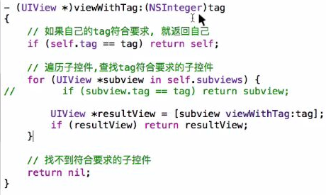
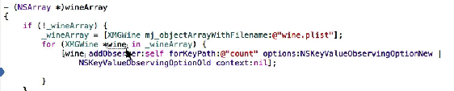
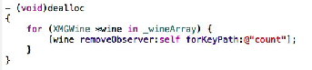
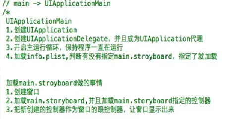
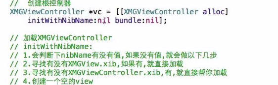
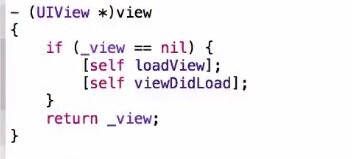
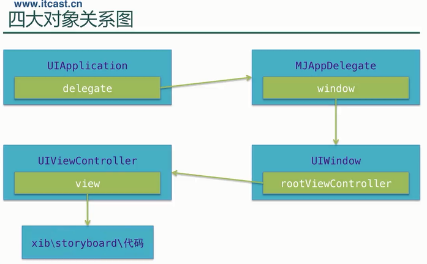
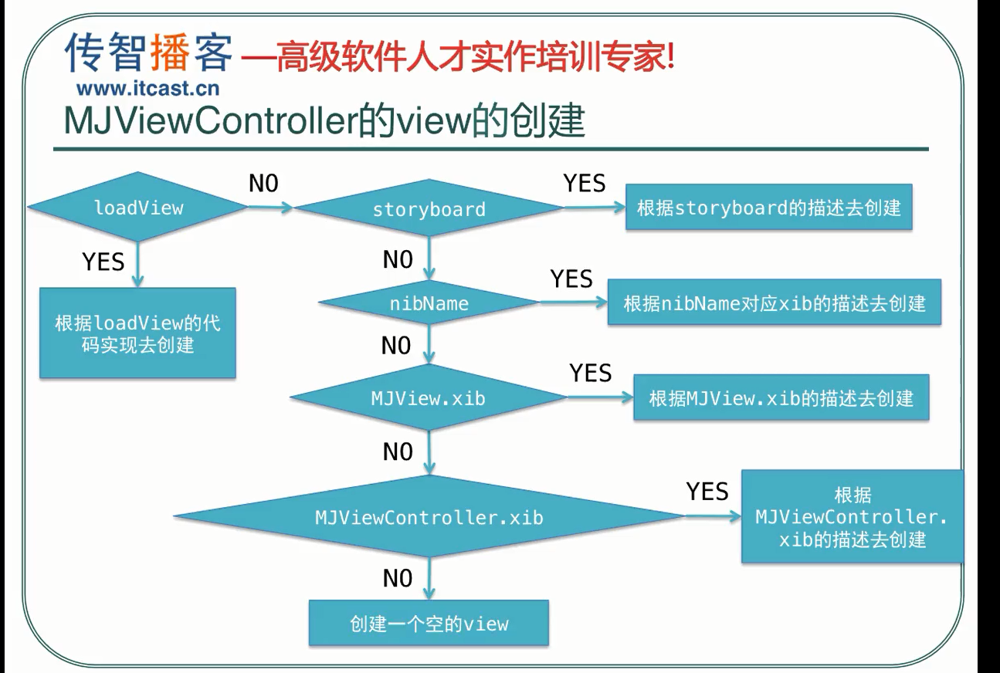
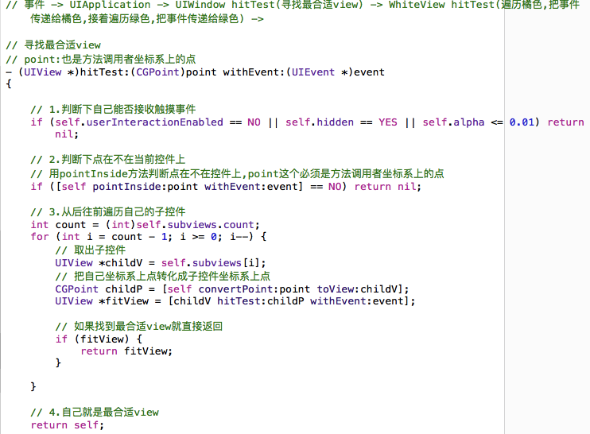
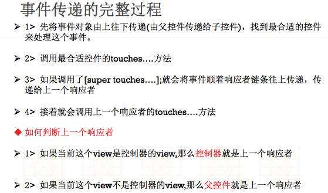

##花川学院 swift
##屏幕尺寸
- iPhone 4、4S---320*480，4、4S是retina，@2x
- iPhone 5、5C、5S---320*568，retina，@2x
- iPhone 6、6S---375*667，retina，@2x
- iPhone 6Plus、6sPlus---414*736，retain，@3x
---
##启动图片
- 有了LaunchScreen，这样会给美工省事很多，不需要再制作不同屏幕尺寸的启动图片，它会根据当前屏幕尺寸自动拉伸图片，并且底层实质是给LaunchScreen.storyboard截图保存，启动的时候显示的是这张图片
- 模拟器或者真机的尺寸实质上是启动图片的尺寸
---
##文档学习
- iOS9.3-->Cocoa Touch Layer-->UIKit-->Guides
- iOS9.3-->Cocoa Touch Layer-->UIKit-->Reference(常用的类参考)
- iOS9.3-->General-->Guides-->iOS9.3 API Diffs(和之前相比新增以及修改了什么)
---
##插件失效解决
- 查询Xcode当前版本号<br>
defaults read /Applications/Xcode.app/Contents/Info DVTPlugInCompatibilityUUID

- 前往文件夹：<br>
~/Library/Application Support/Developer/Shared/Xcode/Plug-ins
---
##Pch文件相对路径
- 告诉系统提前编译pch --> YES
- 相对路径即可  /$(TARGET_NAME)/PrefixHeader.pch
- 全局头文件
- 全局常用宏
  -  define LBRandomColor [UIColor colorWithRed:arc4random_uniform(256)/255.0 green:arc4random_uniform(256)/255.0 blue:arc4random_uniform(256)/255.0 alpha:1.0]

  - define LBNotificationCenter  [NSNotificationCenter defaultCenter]
- 自定义LBLog
```objc
#ifdef __OBJC__（防止混编出错）
#ifdef DEBUG
#define LBLog(...)  NSLog(__VA_ARGS__)
#else
#define LBLog(...)
#endif
```
---
##Bundle identifier
- 代表项目的唯一标示,由2部分组成
 ```
 - organization identifier（一般都是公司的域名反过来写）
   - com.521it
 - product name（项目名称）
   - sinaApp
 ```
 - organization name（一般都是公司名称）
   - xiaomage

Bundle identifier=com.521it.sinaApp（域名）
- 它可以唯一的标识一个软件，如果下载的时候发现手机上面有一个软件的Bundle identifier一样，那么就会卸载之前的那个软件，安装这个新的软件，苹果推送消息的时候就是通过这个标识找到对应的软件的
- Bundle version 内部版本号，提交给测试部门使用，内部工作人员调试交流时候辨别的
- Bundle Name：APP安装后的名称
- Bundle versions string,short：外部版本号，版本号可以在这修改，发布提交的时候就使用这个，迭代开发
- 获得当前版本号
 - NSString *version=  [NSBundle mainBundle].infoDictionary[@"CFBundleShortVersionString"];
 - 版本号的格式：v<主版本号>.<副版本号>.<发布号>
   - 版本号的初始值：v1.0.0
 - 管理规则:
  - 主版本号（Major version）
    -   产品的主体构件进行重大修改，主版本号加1；
    -   产品的主体构件之间的接口协议重大修改，主版本号加1
  - 副版本号（Minor version）
   - 主版本号变更时，副版本号置0；
   - 数据结构变更(新增或修改注释含义的情况除外)，副版本号加1；
   - 若副版本号累加至超过20时，采用主版本号进位制，主版本号加1，
   - 副版本号重新置0
  - 发布号（Release）
   - 主版本号或副版本号变更时，Release号置0；
   - 若发布的版本无数据结构变更，则Release号加1。

```objc
这里有一段代码，可以在xcode编译时候自动增加build号码。
先把 Info.plist 里的版本号改成某个数字，然后 Targets → your target → Build Phases → Run Script 的地方加

version=`/usr/libexec/PlistBuddy -c "Print CFBundleVersion" $PRODUCT_SETTINGS_PATH`
version=`expr $version + 1`
/usr/libexec/PlistBuddy -c "Set :CFBundleVersion $version" $PRODUCT_SETTINGS_PATH
#/usr/libexec/PlistBuddy -c "Set :CFBundleShortVersionString $version" $PRODUCT_SETTINGS_PATH 这行代码会让version也自增，一般不需要
```
---
##Tag
- 每一个控件都有一个Tag属性，它相当于控件的唯一标识，会从父控件里面寻找tag值一样的控件，按照控件的添加顺序从前往后寻找，会递归查找，连子控件的子控件都会遍历查找
 - viewWithTag会首先找自己的tag，然后找第一个子控件，第一个子控件不是的话，再去看第一个子控件的子控件，直到第一个完全不是的话，那么再去找第二个子控件以及第二个子控件的子控件，依次类推
 - 注意点1：如果一个view里面，有多个view的tag值都是一样的，找到第一个tag值相等的控件后就不再寻找
 - 注意点2：在通过给定的tag值寻找的过程中如果恰巧父控件的tag值就是需要寻找的，那么就返回他自己本身


- 如果是storyboard创建的按钮，默认是system样式

##自定义控件-->Xib、Storyboard、代码的加载过程

 * 当控件通过代码创建时，就会调用这个方法
 * 当控件通过代码创建时，想做一些初始化操作。应该在这个方法中执行
  - -(instancetype)initWithFrame:(CGRect)frame
---
-  当控件从xib\storyboard中创建完毕时，就会调用这个方法
-  当控件从xib\storyboard中创建完毕后想进行一些初始化操作，应该在这个方法中执行,这个方法是等xib\storyboard完全创建完毕，该连得线也连好了之后才会调用，所以在这里进行一些初始化会比较安全稳定
 -  -(void)awakeFromNib
- 当控件是通过xib\storyboard创建时，会调用这个方法来进行初始化控件，不过这个方法调用的时候里面的子控件还没有进行连线，是不完整的初始化，拿到控件是没有值的
---
 - -(id)initWithCoder:(NSCoder *)aDecoder
 - 调用顺序是先调用initWithCoder再调用awakeFromNib
 - initWithCoder还有一个关键点
   - 解析文件的时候就会调用这个方法
   - 只有父类遵守了NSCoding协议的话，那么重写initWithCoder方法的时候，才可以使用[super initWithCoder]
   - 所以自定义对象的时候重写initWithCoder的时候只可以调用[super init]，因为自定义对象的父类是NSObject,NSObject没有遵守NSCoding协议


 ####控件封装的细节
 - 一般自定义控件，为了方便xib或者代码创建都可以对其进行相应的初始化，我们一般会提供一个setup方法，在这里进行初始化，然后在awakeFromNib以及initWithFrame方法中分别调用setup

- 自定义控件的时候我们一般希望提供很多接口，无论是通过
 - init；
 - initWithFrame；
 - initWithShop；
 - shopViewWithShop
都希望可以正常创建控件，initWithFrame方法是这些方法的公共接口，所以需要重写这个方法，那么其他方法就会正常创建控件了

##LayoutSubviews
-  布局子控件，设置子控件的frame
-  是父控件先确定了自己的尺寸后才去调用该方法去给子控件布局
-  另外当当前控件的尺寸发生改变的时候，会自动调用这个方法，所以一般情况下在这个方法中设置子控件、父控件的frame会比较准确
- 只要父控件的尺寸一确定，就会调用这个方法布局子控件
- 只要父控件的尺寸一改变，就会调用这个方法布局子控件
##KVC/KVO
###key - value - coding
- 常见作用，给模型属性赋值，根据key找到对应属性，给属性赋值
- 可以计算平均值、最大值、最小值、总数等
  - @“@“max.height””
- KVC底层实现
    + setValuesForKeysWithDictionary实现
        * 1.遍历字典中所有的key和value, 相当于调用字典的enumerateKeysAndObjectsUsingBlock方法
        * 2.每次遍历到数据后继续调用KVC的setValue:forKey:方法
    + setValue:forKey:实现
        * 1.调用模型中和当前字典key同名的set方法
            * 例如key=icon, 那么就会调用setIcon
        * 2.如果没有set方法就会直接给模型中同名的成员变量赋值
            * 例如key=icon, 那么就会给icon成员变量赋值
        * 3.如果没有同名的成员变量, 那么就会给带_的成员变量赋值
            * 例如key=icon, 那么就会给_icon成员变量赋值
        * 4.如果都没有找到, 那么就会调用模型的setValue:forUndefinedKey:方法

###key - value - observing
- **常见作用**，根据key找到对应属性，监听属性值的改变
 - 如果有一个加号和减号按钮，点击加号值变大，点击减号值减小，这个使用可以使用kvo监听新旧值改变判断点击了哪一个按钮
 - 2个imageview实现轮播器，可以使用kvo监听contenoffset.x的改变判断用户是向左滑动还是向右滑动
 - 抽屉效果，可以使用kvo监听frame的origin.x新值是否大于0判断左边view隐藏还是右边view隐藏
 - 监听模型属性值改变的时候，需要给每一个模型都绑定一个监听器，所以在字典转模型的时候直接绑定比较好

```objc
//添加监听器，让bb对象监听aa对象里面的cc属性值的改变
//也就是说当aa对象里面的cc属性的值改变的时候就自动调用bb对象的observeValueForKeyPath:方法
[aa(self.deals.lastObject)  addObserver:bb(self) forKeyPath:cc(@"price") options:NSKeyValueObservingOptionOld|NSKeyValueObservingOptionNew context:nil];

//实现监听方法，谁监听就在谁那实现该监听方法，每一个oc对象都有该方法
//在这个方法中实现当监听到属性值改变的时候想要进行的操作
//这个方法中的(id)object可以根据实际情况随意修改，类型以及变量名都可以修改，比如(id)object-->(LBTgCell *)tgCell
//方法名千万不要修改就可以,里面的参数可以随意修改,这样系统还是会在监听到属性值改变的时候自动调用
-(void)observeValueForKeyPath:(NSString *)keyPath ofObject:(id)object change:(NSDictionary<NSString *,id> *)change context:(void *)context
{
    NSLog(@"%@对象的%@属性改变了，改变情况是%@",object,keyPath,change);
}
打印台打印信息如下：
<XMGDeal: 0x7f8bd8f78b10>对象的price属性改变了{
    kind = 1;
    new = 52;//new=NSKeyValueChangeNewKey
    old = 228;//old=NSKeyValueChangeOldKey
}
//2个方法中参数的对应关系
aa===object
cc===keyPath
```

-** kvo监听的添加和移除**


- **KVO性能问题**
 - 属性值在任何地方的改变都会被监听到，这个有时候可能不是我们想要的效果
   - 比如我们UI基础的时候那个酒的购物车的小Demo
   - 我们当时使用了KVO去监听酒模型的count属性的改变，因为当时想监听用户是点击加号还是减号按钮然后通过count新值以及旧值的大小去决定模型count值是减1还是加1
   - 当时使用kvo也就只想在这里进行监听，但是kvo的一个不好的地方就在这个地方体现了
   - 由于它会全局监听我们酒模型count值的改变，所以当用户点击清空购物车按钮的时候，这个时候count值是应该变为0的，一旦count是0 ，那么新值(0)无论如何都是比旧值小的，那么它就会狂减，正常情况下购物车清空后总价肯定也为0
   - 但是这个时候总价却变成了负数，这个时候我们还需要在当用户点击了清空的时候先让kvo自己内部去处理，它处理了之后我们再去给显示总结的label重新赋值为0，这样无端给我们增加了负担
   - 这个就是kvo监听会全局监听带来的坏处
 - 给一个类添加一个监听器，系统内部会给该类创建一个子类NSKVONotifying_LBTgCell

####程序启动原理/控制器view的创建方式
- 程序启动
 - 1.执行Main
 - 2.执行UIApplicationMain函数.
 - 3.根据3和4这两个参数名称创建UIApplication对象,创建UIApplicationDelegate对象，并让它成为UIApplication的代理.
   - UIApplicationMian函数的第三个参数就是UIApplication的类名或者子类的名称,如果指定为nil,它会默认为@"UIApplication"
   -  UIApplication的第四个参数为UIApplication的代理的名称
 - 4.开启一个主运行循环，监听系统事件(前台后台退出焦点)，保证应用程序一直运行，不退出
 - 5.加载info.plist配置文件.判断一下info.plist文件当中有没有描述main(指定Main storyboard file base name)
   - 有指定的话,就去加载main.storyboard,如果没有,那么应用程序加载完毕,加载完毕会通知代理，调用代理的didFinishLaunch...方法



```objc
    self.window=[[UIWindow alloc]initWithFrame:[UIScreen mainScreen].bounds];
    //storyboard加载，根据Identifier
    // UIStoryboard *story=[UIStoryboard storyboardWithName:@"Main" bundle:nil];
    // UIViewController *con= [story instantiateViewControllerWithIdentifier:@"Main"];

    //UIStoryboard *story2=[UIStoryboard storyboardWithName:@"New" bundle:nil];
    //myNewController *con2= [story2 instantiateViewControllerWithIdentifier:@"New"];

    //根据xib加载,注意需要先把file`s owner的class name设置成需要设置的对应类的类名，
    //然后给file`s owner的view拖给自己添加到xib的UIView
    //一定要描述xib的文件拥有者是控制器，也就是说这个xib是用来描述控制器的
    UIViewController *con3=[[UIViewController alloc]initWithNibName:@"XibController" bundle:nil];
    //设置window的根控制器
    self.window.rootViewController=con3;//con、con2
    [self.window makeKeyAndVisible];
    //注意点：在iOS9以后，只要和didFinishLanunch方法有关联的window，都需要设置跟控制器，其他地方创建的window可以不设置根控制器，只要让它显示或者hidden=NO,它就能显示出来
```
- LoadView：默认是加载控制器view，可以自定义view
 - 使用场景
   - 登录页面，在该方法中进行判断，如果没有登录，给出登录页面，如果登录就直接是其他页面
 - 当控制器的view第一次被使用的时候调用
 - 不使用storyboard的view，自定义view，重写loadView方法
 - 如果界面只有一个控件，比如webview，可以重写LoadView方法，让控件成为控制器view，节约性能
   - 下图中所指的空并不是真的空，几乎透明而已

---

---
- 自定义LoadView示例
 - 自定义一个view，在view里面重写drawrect方法，drawrect方法里面使用drawInRect画一个image即可
 - 在LoadView方法里面直接加载这个view，然后让它的尺寸等于屏幕的尺寸
 - 最后把view赋值给控制器的view
- 控制器view的创建过程
 - initWithNibName如果指定为空，那么会按照下图方式创建控制器view，另外init底层会调用initWithNibName

---
- 使用storyBoard描述单独的控制器
 - 创建一个storyBoard，名字一般都是和控制器类名一样
 - 在storyBoard里面弄出箭头
 - 修改storyBoard的calssName为我们的控制器的类名
 - 在代码里面创建控制器的部分进行storyBoard加载<br>
     // 创建storyBoard
   - UIStoryBoard *storyBoard=[UIStoryBoard storyBoardWithName:@""]<br>
   // 加载箭头指向的控制器
   - LBMineViewController *mineVc=[storyBoard instantiateInitiaviewController]

---
- 控制器view的懒加载原理

---

---

####事件传递 ---  从上往下传，父控件到子控件
- uiaplication--window--控制器的白色view--红色view--绿色view
- 之所以需要从后往前遍历子控件，是为了循环优化，后添加的显示在前面，先判断后添加的有利于性能，如果判断到后添加的已经是最合适的view了，那么就不需要再去遍历其他子控件了
 - 点击了红色view，首先会把事件传递给uiaplication，uiaplication传递给window，window会去通过hitTest寻找最合适的view，发现自己可以响应事件，触摸点也在自己身上；
 - 然后window就会去从后往前遍历自己的子控件，（window的子控件就是控制器的白色view，它也就这一个子控件）;
 - 然后发现白色view也可以响应事件，并且触摸点也在白色view身上，那么就从白色view的子控件从后往前遍历白色view的子控件（白色view的子控件就是红色view和蓝色view，但是红色view显示在前面，蓝色显示在后面，也就是蓝色view先添加到白色view，红色view后添加到白色view）；
 - 因为红色view后添加到白色view身上，所以先遍历红色view，然后发现红色view自己也可以响应事件，而且触摸点也在红色view身上，那么就去从后往前遍历红色view的子控件（红色view 的子控件就是绿色view）,
 - 然后发现绿色view本身也可以接收触摸事件，但是触摸点不在绿色view身上，这时，就可以断定，触摸点就是在绿色view的父控件身上，就是红色view，那就确定红色view是最合适的处理本次触摸事件的控件

- hitTest
 - 调用时间：只要事件一传递给一个控件就会调用
 - 作用：返回给我们寻找到的最合适的view
 - 可以拦截事件的传递过程，想让谁处理事件谁就可以处理事件 - 如果一个控件有子控件，但是触摸点不在它的子控件view上，它的子控件的hitTest方法还是会调用，只不过子控件不处理事件
 - **注意给UIView或者UIImageView操作的时候，一定要设置它可以与用户交互**
-----
- 默认这个point参数是相对于当前view自己的左上角为原点；
- 转换坐标系后，让这个点相对于toView给出的这个view的左上角的原点
- pointInside，判断一个点在不在某个view上
- 注意最后的那个return是让系统默认进行自己的操作




---
####事件的响应 --- 从下往上响应，子控件抛给父控件
- touchesBegan方法的默认做法是将事件顺着响应者链条向上传递，将事件交给上一个响应者进行处理
  - 也就是说不重写这个方法，那么就会按照系统默认做法把事件交给上一个响应者处理
  - 如果重写了这个方法，里面什么也不写，那么就相当于自己处理这个事件
  - 如果重写了这个方法，里面写了[super touchesBegin...]，那么相当于把事件抛给了上一个响应者



