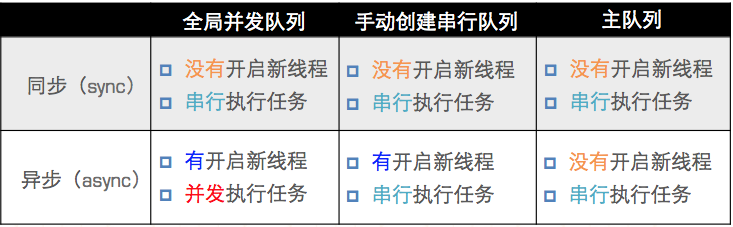

##多线程之GCD
####什么是GCD
- 全称是Grand Central Dispatch，可译为“牛逼的中枢调度器”
- 纯C语言，提供了非常多强大的函数

####GCD的优势
- GCD是苹果公司为多核的并行运算提出的解决方案
- GCD会自动利用更多的CPU内核（比如双核、四核）
- GCD会自动管理线程的生命周期（创建线程、调度任务、销毁线程）
- 程序员只需要告诉GCD想要执行什么任务，不需要编写任何线程管理代码

####任务
- 同步任务  同步任务不具备开启线程的能力`dispatch_sync`
- 异步任务 异步任务具备开启线程的能力`dispatch_async`

####队列
- 并发队列（Concurrent Dispatch Queue）
 - 可以让多个任务并发（同时）执行（自动开启多个线程同时执行任务）
 - 并发功能只有在异步（dispatch_async）函数下才有效

- 串行队列（Serial Dispatch Queue）
 - 让任务一个接着一个地执行（一个任务执行完毕后，再执行下一个任务）

    
####使用GCD的步骤
1. 定制任务
 1. 确定想做的事情
2. 将任务添加到队列中
	1. GCD会自动将队列中的任务取出，放到对应的线程中执行
   2. 任务的取出遵循队列的FIFO原则：先进先出，后进后出
   
####执行任务
- GCD有两个用来执行任务的函数
 - 用同步的方式执行任务
`dispatch_sync(dispatch_queue_t queue, dispatch_block_t block);
queue：队列
block：任务`

 - 用异步的方式执行任务
`dispatch_async(dispatch_queue_t queue, dispatch_block_t block);`
 
- 同步和异步的区别
 - 同步：只能在当前线程中执行任务，不具备开启新线程的能力
 - 异步：可以在新的线程中执行任务，具备开启新线程的能力
 
####容易混淆的术语
 - 有4个术语比较容易混淆：同步、异步、并发、串行
 - 同步和异步主要影响：能不能开启新的线程
  - 同步：在当前线程中执行任务，不具备开启新线程的能力
  - 异步：在新的线程中执行任务，具备开启新线程的能力

 - 并发和串行主要影响：任务的执行方式
  - 并发：多个任务并发（同时）执行
  - 串行：一个任务执行完毕后，再执行下一个任务

####并发队列
- GCD默认已经提供了全局的并发队列，供整个应用使用，不需要手动创建
 - 使用`dispatch_get_global_queue`函数获得全局的并发队列
`dispatch_queue_t `dispatch_get_global_queue(
dispatch_queue_priority_t priority,` // 队列的优先级
unsigned long flags);` // 此参数暂时无用，用0即可
`dispatch_queue_t queue = dispatch_get_global_queue(DISPATCH_QUEUE_PRIORITY_DEFAULT, 0);` // 获得全局并发队列
- 全局并发队列的优先级

```
#define DISPATCH_QUEUE_PRIORITY_HIGH 2 // 高
#define DISPATCH_QUEUE_PRIORITY_DEFAULT 0 // 默认（中）
#define DISPATCH_QUEUE_PRIORITY_LOW (-2) // 低
#define DISPATCH_QUEUE_PRIORITY_BACKGROUND INT16_MIN // 后台
```

####串行队列
- GCD中获得串行有2种途径
 - 使用`dispatch_queue_create`函数创建串行队列

```objc
dispatch_queue_t
dispatch_queue_create(const char *label, // 队列名称 
dispatch_queue_attr_t attr); // 队列属性，一般用NULL即可
dispatch_queue_t queue = dispatch_queue_create("cn.itcast.queue", NULL); // 创建
dispatch_release(queue); // 非ARC需要释放手动创建的队列
```

- 使用主队列（跟主线程相关联的队列）
 - 主队列是GCD自带的一种特殊的串行队列
 - 放在主队列中的任务，都会放到主线程中执行
 - 使用`dispatch_get_main_queue()`获得主队列
`dispatch_queue_t queue = dispatch_get_main_queue();`

#####各种队列代码
异步函数  并发队列 会开启新的线程

```objc
- (void)asyncConcurrent
{
    // 1.创建一个并发队列
    // label : 相当于队列的名字
//    dispatch_queue_t queue = dispatch_queue_create("com.renyufei", DISPATCH_QUEUE_CONCURRENT);
    
    //获得一个全局队列
    dispatch_queue_t queue = dispatch_get_global_queue(DISPATCH_QUEUE_PRIORITY_DEFAULT, 0);
    
    // 2.将任务加入队列
    dispatch_async(queue, ^{
        for (NSInteger i = 0; i<10; i++) {
            NSLog(@"1-----%@", [NSThread currentThread]);
        }
    });
    
    dispatch_async(queue, ^{
        for (NSInteger i = 0; i<10; i++) {
            NSLog(@"2-----%@", [NSThread currentThread]);
        }
    });
    
    dispatch_async(queue, ^{
        for (NSInteger i = 0; i<10; i++) {
            NSLog(@"3-----%@", [NSThread currentThread]);
        }
    });
    
    NSLog(@"asyncConcurrent");
}

```
同步 并发队列  不会开启新的线程

```objc
- (void)syncConcurrent
{
    //1.获取一个全局队列
    dispatch_queue_t queue = dispatch_get_global_queue(DISPATCH_QUEUE_PRIORITY_DEFAULT, 0);
    
    //2.将任务添加到队列当中去
    dispatch_sync(queue, ^{
        NSLog(@"1-----%@", [NSThread currentThread]);
    });
    
    dispatch_sync(queue, ^{
        NSLog(@"2-----%@", [NSThread currentThread]);
    });
    
    dispatch_sync(queue, ^{
        NSLog(@"3-----%@", [NSThread currentThread]);
    });
}
```
异步 串行队列  会开启新的线程  但是任务会串行执行 一个执行完之后才会执行下一个任务

```objc
- (void)asyncSerial
{
    //1.创建一个串行队列
    dispatch_queue_t queue = dispatch_queue_create("com.renyufei", DISPATCH_QUEUE_SERIAL);
    
    dispatch_async(queue, ^{
        NSLog(@"1-------%@",[NSThread currentThread]);
    });
    
    dispatch_async(queue, ^{
        NSLog(@"2-------%@",[NSThread currentThread]);
    });
    
    dispatch_async(queue, ^{
        NSLog(@"3-------%@",[NSThread currentThread]);
    });
}
```
同步 串行队列  不会开启新的线程 在当前线程执行任务。任务是串行的，执行完一个任务，再执行下一个任务

```objc
- (void)syncSerial
{
    dispatch_queue_t queue = dispatch_queue_create("com.renyufei", DISPATCH_QUEUE_SERIAL);
    
    dispatch_sync(queue, ^{
        NSLog(@"1-------%@",[NSThread currentThread]);
    });
    
    dispatch_sync(queue, ^{
        NSLog(@"2-------%@",[NSThread currentThread]);
    });
    
    dispatch_sync(queue, ^{
        NSLog(@"3-------%@",[NSThread currentThread]);
    });
}
```
异步 主队列：只在主线程中执行任务

```objc
- (void)asyncMain
{
    dispatch_queue_t queue = dispatch_get_main_queue();
    
    dispatch_async(queue, ^{
        NSLog(@"1-------%@",[NSThread currentThread]);
    });
    
    dispatch_async(queue, ^{
        NSLog(@"2-------%@",[NSThread currentThread]);
    });
    
    dispatch_async(queue, ^{
        NSLog(@"3-------%@",[NSThread currentThread]);
    });
}
```
同步 主队列  会造成死锁

```objc
- (void)syncMain
{
    NSLog(@"syncMain ----- begin");
    
    // 1.获得主队列
    dispatch_queue_t queue = dispatch_get_main_queue();
    
    // 2.将任务加入队列
    dispatch_sync(queue, ^{
        NSLog(@"1-----%@", [NSThread currentThread]);
    });
    dispatch_sync(queue, ^{
        NSLog(@"2-----%@", [NSThread currentThread]);
    });
    dispatch_sync(queue, ^{
        NSLog(@"3-----%@", [NSThread currentThread]);
    });
    
    NSLog(@"syncMain ----- end");

}
```
####各种队列的执行效果
效果如下图所示



		dispatch_queue_t queue = dispatch_get_global_queue(DISPATCH_QUEUE_PRIORITY_DEFAULT, 0);//获得全局并发队
		dispatch_async(queue, ^{
        NSLog(@"-----下载图片1---%@", [NSThread currentThread]);
    	});
    	dispatch_async(queue, ^{
        	NSLog(@"-----下载图片2---%@", [NSThread currentThread]);
    	});
    	dispatch_async(queue, ^{
        	NSLog(@"-----下载图片3---%@", [NSThread currentThread]);
    	});
    	dispatch_async(queue, ^{
        	NSLog(@"-----下载图片4---%@", [NSThread currentThread]);
    	});
    	dispatch_async(queue, ^{
       		 NSLog(@"-----下载图片5---%@", [NSThread currentThread]);
    	});
    	
    	
####线程间通信

```objc
dispatch_async(
dispatch_get_global_queue(DISPATCH_QUEUE_PRIORITY_DEFAULT, 0), ^{
    // 执行耗时的异步操作...
      dispatch_async(dispatch_get_main_queue(), ^{
        // 回到主线程，执行UI刷新操作
        });
});
```

####GCD其他用法
#####延迟执行
- iOS常见的延时执行有2种方式
 - 调用NSObject的方法
```[self performSelector:@selector(run) withObject:nil afterDelay:2.0];
// 2秒后再调用self的run方法```

 - 使用GCD函数
```dispatch_after(dispatch_time(DISPATCH_TIME_NOW, (int64_t)(2.0 * NSEC_PER_SEC)), dispatch_get_main_queue(), ^{
    // 2秒后异步执行这里的代码...
    
});```

#####一次性代码
使用dispatch_once函数能保证某段代码在程序运行过程中只被执行1次
```static dispatch_once_t onceToken;
dispatch_once(&onceToken, ^{
    // 只执行1次的代码(这里面默认是线程安全的)
});```
#####队列租
有这么1种需求
首先：分别异步执行2个耗时的操作
其次：等2个异步操作都执行完毕后，再回到主线程执行操作

如果想要快速高效地实现上述需求，可以考虑用队列组
```dispatch_group_t group =  dispatch_group_create();
dispatch_group_async(group, dispatch_get_global_queue(DISPATCH_QUEUE_PRIORITY_DEFAULT, 0), ^{
    // 执行1个耗时的异步操作
});
dispatch_group_async(group, dispatch_get_global_queue(DISPATCH_QUEUE_PRIORITY_DEFAULT, 0), ^{
    // 执行1个耗时的异步操作
});
dispatch_group_notify(group, dispatch_get_main_queue(), ^{
    // 等前面的异步操作都执行完毕后，回到主线程...
});```

#####队列组用法
比如我们想把网络上面两张图片合成一张图片，这时候我们就可以使用队列组来完成这个需求，具体实现代码如下

```objc
- (void)touchesBegan:(NSSet<UITouch *> *)touches withEvent:(UIEvent *)event
{
    dispatch_queue_t queue = dispatch_queue_create("renyufei.com", DISPATCH_QUEUE_CONCURRENT);
    
    dispatch_group_t group = dispatch_group_create();
    
    dispatch_group_async(group, queue, ^{
        NSURL *url = [NSURL URLWithString:@"http://d.hiphotos.baidu.com/baike/c0%3Dbaike150%2C5%2C5%2C150%2C50/sign=6fb4569492eef01f591910978197f240/94cad1c8a786c917a405bdc9cf3d70cf3bc75738.jpg"];
        self.image1 = [UIImage imageWithData:[NSData dataWithContentsOfURL:url]];
        
    });
    
    dispatch_group_async(group, queue, ^{
        NSURL *url = [NSURL URLWithString:@"http://d.hiphotos.baidu.com/baike/c0%3Dbaike80%2C5%2C5%2C80%2C26/sign=6ed64c51b1b7d0a26fc40ccfaa861d6c/50da81cb39dbb6fd9184c5c50a24ab18962b3771.jpg"];
        self.image2 = [UIImage imageWithData:[NSData dataWithContentsOfURL:url]];
    });
    
    dispatch_group_notify(group, queue, ^{
        UIGraphicsBeginImageContext(CGSizeMake(100, 100));
        
        [self.image1 drawInRect:CGRectMake(0, 0, 50, 100)];
        [self.image2 drawInRect:CGRectMake(0, 50, 50, 100)];
        
        UIImage *image = UIGraphicsGetImageFromCurrentImageContext();
        dispatch_async(dispatch_get_main_queue(), ^{
            self.imageView.image = image;
        });
        
        UIGraphicsEndImageContext();
    });
}

```
我们还可以使用栅栏函数来完成这一操作，遮拦函数是先完成栅栏之前的然后继续往下执行

```objc
- (void)barrier
{
    dispatch_queue_t queue = dispatch_queue_create("com.renyufe", DISPATCH_QUEUE_CONCURRENT);
    
    dispatch_async(queue, ^{
        NSLog(@"1-------%@",[NSThread currentThread]);
    });
    
    dispatch_async(queue, ^{
        NSLog(@"2-------%@",[NSThread currentThread]);
    });
    
    dispatch_barrier_async(queue, ^{
        NSLog(@"嘿嘿");
    });
    
    dispatch_async(queue, ^{
        NSLog(@"3-------%@",[NSThread currentThread]);
    });
    
    dispatch_async(queue, ^{
        NSLog(@"4-------%@",[NSThread currentThread]);
    });
    
    NSLog(@"结束le");
}
```


####单例模式
- 单例模式的作用
 - 可以保证在程序运行过程，一个类只有一个实例，而且该实例易于供外界访问
 - 从而方便地控制了实例个数，并节约系统资源

- 单例模式的使用场合
 - 在整个应用程序中，共享一份资源（这份资源只需要创建初始化1次）

- 单例模式在ARC\MRC环境下的写法有所不同，需要编写2套不同的代码
 - 可以用宏判断是否为ARC环境

```objc
#if __has_feature(objc_arc)
// ARC
#else
// MRC
#endif
```
当我们写单例的时候最好重写一下`+ (instancetype)allocWithZone:(struct _NSZone *)zone`和`- (id)copyWithZone:(NSZone *)zone`这样在使用alloc或者copy的时候也是同一个对象
具体实现代码如下

```objc
static Person *_person;

+ (instancetype)allocWithZone:(struct _NSZone *)zone
{
    static dispatch_once_t onceToken;
    dispatch_once(&onceToken, ^{
        _person = [super allocWithZone:zone];
    });
    return _person;
}

+ (instancetype)sharePerson
{
    static dispatch_once_t onceToken;
    dispatch_once(&onceToken, ^{
        _person = [[self alloc]init];
    });
    return _person;
}

- (id)copyWithZone:(NSZone *)zone
{
    return _person;
}
```
如果项目中有很多个单例，我们不妨把单例抽出来弄成一个宏，宏的具体实现代码如下，`\`是换行的，`##`是拼接的关键词

```objc
#define RYFSingletonH(name) + (instancetype)share##name;

#define RYFSingletonM(name)\
static id _instance;\
\
+ (instancetype)allocWithZone:(struct _NSZone *)zone\
{\
    static dispatch_once_t onceToken;\
    dispatch_once(&onceToken, ^{\
        _instance = [super allocWithZone:zone];\
    });\
    return _instance;\
}\
\
+ (instancetype)sharePerson\
{\
    static dispatch_once_t onceToken;\
    dispatch_once(&onceToken, ^{\
        _instance = [[self alloc]init];\
    });\
    return _instance;\
}\
\
- (id)copyWithZone:(NSZone *)zone\
{\
    return _instance;\
}
```
如果不想使用dispatch_once_t来实现单例的话，我们也可以使用对alloc或者当前类的类方法内部加锁`@synchronized`,这样创建出来的也是同一个对象，注意，加锁不要加错位置了，加锁的目的就防止同时对它的访问，然后在判断实例化对象是否等于nil，只有当nil的时候才会去创建，不是nil的话就用之前创建好的那一份


```objc
static Person *_person;
+ (instancetype)allocWithZone:(struct _NSZone *)zone
{
    @synchronized(self) {
        if (_person == nil) {
            _person = [super allocWithZone:zone];
        }
    }
    
    return _person;
}

+ (instancetype)sharePerson
{
    @synchronized(self) {
        if (_person == nil) {
            _person = [[self alloc]init];
        }
    }
    return _person;
}

- (id)copyWithZone:(NSZone *)zone
{
    return _person;
}

```

MRC情况下的单例
非ARC中（MRC），单例模式的实现（比ARC多了几个步骤）
实现内存管理方法
```
- (id)retain { return self; }
- (NSUInteger)retainCount { return 1; }
- (oneway void)release {}
- (id)autorelease { return self; }
```


